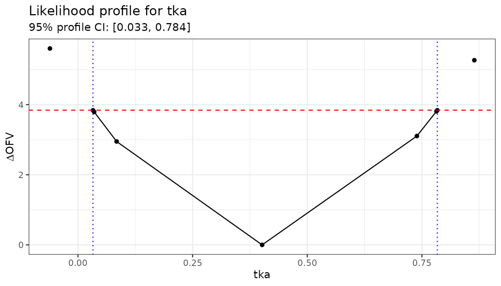
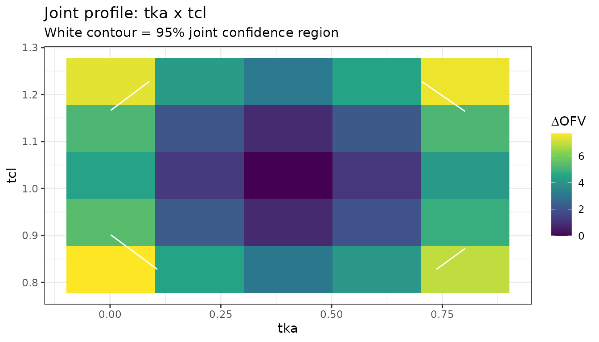

# Likelihood Profiling for NLME Models

## Introduction

Wald-based confidence intervals (CIs), which are the default output from
`nlmixr2`, rely on the assumption that the parameter estimates are
normally distributed. For parameters near boundaries, or for variance
components of random effects, this assumption often breaks down and the
resulting CIs can be misleading.

**Likelihood profiling** provides a more reliable alternative. Rather
than approximating the likelihood surface with a quadratic, it evaluates
the actual objective function (OFV) at a grid of parameter values,
holding each parameter fixed in turn and re-estimating the rest. A
parameter’s confidence interval is the set of values whose OFV increase
relative to the minimum is below a threshold – by default
$`\chi^2_{0.95,1} \approx 3.84`$.

`nlmixr2extra` provides two profiling methods via the
[`profile()`](https://rdrr.io/r/stats/profile.html) generic:

| Method | Function | Description |
|----|----|----|
| `"llp"` | [`profileLlp()`](https://nlmixr2.github.io/nlmixr2extra/reference/profileLlp.md) | Adaptive log-likelihood profiling – searches for the exact OFV boundary |
| `"fixed"` | [`profileFixed()`](https://nlmixr2.github.io/nlmixr2extra/reference/profileFixed.md) | Evaluates the OFV at user-supplied fixed values |

## Quick start

### Define and fit a model

We use the single-dose theophylline dataset (`theo_sd`) from
`nlmixr2data`.

``` r

library(nlmixr2extra)
library(ggplot2)

oneCmt <- function() {
  ini({
    tka  <- log(1.57)   # log absorption rate constant
    tcl  <- log(2.72)   # log clearance
    tv   <- log(31.5)   # log volume (fixed)
    eta.ka ~ 0.6
    eta.cl ~ 0.09
    add.sd <- 0.7
  })
  model({
    ka <- exp(tka + eta.ka)
    cl <- exp(tcl + eta.cl)
    v  <- exp(tv)
    cp <- linCmt()
    cp ~ add(add.sd)
  })
}

fit := nlmixr2(oneCmt, data = nlmixr2data::theo_sd,
               est = "focei", control = list(print = 0))
fit
```

``` math
\begin{align*}
{ka} & = \exp\left({tka}+{eta.ka}\right) \\
{cl} & = \exp\left({tcl}+{eta.cl}\right) \\
{v} & = \exp\left({tv}\right) \\
{cp} & = linCmt() \\
{cp} & \sim add({add.sd})
\end{align*}
```

### Profile all parameters

``` r

# Profiles tka and tcl; eta.ka, eta.cl, and add.sd are also included.
profAll := profile(fit)
#> ℹ loading from likelihood-profiling-profAll.rds
profAll
#>    Parameter      OFV         tka        tcl         tv       add.sd
#> 1        tka 130.2895  0.40153830  1.0278836  3.4295255 7.819052e-01
#> 2        tka 135.8912 -0.06120955  1.0360628  3.4203802 7.810391e-01
#> 3        tka       NA  0.03260143         NA         NA           NA
#> 4        tka 134.1288  0.03271627  1.0350141  3.4208530 7.812764e-01
#> 5        tka 134.0829  0.03528035  1.0351139  3.4208320 7.811889e-01
#> 6        tka 133.2386  0.08420023  1.0346181  3.4213993 7.812900e-01
#> 7        tka 133.3939  0.73903804  1.0192860  3.4385565 7.821123e-01
#> 8        tka 134.0994  0.78172572  1.0188197  3.4392264 7.822249e-01
#> 9        tka 134.1298  0.78351823  1.0188477  3.4392419 7.820724e-01
#> 10       tka       NA  0.78358502         NA         NA           NA
#> 11       tka 135.5566  0.86428615  1.0180805  3.4401796 7.822978e-01
#> 12       tcl 130.2895  0.40153830  1.0278836  3.4295255 7.819052e-01
#> 13       tcl 166.0851  0.43063881 -0.1566882  3.4458326 7.868505e-01
#> 14       tcl       NA          NA  0.7989937         NA           NA
#> 15       tcl 134.1289  0.41778827  0.7990577  3.4384113 7.835939e-01
#> 16       tcl 134.1156  0.41749888  0.7995185  3.4383893 7.836194e-01
#> 17       tcl 134.0216  0.41795155  0.8027911  3.4383068 7.836876e-01
#> 18       tcl 133.4478  0.41702370  0.8233050  3.4378203 7.833090e-01
#> 19       tcl 131.6055  0.41179773  0.9007595  3.4351561 7.827614e-01
#> 20       tcl 131.6107  0.39369240  1.1535003  3.4247717 7.815867e-01
#> 21       tcl 133.4621  0.39102319  1.2299623  3.4232093 7.815756e-01
#> 22       tcl 134.0285  0.39073028  1.2498464  3.4230214 7.813946e-01
#> 23       tcl 134.1174  0.39016263  1.2528827  3.4230072 7.815514e-01
#> 24       tcl 134.1292  0.39082650  1.2532866  3.4230018 7.814750e-01
#> 25       tcl       NA          NA  1.2533396         NA           NA
#> 26       tcl 166.5147  0.38693741  2.2124554  3.4209838 7.826220e-01
#> 27        tv 130.2895  0.40153830  1.0278836  3.4295255 7.819052e-01
#> 28        tv 231.0193 -3.14398204  0.5588538 -0.5227888 1.301043e+00
#> 29        tv 160.5725  0.13479013  1.1473982  3.2787989 8.841199e-01
#> 30        tv 134.1156  0.31702529  1.0686424  3.3803737 7.906060e-01
#> 31        tv 134.0942  0.31734179  1.0685053  3.3805151 7.904998e-01
#> 32        tv 134.0433  0.31788884  1.0682572  3.3808524 7.903636e-01
#> 33        tv 133.9242  0.31932087  1.0676208  3.3816505 7.900005e-01
#> 34        tv 133.6545  0.32254144  1.0660969  3.3835039 7.892147e-01
#> 35        tv 133.0897  0.32970079  1.0627068  3.3876274 7.875765e-01
#> 36        tv 132.0946  0.34427523  1.0557941  3.3960087 7.848158e-01
#> 37        tv 130.8832  0.36920588  1.0437568  3.4104055 7.819798e-01
#> 38        tv 132.0399  0.45754681  0.9988603  3.4623665 7.922055e-01
#> 39        tv 134.0805  0.48356909  0.9848542  3.4780321 8.017626e-01
#> 40        tv       NA          NA         NA  3.4783533           NA
#> 41        tv 134.4153  0.48704670  0.9829897  3.4801623 8.032996e-01
#> 42        tv 592.5970 -2.20918672 29.3509751  7.3818398 5.724111e+00
#> 43    add.sd 130.2895  0.40153830  1.0278836  3.4295255 7.819052e-01
#> 44    add.sd 141.3580  0.40521426  1.0225466  3.4355804 1.490116e-08
#> 45    add.sd 183.2415  0.40060147  1.0321066  3.4240425 5.105346e-01
#> 46    add.sd 130.8889  0.40235730  1.0266305  3.4306330 8.252030e-01
#> 47    add.sd 132.1226  0.40269356  1.0262105  3.4315382 8.602525e-01
#> 48    add.sd 133.1296  0.40325618  1.0253784  3.4321163 8.814067e-01
#> 49    add.sd 133.6883  0.40323673  1.0251800  3.4324090 8.918168e-01
#> 50    add.sd 133.9460  0.40312079  1.0250480  3.4325264 8.963927e-01
#> 51    add.sd 134.0556  0.40376780  1.0249541  3.4326054 8.982999e-01
#> 52    add.sd 134.1005  0.40362974  1.0251401  3.4326447 8.990769e-01
#> 53    add.sd 134.1188  0.40320335  1.0250444  3.4326211 8.993904e-01
#> 54    add.sd 134.1261  0.40368832  1.0249427  3.4326342 8.995163e-01
#> 55    add.sd       NA          NA         NA         NA 8.995669e-01
#> 56    add.sd 210.2365  0.42691799  0.9991699  3.4615924 1.683002e+00
#>         eta.ka      eta.cl profileBound
#> 1  0.329035499 0.121102205           NA
#> 2  0.538564672 0.120269658           NA
#> 3           NA          NA    -3.841459
#> 4  0.458539898 0.119833239           NA
#> 5  0.456196184 0.119756272           NA
#> 6  0.422478176 0.119852336           NA
#> 7  0.452367096 0.122130420           NA
#> 8  0.482905205 0.122447707           NA
#> 9  0.484150414 0.122335086           NA
#> 10          NA          NA     3.841459
#> 11 0.553262792 0.122191126           NA
#> 12 0.329035499 0.121102205           NA
#> 13 0.332483048 0.605508310           NA
#> 14          NA          NA    -3.841459
#> 15 0.331163211 0.171647781           NA
#> 16 0.331318653 0.171677860           NA
#> 17 0.330995621 0.170571723           NA
#> 18 0.331475511 0.161621084           NA
#> 19 0.330778140 0.136949382           NA
#> 20 0.327770744 0.135188902           NA
#> 21 0.327262106 0.159362774           NA
#> 22 0.327490620 0.167275993           NA
#> 23 0.326849106 0.168592207           NA
#> 24 0.327213834 0.168803615           NA
#> 25          NA          NA     3.841459
#> 26 0.325723106 0.605508310           NA
#> 27 0.329035499 0.121102205           NA
#> 28 0.025438031 0.026981276           NA
#> 29 0.277291057 0.100762926           NA
#> 30 0.315907986 0.114525102           NA
#> 31 0.316012260 0.114547830           NA
#> 32 0.316064781 0.114582084           NA
#> 33 0.316336670 0.114679185           NA
#> 34 0.316908291 0.114930753           NA
#> 35 0.318166867 0.115495153           NA
#> 36 0.320535927 0.116634251           NA
#> 37 0.324478713 0.118461288           NA
#> 38 0.335264048 0.125172731           NA
#> 39 0.337275699 0.127218547           NA
#> 40          NA          NA     3.841459
#> 41 0.337410533 0.127555949           NA
#> 42 0.003557558 0.003184402           NA
#> 43 0.329035499 0.121102205           NA
#> 44 0.301533722 0.114334105           NA
#> 45 0.359139601 0.126828241           NA
#> 46 0.323821893 0.119838836           NA
#> 47 0.319437093 0.118688815           NA
#> 48 0.316902498 0.117974399           NA
#> 49 0.315842544 0.118069782           NA
#> 50 0.315445663 0.117687340           NA
#> 51 0.314618073 0.117563640           NA
#> 52 0.314631349 0.117703748           NA
#> 53 0.314998293 0.117643523           NA
#> 54 0.314842537 0.117662521           NA
#> 55          NA          NA     3.841459
#> 56 0.199948027 0.081175884           NA
```

### Profile a single parameter

``` r

profTka := profile(fit, which = "tka")
#> ℹ loading from likelihood-profiling-profTka.rds
profTka
#>    Parameter      OFV         tka      tcl       tv    add.sd    eta.ka
#> 1        tka 130.2895  0.40153830 1.027884 3.429526 0.7819052 0.3290355
#> 2        tka 135.8912 -0.06120955 1.036063 3.420380 0.7810391 0.5385647
#> 3        tka       NA  0.03260143       NA       NA        NA        NA
#> 4        tka 134.1288  0.03271627 1.035014 3.420853 0.7812764 0.4585399
#> 5        tka 134.0829  0.03528035 1.035114 3.420832 0.7811889 0.4561962
#> 6        tka 133.2386  0.08420023 1.034618 3.421399 0.7812900 0.4224782
#> 8        tka 133.3939  0.73903804 1.019286 3.438556 0.7821123 0.4523671
#> 9        tka 134.0994  0.78172572 1.018820 3.439226 0.7822249 0.4829052
#> 10       tka 134.1298  0.78351823 1.018848 3.439242 0.7820724 0.4841504
#> 11       tka       NA  0.78358502       NA       NA        NA        NA
#> 12       tka 135.5566  0.86428615 1.018080 3.440180 0.7822978 0.5532628
#>       eta.cl profileBound
#> 1  0.1211022           NA
#> 2  0.1202697           NA
#> 3         NA    -3.841459
#> 4  0.1198332           NA
#> 5  0.1197563           NA
#> 6  0.1198523           NA
#> 8  0.1221304           NA
#> 9  0.1224477           NA
#> 10 0.1223351           NA
#> 11        NA     3.841459
#> 12 0.1221911           NA
```

## The log-likelihood profiling method (`"llp"`)

[`profileLlp()`](https://nlmixr2.github.io/nlmixr2extra/reference/profileLlp.md)
uses an adaptive algorithm:

1.  Start from the point estimate and step in both directions.
2.  At each step, fix the target parameter and re-estimate all others.
3.  Stop when the OFV change is within `ofvtol` of the desired
    `ofvIncrease`, or when the next parameter step would not change its
    rounded value to `paramDigits` significant figures.

### Control options

All LLP settings are set via
[`llpControl()`](https://nlmixr2.github.io/nlmixr2extra/reference/llpControl.md):

``` r

# Default settings
ctrl <- llpControl(
  ofvIncrease   = qchisq(0.95, df = 1),  # ~3.84 for 95% CI
  rseTheta      = 30,    # starting step size as % of the estimate
  itermax       = 10,    # max iterations per direction
  ofvtol        = 0.005, # tolerance on OFV difference
  paramDigits   = 3      # significant digits for convergence
)

# a separate name: each `:=` target is its own cache entry
profTkaCtrl := profile(fit, which = "tka", control = ctrl)
#> ℹ loading from likelihood-profiling-profTkaCtrl.rds
```

To get a 90% CI instead of 95%, lower the threshold:

``` r

profTka90 := profile(fit, which = "tka",
                     control = list(ofvIncrease = qchisq(0.90, df = 1)))
#> ℹ loading from likelihood-profiling-profTka90.rds
```

### Interpreting the output

The returned data frame has one row per model evaluation. Key columns:

- `Parameter` – which parameter was fixed on this row
- `OFV` – the objective function value at that step
- `profileBound` – present on the boundary rows; its absolute value is
  the `ofvIncrease` threshold and its sign indicates lower (`-`) or
  upper (`+`)
- One column per model parameter showing its estimate at each step

``` r

# Show rows near the boundary
profTka[!is.na(profTka$profileBound), ]
#>    Parameter OFV        tka tcl tv add.sd eta.ka eta.cl profileBound
#> 3        tka  NA 0.03260143  NA NA     NA     NA     NA    -3.841459
#> 11       tka  NA 0.78358502  NA NA     NA     NA     NA     3.841459
```

The rows where `profileBound` is non-`NA` give the profile CI limits
directly from the `tka` column.

## Plotting the profile

The profile data frame contains everything needed for a profile plot. A
standard presentation shows OFV - OFV_min on the y-axis and the
parameter value on the x-axis, with a horizontal reference line at the
CI threshold.

``` r

# Compute Delta OFV relative to the minimum
ofvMin <- min(profTka$OFV, na.rm = TRUE)
profTka$dOFV <- profTka$OFV - ofvMin

# The two boundary rows (one per direction)
bounds <- profTka[!is.na(profTka$profileBound), ]

ggplot(profTka, aes(x = tka, y = dOFV)) +
  geom_line() +
  geom_point() +
  geom_hline(yintercept = qchisq(0.95, 1), linetype = "dashed", colour = "red") +
  geom_vline(xintercept = bounds$tka, linetype = "dotted", colour = "blue") +
  labs(
    x     = "tka",
    y     = expression(Delta * "OFV"),
    title = "Likelihood profile for tka",
    subtitle = sprintf(
      "95%% profile CI: [%.3f, %.3f]",
      min(bounds$tka), max(bounds$tka)
    )
  ) +
  theme_bw()
#> Warning: Removed 2 rows containing missing values or values outside the scale range
#> (`geom_point()`).
```



A symmetric, approximately parabolic profile indicates the Wald CI is
reliable. An asymmetric or flat profile indicates non-normality; in
these cases the profile CI is more trustworthy.

## The fixed-point method (`"fixed"`)

[`profileFixed()`](https://nlmixr2.github.io/nlmixr2extra/reference/profileFixed.md)
evaluates the OFV at a user-supplied grid rather than searching
adaptively. It is useful when you want to reproduce a specific grid
(e.g. for a table or a plot comparing multiple models) or when the
adaptive algorithm struggles.

### Evaluating a uniform grid

``` r

# Evaluate tka at seven equally spaced values around the point estimate
tkaEst <- fit$theta["tka"]

grid <- data.frame(tka = seq(tkaEst - 0.6, tkaEst + 0.6, length.out = 7))

profGrid := profile(fit, which = grid, method = "fixed")
#> ℹ loading from likelihood-profiling-profGrid.rds
profGrid[, c("Parameter", "tka", "OFV")]
#>   Parameter          tka      OFV
#> 1       tka -0.198461702 138.6112
#> 2       tka  0.001538298 134.6977
#> 3       tka  0.201538298 131.5418
#> 4       tka  0.401538298 130.2895
#> 5       tka  0.601538298 131.4834
#> 6       tka  0.801538298 134.4394
#> 7       tka  1.001538298 138.1211
```

### Two-parameter joint profile

[`profileFixed()`](https://nlmixr2.github.io/nlmixr2extra/reference/profileFixed.md)
accepts a data frame with multiple columns. Each row fixes all named
parameters simultaneously, allowing you to trace joint profile contours.

``` r

grid2d <- expand.grid(
  tka = seq(tkaEst - 0.4, tkaEst + 0.4, length.out = 5),
  tcl = seq(nlmixr2est::fixef(fit)[["tcl"]] - 0.2,
            nlmixr2est::fixef(fit)[["tcl"]] + 0.2, length.out = 5)
)

profJoint := profile(fit, which = grid2d, method = "fixed")
#> ℹ loading from likelihood-profiling-profJoint.rds

ggplot(profJoint, aes(x = tka, y = tcl,
                       fill = OFV - min(OFV, na.rm = TRUE))) +
  geom_tile() +
  scale_fill_viridis_c(name = expression(Delta * "OFV")) +
  geom_contour(aes(z = OFV - min(OFV, na.rm = TRUE)),
               breaks = qchisq(0.95, 2), colour = "white") +
  labs(title = "Joint profile: tka x tcl",
       subtitle = "White contour = 95% joint confidence region") +
  theme_bw()
#> Warning: The following aesthetics were dropped during statistical transformation: fill.
#> ℹ This can happen when ggplot fails to infer the correct grouping structure in
#>   the data.
#> ℹ Did you forget to specify a `group` aesthetic or to convert a numerical
#>   variable into a factor?
```



## Comparing profile CIs with Wald CIs

Profile CIs are wider than Wald CIs when the likelihood surface is
asymmetric. This is common for variance parameters and log-scale
parameters near zero.

``` r

# Wald CI from the fit
waldCi <- confint(fit)  # uses the covariance matrix

# Extract profile CI from the boundary rows
boundRows <- profAll[!is.na(profAll$profileBound), ]

# For each parameter, the two boundRows give lower and upper limits
profileCi <- tapply(
  seq_len(nrow(boundRows)),
  boundRows$Parameter,
  function(idx) {
    vals <- boundRows[idx, boundRows$Parameter[idx[1]]]
    c(lower = min(vals), upper = max(vals))
  }
)

# Show side-by-side
do.call(rbind, lapply(names(profileCi), function(p) {
  data.frame(
    parameter   = p,
    wald_lower  = waldCi[p, 1],
    wald_upper  = waldCi[p, 2],
    prof_lower  = profileCi[[p]]["lower"],
    prof_upper  = profileCi[[p]]["upper"]
  )
}))
#>        parameter wald_lower wald_upper prof_lower prof_upper
#> lower     add.sd  0.7819052  0.7819052 0.89956691  0.8995669
#> lower1       tcl  1.0278836  2.7951440 0.79899372  1.2533396
#> lower2       tka  0.4015383  1.4941213 0.03260143  0.7835850
#> lower3        tv  3.4295255 30.8619957 3.47835329  3.4783533
```

## Tips

- **Start with `which`**: profiling all parameters is time-consuming.
  Profile only the parameters of primary interest first.
- **Increase `itermax`** if you see “aborted due to too many
  iterations”. The default of 10 is conservative; 20-30 is often
  sufficient for variance parameters.
- **Adjust `rseTheta`**: if the initial step is too large (OFV jumps
  past the target immediately) reduce `rseTheta`. If it is too small
  (many steps needed before the boundary is reached) increase it.
- **Fixed-point fallback**: when
  [`profileLlp()`](https://nlmixr2.github.io/nlmixr2extra/reference/profileLlp.md)
  fails to converge for a particular parameter,
  [`profileFixed()`](https://nlmixr2.github.io/nlmixr2extra/reference/profileFixed.md)
  on a coarse grid around the estimate can give a rough CI quickly.
