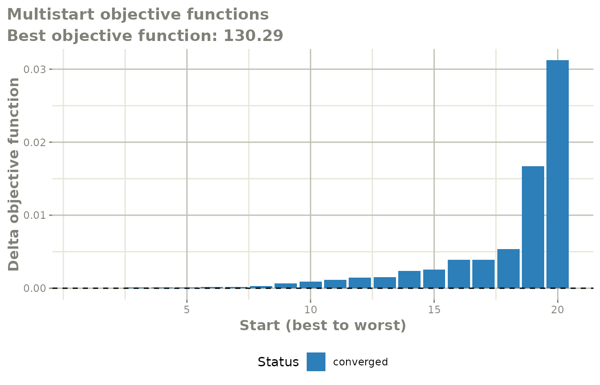
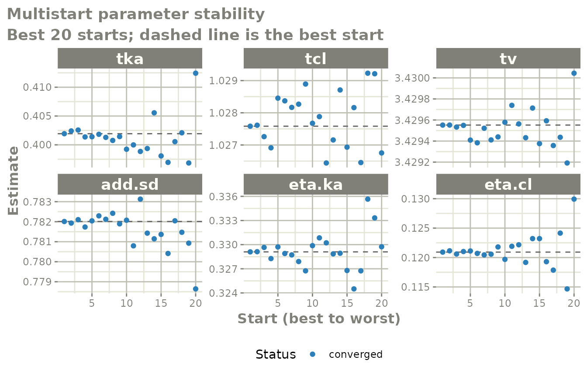

# Multistart estimation

## The question multistart answers

A population model is fit by minimising an objective function, and the
minimiser only ever finds *a* minimum – the one downhill from wherever
it started. Nothing in a converged fit tells you whether a different set
of initial estimates would have found somewhere better.

[`multistart()`](https://nlmixr2.github.io/nlmixr2extra/reference/multistart.md)
answers that directly: it re-estimates the model from many perturbed
starting points and shows you what each one found. If every start lands
on the same objective function, the fit is at a well-identified optimum.
If several starts settle at visibly different values, the fit you had
was one of several local optima and the parameter estimates should not
be trusted at face value.

``` r

library(nlmixr2extra)
```

## A first run

Start from an ordinary fit.

``` r

one.compartment <- function() {
  ini({
    tka <- 0.45
    tcl <- 1
    tv <- 3.45
    eta.ka ~ 0.6
    eta.cl ~ 0.3
    add.sd <- 0.7
  })
  model({
    ka <- exp(tka + eta.ka)
    cl <- exp(tcl + eta.cl)
    v <- exp(tv)
    linCmt() ~ add(add.sd)
  })
}

fit := nlmixr2(one.compartment, nlmixr2data::theo_sd, est = "focei",
               control = list(print = 0))
```

Then hand that fit to
[`multistart()`](https://nlmixr2.github.io/nlmixr2extra/reference/multistart.md).
Every option lives in
[`multistartControl()`](https://nlmixr2.github.io/nlmixr2extra/reference/multistartControl.md),
which
[`multistart()`](https://nlmixr2.github.io/nlmixr2extra/reference/multistart.md)
accepts as a plain list.

``` r

ms := multistart(fit, control = list(n = 20, spread = 0.3))
ms
#>    start     OBJF        dOBJF      AIC      BIC converged boundary
#> 1      1 130.2895 0.000000e+00 384.8893 402.1861      TRUE    FALSE
#> 2      3 130.2895 5.470853e-06 384.8893 402.1861      TRUE    FALSE
#> 3      7 130.2896 8.827511e-05 384.8894 402.1862      TRUE    FALSE
#> 4      2 130.2896 9.266364e-05 384.8894 402.1862      TRUE    FALSE
#> 5     16 130.2896 1.262509e-04 384.8894 402.1862      TRUE    FALSE
#> 6      6 130.2897 1.622165e-04 384.8894 402.1863      TRUE    FALSE
#> 7     14 130.2897 1.734840e-04 384.8895 402.1863      TRUE    FALSE
#> 8     15 130.2898 2.977481e-04 384.8896 402.1864      TRUE    FALSE
#> 9      5 130.2902 6.385620e-04 384.8899 402.1867      TRUE    FALSE
#> 10    11 130.2904 9.244870e-04 384.8902 402.1870      TRUE    FALSE
```

The first candidate is always the unperturbed starting point, so the fit
you began with is always in the comparison. The other `n - 1` candidates
perturb every unfixed population parameter on the scale it is estimated
on – for a mu-referenced parameter that is usually the log scale – and
clip the result to the parameter’s declared bounds. Between-subject
variances are perturbed multiplicatively, so they stay positive.

`ms$summary` has one row per estimated start, sorted best first, with
the objective function, its distance from the best (`dOBJF`), the
information criteria, whether the start converged, whether it finished
with a parameter at a boundary, and the final estimate of every
parameter. `ms$best` is the best fit found and behaves like any other
fit.

## Reading the two plots

``` r

plot(ms)
```



The waterfall plot puts the starts in order, best to worst, and draws
each one’s objective function relative to the best. What you want to see
is a flat run of bars at zero: every start found the same optimum. A
staircase means several optima; the height of each step is the
objective-function penalty for landing there. Bars are coloured by
whether the start converged and whether it finished at a boundary, and
the subtitle counts the starts that failed outright.

``` r

plot(ms, "parameters")
```



The parameter-stability plot takes the best `kBest` starts and shows how
each parameter estimate varies across them, with the best start’s value
as a dashed reference line. This is the more diagnostic of the two: a
parameter whose estimate wanders while the objective function barely
moves is not identified by the data, whichever optimum you take.

## Controlling the search

### How far the starts spread

`spread` is the fractional half-width of the perturbation, so
`spread = 0.3` moves a parameter within 30% of its value. `omegaFold`
does the same job for the variances, as a fold-range: the default of `2`
draws each variance between half and twice its initial value.

`sampling` picks how the interval is covered. `"uniform"` is the
default; `"lhs"` uses a Latin hypercube, which covers the range more
evenly for the same number of starts and is usually the better choice
when `n` is small; `"normal"` concentrates the starts near the initial
estimates with occasional far excursions.

`which` restricts the perturbation to named parameters, which is useful
when you suspect one particular part of the model:

``` r

# a separate name: each `:=` target is its own cache entry
msWhich := multistart(fit, control = list(n = 20, which = c("tka", "tcl")))
msWhich
#>    start     OBJF        dOBJF      AIC      BIC converged boundary
#> 1      4 130.2895 0.000000e+00 384.8893 402.1861      TRUE    FALSE
#> 2      9 130.2895 6.025507e-07 384.8893 402.1861      TRUE    FALSE
#> 3     20 130.2895 7.847939e-07 384.8893 402.1861      TRUE    FALSE
#> 4     14 130.2895 3.219758e-06 384.8893 402.1861      TRUE    FALSE
#> 5      5 130.2895 3.480192e-06 384.8893 402.1861      TRUE    FALSE
#> 6      1 130.2895 3.723838e-06 384.8893 402.1861      TRUE    FALSE
#> 7     18 130.2895 4.816477e-06 384.8893 402.1861      TRUE    FALSE
#> 8      8 130.2895 5.434646e-06 384.8893 402.1861      TRUE    FALSE
#> 9     19 130.2895 5.641796e-06 384.8893 402.1861      TRUE    FALSE
#> 10    17 130.2895 6.510251e-06 384.8893 402.1861      TRUE    FALSE
```

### Screening

Fully estimating twenty starts is expensive, and many of them start
somewhere hopeless. By default
[`multistart()`](https://nlmixr2.github.io/nlmixr2extra/reference/multistart.md)
first evaluates each candidate with an empirical-Bayes step only – a
small fraction of the cost of an estimation – and fully estimates just
the best `nFit`:

``` r

msScreen := multistart(fit, control = list(n = 50, nFit = 10, spread = 0.5))
head(msScreen$starts)
#>   start seed screenOFV fitted         tka       tcl       tv    add.sd
#> 1     1 1235  130.2895   TRUE  0.40152295 1.0275730 3.429498 0.7820764
#> 2     2 1236  356.0790   TRUE  0.01522636 1.1532445 3.804255 0.9054558
#> 3     3 1237  743.8402  FALSE -0.08898130 0.7527491 3.999081 0.7963275
#> 4     4 1238  372.7510  FALSE  0.18425653 1.4626818 2.717245 1.1193720
#> 5     5 1239  821.1638  FALSE  0.08824574 0.7524156 2.800570 0.5847697
#> 6     6 1240  190.0571   TRUE  0.12032249 1.3467357 3.517627 1.1967345
#>      eta.ka     eta.cl
#> 1 0.3288761 0.12085004
#> 2 0.5424067 0.14679869
#> 3 0.4301163 0.12862469
#> 4 0.2445265 0.08746995
#> 5 0.2050017 0.06386997
#> 6 0.5206213 0.06438330
```

`ms$starts` records the screening objective for every candidate and
which of them were estimated. Pass `screen = "none"` to estimate all of
them.

Screening is a cheap approximation, so it is a way of spending a fixed
budget well rather than a guarantee: a candidate that screens badly can
still be the one that would have found the best optimum. When the budget
allows it, `screen = "none"` is the more thorough answer.

### Where to perturb around

Starting from a fit, `around = "final"` (the default) perturbs around
that fit’s final estimates, which asks “is this a local optimum?”.
`around = "initial"` perturbs around the estimates the fit started from,
which asks “how sensitive was this fit to where I started it?”. Both are
worth running.

You can also skip the first fit entirely and give
[`multistart()`](https://nlmixr2.github.io/nlmixr2extra/reference/multistart.md)
a model and data:

``` r

msModel := multistart(one.compartment, nlmixr2data::theo_sd,
                      est = "focei", control = list(n = 20))
msModel
#>    start     OBJF        dOBJF      AIC      BIC converged boundary
#> 1      9 130.2895 0.000000e+00 384.8893 402.1861      TRUE    FALSE
#> 2      1 130.2895 2.234498e-05 384.8893 402.1861      TRUE    FALSE
#> 3     11 130.2895 2.564410e-05 384.8893 402.1861      TRUE    FALSE
#> 4     16 130.2895 3.333938e-05 384.8893 402.1861      TRUE    FALSE
#> 5      6 130.2896 7.260501e-05 384.8894 402.1862      TRUE    FALSE
#> 6      2 130.2897 1.401312e-04 384.8894 402.1862      TRUE    FALSE
#> 7      7 130.2897 1.595570e-04 384.8894 402.1863      TRUE    FALSE
#> 8      4 130.2897 1.713112e-04 384.8895 402.1863      TRUE    FALSE
#> 9     18 130.2897 1.842884e-04 384.8895 402.1863      TRUE    FALSE
#> 10     3 130.2898 3.083525e-04 384.8896 402.1864      TRUE    FALSE
```

## Long runs

Each start is cached to disk as it completes, so an interrupted run
resumes where it stopped – just call
[`multistart()`](https://nlmixr2.github.io/nlmixr2extra/reference/multistart.md)
again with the same arguments. Asking for more starts re-uses the ones
already estimated:

``` r

ms <- multistart(fit, control = list(n = 10))   # estimates 10
ms <- multistart(fit, control = list(n = 30))   # estimates the 20 new ones
```

Anything that changes what a starting point *is* – `sampling`, `spread`,
`which`, `perturbOmega`, `omegaFold` or `seed` – gives the run its own
cache, so a cached estimation is never reported against a start it did
not come from. Pass `restart = TRUE` to discard the cache, or
`cacheDir = NA` to never write one.

`cores` estimates several starts at once. Be careful with it: each
estimation already runs across every available thread, so
[`multistart()`](https://nlmixr2.github.io/nlmixr2extra/reference/multistart.md)
pins each worker to a single thread to avoid oversubscribing the
machine. Whether that is faster than the serial default depends on how
well the model parallelises over subjects – a model that already uses
all your cores efficiently is usually better left serial. Parallel
estimation is not available on Windows.

## Reproducibility

Every nlmixr2 estimator runs inside its own seeded block, so calling
[`set.seed()`](https://rdrr.io/r/base/Random.html) before a fit does not
change it.
[`multistart()`](https://nlmixr2.github.io/nlmixr2extra/reference/multistart.md)
follows the same discipline: `multistartControl(seed=)` seeds the
perturbation draws and gives each start its own derived seed, and the
run neither depends on nor disturbs the surrounding RNG state. The same
`seed` gives the same starts and the same results.

`ms$starts` records the seed used for each start alongside its starting
estimates, so any individual start can be reproduced on its own.
