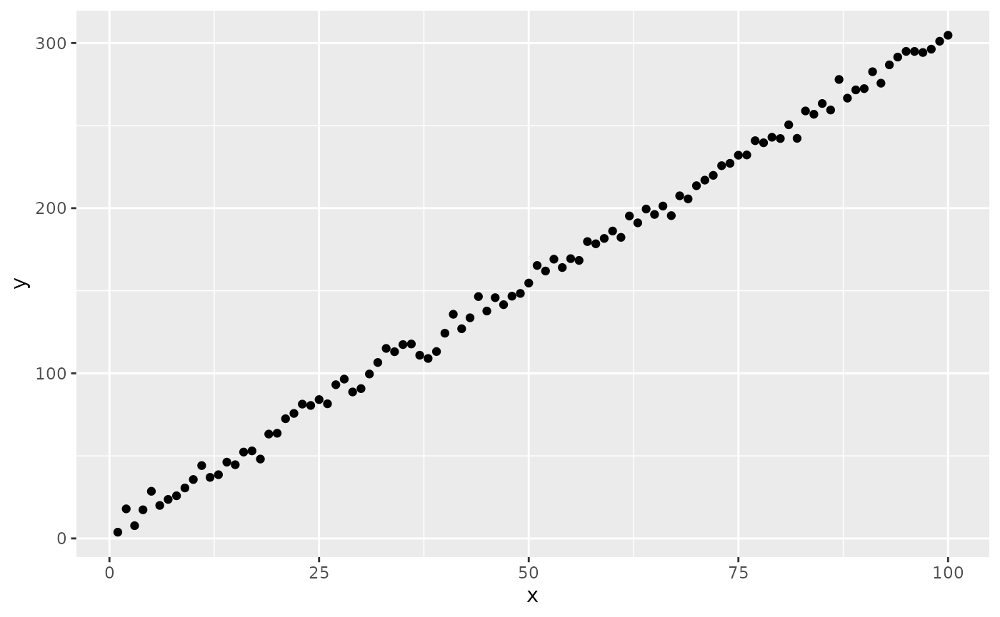
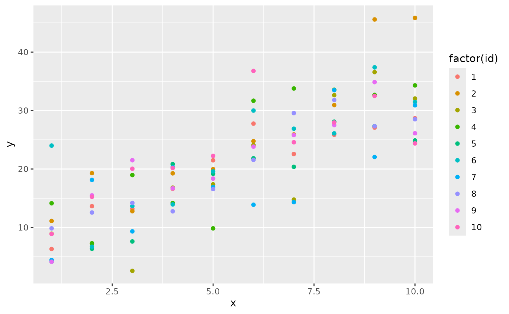
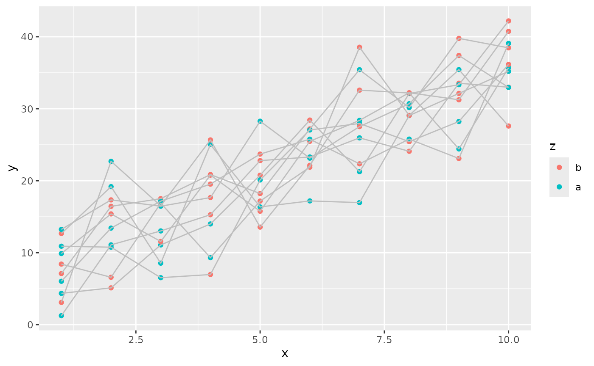
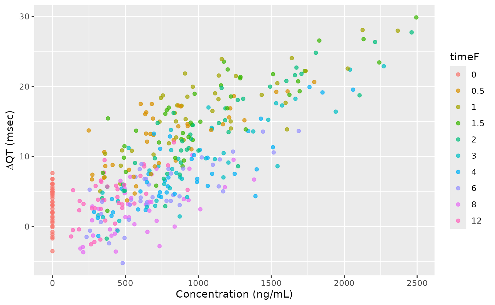

# nlmixr2 Algebraic Solutions with Formula

## Introduction

Some models are able to be described by simple algebraic solutions. To
simplify algebraic models, you can use a formula interface similar to
the formula used with the `lme4` library. (The formula interface is
described in more detail below; knowledge of `lme4` is not required to
use the formula interface.)

## Quick start

The simplest, non-trivial model is a linear model, `y = m*x + b`. We
will generate the data for this model and then fit it to show the
simplest use case of the nlmixr2 formula interface.

``` r

library(nlmixr2extra)
library(dplyr)
#> 
#> Attaching package: 'dplyr'
#> The following objects are masked from 'package:stats':
#> 
#>     filter, lag
#> The following objects are masked from 'package:base':
#> 
#>     intersect, setdiff, setequal, union
library(ggplot2)
```

``` r

# Simulate the equation y = 3*x + 5 with normally-distributed residual error
# having a standard deviation of 5
withr::with_seed(
  5, # standardize the random seed so that the results are reproducible
  dSim <-
    data.frame(
      x = 1:100,
      y =
        (1:100)*3 +
        5 +
        rnorm(n = 100, mean = 0, sd = 5)
    )
)

ggplot(dSim, aes(x=x, y=y)) + geom_point()
```



To fit this model requires only one line of R code:

``` r

mod <-
  nlmixrFormula(
    y~m*x + b,
    data = dSim,
    start = c(m = 2.5, b = 4, addSd = 2),
    est = "focei"
  )
#> ℹ parameter labels from comments are typically ignored in non-interactive mode
#> ℹ Need to run with the source intact to parse comments
#> → loading into symengine environment...
#> → pruning branches (`if`/`else`) of full model...
#> ✔ done
#> → finding duplicate expressions in EBE model...
#> [====|====|====|====|====|====|====|====|====|====] 0:00:00
#> → optimizing duplicate expressions in EBE model...
#> [====|====|====|====|====|====|====|====|====|====] 0:00:00
#> → compiling EBE model...
#> ✔ done
#> rxode2 5.1.2 using 2 threads (see ?getRxThreads)
#>   no cache: create with `rxCreateCache()`
#> Key: U: Unscaled Parameters; X: Back-transformed parameters; G: Gill difference gradient approximation
#> F: Forward difference gradient approximation
#> C: Central difference gradient approximation
#> M: Mixed forward and central difference gradient approximation
#> Unscaled parameters for Omegas=chol(solve(omega));
#> Diagonals are transformed, as specified by foceiControl(diagXform=)
#> |-----+---------------+-----------+-----------+-----------|
#> |    #| Objective Fun |         m |         b |     addSd |
#> |    1|     23328.257 |   -0.5000 |     1.000 |    -1.000 |
#> |    U|     23328.257 |     2.500 |     4.000 |     2.000 |
#> |    X|     23328.257 |     2.500 |     4.000 |     2.000 |
#> |    G|    Gill Diff. |-3.500e+04 |    -330.1 |-2.309e+04 |
#> |    2|     2279.8518 |    0.3347 |     1.008 |   -0.4494 |
#> |    U|     2279.8518 |     2.834 |     4.002 |     2.551 |
#> |    X|     2279.8518 |     2.834 |     4.002 |     2.551 |
#> |    F| Forward Diff. |    -7625. |    -73.34 |    -1562. |
#> |    3|     2346.9758 |     1.129 |     1.016 |    -1.057 |
#> |    U|     2346.9758 |     3.152 |     4.004 |     1.943 |
#> |    X|     2346.9758 |     3.152 |     4.004 |     1.943 |
#> |    4|     572.40937 |    0.7938 |     1.012 |   -0.6304 |
#> |    U|     572.40937 |     3.018 |     4.003 |     2.370 |
#> |    X|     572.40937 |     3.018 |     4.003 |     2.370 |
#> |    F| Forward Diff. |     19.71 |    -2.381 |    -253.1 |
#> |    5|     493.69538 |    0.7555 |     1.017 |   -0.1384 |
#> |    U|     493.69538 |     3.002 |     4.004 |     2.862 |
#> |    X|     493.69538 |     3.002 |     4.004 |     2.862 |
#> |    F| Forward Diff. |    -492.7 |    -6.353 |    -128.2 |
#> |    6|     613.99834 |    0.9759 |     1.108 |    0.2938 |
#> |    U|     613.99834 |     3.090 |     4.027 |     3.294 |
#> |    X|     613.99834 |     3.090 |     4.027 |     3.294 |
#> |    7|     545.41103 |    0.8934 |     1.019 |   -0.1025 |
#> |    U|     545.41103 |     3.057 |     4.005 |     2.898 |
#> |    X|     545.41103 |     3.057 |     4.005 |     2.898 |
#> |    8|     483.23786 |    0.7958 |     1.018 |   -0.1279 |
#> |    U|     483.23786 |     3.018 |     4.004 |     2.872 |
#> |    X|     483.23786 |     3.018 |     4.004 |     2.872 |
#> |    F| Forward Diff. |     39.65 |    -1.374 |    -119.9 |
#> |    9|     479.23921 |    0.7827 |     1.018 |  -0.08838 |
#> |    U|     479.23921 |     3.013 |     4.005 |     2.912 |
#> |    X|     479.23921 |     3.013 |     4.005 |     2.912 |
#> |   10|     477.54576 |    0.7685 |     1.018 |  -0.04538 |
#> |    U|     477.54576 |     3.007 |     4.005 |     2.955 |
#> |    X|     477.54576 |     3.007 |     4.005 |     2.955 |
#> |    F| Forward Diff. |    -300.9 |    -4.454 |    -108.9 |
#> |   11|     466.25271 |    0.7965 |     1.050 |   0.03049 |
#> |    U|     466.25271 |     3.019 |     4.013 |     3.030 |
#> |    X|     466.25271 |     3.019 |     4.013 |     3.030 |
#> |    F| Forward Diff. |     47.96 |    -1.108 |    -95.36 |
#> |   12|     460.58498 |    0.7749 |     1.075 |    0.1109 |
#> |    U|     460.58498 |     3.010 |     4.019 |     3.111 |
#> |    X|     460.58498 |     3.010 |     4.019 |     3.111 |
#> |    F| Forward Diff. |    -193.3 |    -3.271 |    -85.89 |
#> |   13|     453.32377 |    0.7931 |     1.126 |    0.1791 |
#> |    U|     453.32377 |     3.017 |     4.032 |     3.179 |
#> |    X|     453.32377 |     3.017 |     4.032 |     3.179 |
#> |   14|     447.92451 |    0.7886 |     1.189 |    0.2525 |
#> |    U|     447.92451 |     3.015 |     4.047 |     3.252 |
#> |    X|     447.92451 |     3.015 |     4.047 |     3.252 |
#> |   15|     431.97160 |    0.7840 |     1.426 |    0.5327 |
#> |    U|      431.9716 |     3.014 |     4.107 |     3.533 |
#> |    X|      431.9716 |     3.014 |     4.107 |     3.533 |
#> |    F| Forward Diff. |    -42.65 |    -1.447 |    -45.03 |
#> |   16|     422.61969 |    0.7809 |     1.922 |    0.7694 |
#> |    U|     422.61969 |     3.012 |     4.230 |     3.769 |
#> |    X|     422.61969 |     3.012 |     4.230 |     3.769 |
#> |    F| Forward Diff. |    -25.86 |    -1.054 |    -30.36 |
#> |   17|     412.16509 |    0.7706 |     3.287 |     1.265 |
#> |    U|     412.16509 |     3.008 |     4.572 |     4.265 |
#> |    X|     412.16509 |     3.008 |     4.572 |     4.265 |
#> |    F| Forward Diff. |    -5.767 |   -0.4524 |    -10.36 |
#> |   18|     410.08451 |    0.7629 |     4.205 |     1.529 |
#> |    U|     410.08451 |     3.005 |     4.801 |     4.529 |
#> |    X|     410.08451 |     3.005 |     4.801 |     4.529 |
#> |    F| Forward Diff. |   -0.3733 |   -0.2161 |    -3.524 |
#> |   19|     409.68576 |    0.7573 |     4.838 |     1.676 |
#> |    U|     409.68576 |     3.003 |     4.959 |     4.676 |
#> |    X|     409.68576 |     3.003 |     4.959 |     4.676 |
#> |    F| Forward Diff. |     1.114 |  -0.09803 |   -0.5017 |
#> |   20|     409.65396 |    0.7549 |     5.097 |     1.715 |
#> |    U|     409.65396 |     3.002 |     5.024 |     4.715 |
#> |    X|     409.65396 |     3.002 |     5.024 |     4.715 |
#> |    F| Forward Diff. |    0.9183 |  -0.06145 |    0.2053 |
#> |   21|     409.65396 |    0.7549 |     5.097 |     1.715 |
#> |    U|     409.65396 |     3.002 |     5.024 |     4.715 |
#> |    X|     409.65396 |     3.002 |     5.024 |     4.715 |
#> calculating covariance matrix
#> done
#> → Calculating residuals/tables
#> ✔ done
```

You can also use a call to `nlmixr` or `nlmixr2`, the arguments are the
same as `nlmixrFormula`:

``` r

mod <-
  nlmixr(
    y ~ m*x + b,
    data = dSim,
    start = c(m = 2.5, b = 4, addSd = 2),
    est = "focei"
  )
#> ℹ parameter labels from comments are typically ignored in non-interactive mode
#> ℹ Need to run with the source intact to parse comments
#> Key: U: Unscaled Parameters; X: Back-transformed parameters; G: Gill difference gradient approximation
#> F: Forward difference gradient approximation
#> C: Central difference gradient approximation
#> M: Mixed forward and central difference gradient approximation
#> Unscaled parameters for Omegas=chol(solve(omega));
#> Diagonals are transformed, as specified by foceiControl(diagXform=)
#> |-----+---------------+-----------+-----------+-----------|
#> |    #| Objective Fun |         m |         b |     addSd |
#> |    1|     23328.257 |   -0.5000 |     1.000 |    -1.000 |
#> |    U|     23328.257 |     2.500 |     4.000 |     2.000 |
#> |    X|     23328.257 |     2.500 |     4.000 |     2.000 |
#> |    G|    Gill Diff. |-3.500e+04 |    -330.1 |-2.309e+04 |
#> |    2|     2279.8518 |    0.3347 |     1.008 |   -0.4494 |
#> |    U|     2279.8518 |     2.834 |     4.002 |     2.551 |
#> |    X|     2279.8518 |     2.834 |     4.002 |     2.551 |
#> |    F| Forward Diff. |    -7625. |    -73.34 |    -1562. |
#> |    3|     2346.9758 |     1.129 |     1.016 |    -1.057 |
#> |    U|     2346.9758 |     3.152 |     4.004 |     1.943 |
#> |    X|     2346.9758 |     3.152 |     4.004 |     1.943 |
#> |    4|     572.40937 |    0.7938 |     1.012 |   -0.6304 |
#> |    U|     572.40937 |     3.018 |     4.003 |     2.370 |
#> |    X|     572.40937 |     3.018 |     4.003 |     2.370 |
#> |    F| Forward Diff. |     19.71 |    -2.381 |    -253.1 |
#> |    5|     493.69538 |    0.7555 |     1.017 |   -0.1384 |
#> |    U|     493.69538 |     3.002 |     4.004 |     2.862 |
#> |    X|     493.69538 |     3.002 |     4.004 |     2.862 |
#> |    F| Forward Diff. |    -492.7 |    -6.353 |    -128.2 |
#> |    6|     613.99834 |    0.9759 |     1.108 |    0.2938 |
#> |    U|     613.99834 |     3.090 |     4.027 |     3.294 |
#> |    X|     613.99834 |     3.090 |     4.027 |     3.294 |
#> |    7|     545.41103 |    0.8934 |     1.019 |   -0.1025 |
#> |    U|     545.41103 |     3.057 |     4.005 |     2.898 |
#> |    X|     545.41103 |     3.057 |     4.005 |     2.898 |
#> |    8|     483.23786 |    0.7958 |     1.018 |   -0.1279 |
#> |    U|     483.23786 |     3.018 |     4.004 |     2.872 |
#> |    X|     483.23786 |     3.018 |     4.004 |     2.872 |
#> |    F| Forward Diff. |     39.65 |    -1.374 |    -119.9 |
#> |    9|     479.23921 |    0.7827 |     1.018 |  -0.08838 |
#> |    U|     479.23921 |     3.013 |     4.005 |     2.912 |
#> |    X|     479.23921 |     3.013 |     4.005 |     2.912 |
#> |   10|     477.54576 |    0.7685 |     1.018 |  -0.04538 |
#> |    U|     477.54576 |     3.007 |     4.005 |     2.955 |
#> |    X|     477.54576 |     3.007 |     4.005 |     2.955 |
#> |    F| Forward Diff. |    -300.9 |    -4.454 |    -108.9 |
#> |   11|     466.25271 |    0.7965 |     1.050 |   0.03049 |
#> |    U|     466.25271 |     3.019 |     4.013 |     3.030 |
#> |    X|     466.25271 |     3.019 |     4.013 |     3.030 |
#> |    F| Forward Diff. |     47.96 |    -1.108 |    -95.36 |
#> |   12|     460.58498 |    0.7749 |     1.075 |    0.1109 |
#> |    U|     460.58498 |     3.010 |     4.019 |     3.111 |
#> |    X|     460.58498 |     3.010 |     4.019 |     3.111 |
#> |    F| Forward Diff. |    -193.3 |    -3.271 |    -85.89 |
#> |   13|     453.32377 |    0.7931 |     1.126 |    0.1791 |
#> |    U|     453.32377 |     3.017 |     4.032 |     3.179 |
#> |    X|     453.32377 |     3.017 |     4.032 |     3.179 |
#> |   14|     447.92451 |    0.7886 |     1.189 |    0.2525 |
#> |    U|     447.92451 |     3.015 |     4.047 |     3.252 |
#> |    X|     447.92451 |     3.015 |     4.047 |     3.252 |
#> |   15|     431.97160 |    0.7840 |     1.426 |    0.5327 |
#> |    U|      431.9716 |     3.014 |     4.107 |     3.533 |
#> |    X|      431.9716 |     3.014 |     4.107 |     3.533 |
#> |    F| Forward Diff. |    -42.65 |    -1.447 |    -45.03 |
#> |   16|     422.61969 |    0.7809 |     1.922 |    0.7694 |
#> |    U|     422.61969 |     3.012 |     4.230 |     3.769 |
#> |    X|     422.61969 |     3.012 |     4.230 |     3.769 |
#> |    F| Forward Diff. |    -25.86 |    -1.054 |    -30.36 |
#> |   17|     412.16509 |    0.7706 |     3.287 |     1.265 |
#> |    U|     412.16509 |     3.008 |     4.572 |     4.265 |
#> |    X|     412.16509 |     3.008 |     4.572 |     4.265 |
#> |    F| Forward Diff. |    -5.767 |   -0.4524 |    -10.36 |
#> |   18|     410.08451 |    0.7629 |     4.205 |     1.529 |
#> |    U|     410.08451 |     3.005 |     4.801 |     4.529 |
#> |    X|     410.08451 |     3.005 |     4.801 |     4.529 |
#> |    F| Forward Diff. |   -0.3733 |   -0.2161 |    -3.524 |
#> |   19|     409.68576 |    0.7573 |     4.838 |     1.676 |
#> |    U|     409.68576 |     3.003 |     4.959 |     4.676 |
#> |    X|     409.68576 |     3.003 |     4.959 |     4.676 |
#> |    F| Forward Diff. |     1.114 |  -0.09803 |   -0.5017 |
#> |   20|     409.65396 |    0.7549 |     5.097 |     1.715 |
#> |    U|     409.65396 |     3.002 |     5.024 |     4.715 |
#> |    X|     409.65396 |     3.002 |     5.024 |     4.715 |
#> |    F| Forward Diff. |    0.9183 |  -0.06145 |    0.2053 |
#> |   21|     409.65396 |    0.7549 |     5.097 |     1.715 |
#> |    U|     409.65396 |     3.002 |     5.024 |     4.715 |
#> |    X|     409.65396 |     3.002 |     5.024 |     4.715 |
#> calculating covariance matrix
#> [====|====|====|====|====|====|====|====|====|====] 0:00:00 
#> done
#> → Calculating residuals/tables
#> ✔ done
```

### Quick start, mixed-effects model

A more typical use case for nlmixr2 is a mixed-effects model. It adds
(subject-level) random effects to the model.

``` r

# Setup the dataset for nonlinear mixed-effects fitting

# Simulate the equation y = 3*x + 5 with normally-distributed residual error
# having a standard deviation of 5
withr::with_seed(
  5, # standardize the random seed so that the results are reproducible
  {
    dSimSetup <-
      data.frame(
        id = rep(1:10, each=10),
        x = rep(1:10, 10),
        y = 1
      )
    dSimNlmePrep <-
      nlmixrFormula(
        y~m*x + b + bRe ~ bRe|id,
        start = c(m=3, b=5, addSd=5),
        data = dSimSetup,
        est = "rxSolve"
      )
  }
)
#> ℹ parameter labels from comments are typically ignored in non-interactive mode
#> ℹ Need to run with the source intact to parse comments

# Modify the simulated results to be ready for fitting
dSimNlme <-
  dSimNlmePrep |>
  as.data.frame() |>
  select(id, time, x, y=sim)

ggplot(dSimNlme, aes(x=x, y=y, colour=factor(id))) + geom_point()
```



``` r

mod <-
  nlmixr(
    y~m*x + b + bRe ~ bRe|id,
    start = c(m=3, b=5, addSd=5),
    data = dSimNlme,
    est = "focei"
  )
#> ℹ parameter labels from comments are typically ignored in non-interactive mode
#> ℹ Need to run with the source intact to parse comments
#> → loading into symengine environment...
#> → pruning branches (`if`/`else`) of full model...
#> ✔ done
#> → calculate jacobian
#> → calculate ∂(f)/∂(η)
#> [====|====|====|====|====|====|====|====|====|====] 0:00:00
#> → calculate ∂(R²)/∂(η)
#> [====|====|====|====|====|====|====|====|====|====] 0:00:00
#> → finding duplicate expressions in inner model...
#> [====|====|====|====|====|====|====|====|====|====] 0:00:00 
#> 
#> [====|====|====|====|====|====|====|====|====|====] 0:00:00
#> → finding duplicate expressions in EBE model...
#> [====|====|====|====|====|====|====|====|====|====] 0:00:00
#> → optimizing duplicate expressions in EBE model...
#> [====|====|====|====|====|====|====|====|====|====] 0:00:00
#> → compiling inner model...
#> ✔ done
#> → finding duplicate expressions in FD model...
#> [====|====|====|====|====|====|====|====|====|====] 0:00:00
#> → compiling EBE model...
#> ✔ done
#> → compiling events FD model...
#> ✔ done
#> Key: U: Unscaled Parameters; X: Back-transformed parameters; G: Gill difference gradient approximation
#> F: Forward difference gradient approximation
#> C: Central difference gradient approximation
#> M: Mixed forward and central difference gradient approximation
#> Unscaled parameters for Omegas=chol(solve(omega));
#> Diagonals are transformed, as specified by foceiControl(diagXform=)
#> |-----+---------------+-----------+-----------+-----------+-----------|
#> |    #| Objective Fun |         m |         b |     addSd |        o1 |
#> |    1|     437.57349 |     0.000 |     1.000 |     1.000 |    -1.000 |
#> |    U|     437.57349 |     3.000 |     5.000 |     5.000 |     1.000 |
#> |    X|     437.57349 |     3.000 |     5.000 |     5.000 |     1.000 |
#> |    G|    Gill Diff. |     9.554 |    0.2498 |    -10.84 |     5.831 |
#> |    2|     447.38182 |   -0.6187 |    0.9838 |     1.702 |    -1.331 |
#> |    U|     447.38182 |     2.794 |     4.997 |     6.754 |    0.6687 |
#> |    X|     447.38182 |     2.794 |     4.997 |     6.754 |    0.6687 |
#> |    3|     435.98656 |   -0.1862 |    0.9951 |     1.211 |    -1.114 |
#> |    U|     435.98656 |     2.938 |     4.999 |     5.528 |    0.8864 |
#> |    X|     435.98656 |     2.938 |     4.999 |     5.528 |    0.8864 |
#> |    F| Forward Diff. |     3.858 |   -0.1058 |     9.655 |     1.970 |
#> |    4|     434.98780 |   -0.3503 |    0.9971 |    0.9716 |    -1.202 |
#> |    U|      434.9878 |     2.883 |     4.999 |     4.929 |    0.7979 |
#> |    X|      434.9878 |     2.883 |     4.999 |     4.929 |    0.7979 |
#> |    F| Forward Diff. |     1.660 |   -0.3465 |    -8.513 |     2.806 |
#> |    5|     435.56389 |   -0.4540 |     1.023 |     1.164 |    -1.331 |
#> |    U|     435.56389 |     2.849 |     5.005 |     5.411 |    0.6687 |
#> |    X|     435.56389 |     2.849 |     5.005 |     5.411 |    0.6687 |
#> |    6|     434.58752 |   -0.3687 |     1.001 |     1.066 |    -1.233 |
#> |    U|     434.58752 |     2.877 |     5.000 |     5.165 |    0.7668 |
#> |    X|     434.58752 |     2.877 |     5.000 |     5.165 |    0.7668 |
#> |    F| Forward Diff. |     1.264 |   -0.3289 |     1.011 |   -0.4086 |
#> |    7|     434.57794 |   -0.4572 |     1.035 |     1.053 |    -1.201 |
#> |    U|     434.57794 |     2.848 |     5.007 |     5.133 |    0.7995 |
#> |    X|     434.57794 |     2.848 |     5.007 |     5.133 |    0.7995 |
#> |    F| Forward Diff. |   -0.7021 |   -0.4820 |   -0.3326 |     2.621 |
#> |    8|     434.52858 |   -0.4444 |     1.044 |     1.059 |    -1.248 |
#> |    U|     434.52858 |     2.852 |     5.009 |     5.148 |    0.7517 |
#> |    X|     434.52858 |     2.852 |     5.009 |     5.148 |    0.7517 |
#> |    F| Forward Diff. |   0.05802 |   -0.4063 |    0.8130 |   -0.8299 |
#> |    9|     434.50968 |   -0.4580 |     1.088 |     1.039 |    -1.242 |
#> |    U|     434.50968 |     2.847 |     5.018 |     5.098 |    0.7576 |
#> |    X|     434.50968 |     2.847 |     5.018 |     5.098 |    0.7576 |
#> |    F| Forward Diff. |   -0.1660 |   -0.4284 |   -0.9737 |  -0.01027 |
#> |   10|     434.48385 |   -0.4435 |     1.133 |     1.052 |    -1.231 |
#> |    U|     434.48385 |     2.852 |     5.027 |     5.131 |    0.7685 |
#> |    X|     434.48385 |     2.852 |     5.027 |     5.131 |    0.7685 |
#> |    F| Forward Diff. |   0.02828 |   -0.4130 |  0.009396 |    0.4440 |
#> |   11|     434.47834 |   -0.4477 |     1.178 |     1.053 |    -1.254 |
#> |    U|     434.47834 |     2.851 |     5.036 |     5.133 |    0.7460 |
#> |    X|     434.47834 |     2.851 |     5.036 |     5.133 |    0.7460 |
#> |    F| Forward Diff. |    0.2384 |   -0.3865 |    0.3853 |    -1.363 |
#> |   12|     434.44575 |   -0.4517 |     1.227 |     1.050 |    -1.241 |
#> |    U|     434.44575 |     2.849 |     5.045 |     5.125 |    0.7589 |
#> |    X|     434.44575 |     2.849 |     5.045 |     5.125 |    0.7589 |
#> |   13|     434.40786 |   -0.4548 |     1.343 |     1.054 |    -1.250 |
#> |    U|     434.40786 |     2.848 |     5.069 |     5.136 |    0.7505 |
#> |    X|     434.40786 |     2.848 |     5.069 |     5.136 |    0.7505 |
#> |   14|     434.23129 |   -0.4735 |     1.792 |     1.058 |    -1.240 |
#> |    U|     434.23129 |     2.842 |     5.158 |     5.145 |    0.7600 |
#> |    X|     434.23129 |     2.842 |     5.158 |     5.145 |    0.7600 |
#> |    F| Forward Diff. |    0.3957 |   -0.3477 |    0.8018 |   -0.6666 |
#> |   15|     433.45316 |   -0.6308 |     4.243 |     1.053 |    -1.217 |
#> |    U|     433.45316 |     2.790 |     5.649 |     5.133 |    0.7828 |
#> |    X|     433.45316 |     2.790 |     5.649 |     5.133 |    0.7828 |
#> |   16|     432.91011 |   -0.9014 |     8.459 |     1.045 |    -1.178 |
#> |    U|     432.91011 |     2.700 |     6.492 |     5.113 |    0.8219 |
#> |    X|     432.91011 |     2.700 |     6.492 |     5.113 |    0.8219 |
#> |    F| Forward Diff. |     1.076 |   0.05140 |  -0.02365 |     2.096 |
#> |   17|     433.01569 |    -1.096 |     9.012 |     1.082 |    -1.204 |
#> |    U|     433.01569 |     2.635 |     6.602 |     5.204 |    0.7963 |
#> |    X|     433.01569 |     2.635 |     6.602 |     5.204 |    0.7963 |
#> |   18|     432.86244 |   -0.9718 |     8.648 |     1.058 |    -1.194 |
#> |    U|     432.86244 |     2.676 |     6.530 |     5.144 |    0.8055 |
#> |    X|     432.86244 |     2.676 |     6.530 |     5.144 |    0.8055 |
#> |    F| Forward Diff. |   -0.1047 |  -0.02345 |     1.316 |     1.115 |
#> |   19|     432.83892 |   -0.9885 |     8.847 |     1.034 |    -1.219 |
#> |    U|     432.83892 |     2.670 |     6.569 |     5.085 |    0.7812 |
#> |    X|     432.83892 |     2.670 |     6.569 |     5.085 |    0.7812 |
#> |    F| Forward Diff. |   -0.1439 |  -0.01523 |   -0.4672 |  -0.02991 |
#> |   20|     432.83892 |   -0.9885 |     8.847 |     1.034 |    -1.219 |
#> |    U|     432.83892 |     2.670 |     6.569 |     5.085 |    0.7812 |
#> |    X|     432.83892 |     2.670 |     6.569 |     5.085 |    0.7812 |
#> calculating covariance matrix
#> done
#> → Calculating residuals/tables
#> ✔ done

mod
```

``` math
\begin{align*}
{value} & = {m} {\times} {x}+{b}+{bRe} \\
{value} & \sim add({addSd})
\end{align*}
```

In this model, the fixed effects of `m` and `b` were estimated along
with the random effect of `bRe`.

### Quick start, automatic parameter fixed effects

``` r

# Setup the dataset for nonlinear mixed-effects fitting with different types of
# parameters.

# Simulate the equation y = 3*x + 4(when z = 'a') or 6(when z = 'b') with normally-distributed residual error
# having a standard deviation of 5
withr::with_seed(
  5, # standardize the random seed so that the results are reproducible
  {
    dSimSetup <-
      data.frame(
        id = rep(1:10, each=10),
        x = rep(1:10, 10),
        y = 1,
        z = sample(factor(c("a", "b")), size = 100, replace = TRUE)
      )
    # Note that we need to give `start` as a list so that `b` can carry one
    # starting value per factor level of `z` (named-vector `c()` cannot hold
    # multi-element entries).
    dSimNlmePrep <-
      nlmixrFormula(
        y~m*x + b + bRe ~ bRe|id,
        start = list(m=3, b=c(4, 2), addSd=5),
        param = list(b ~ z),
        data = dSimSetup,
        est = "rxSolve"
      )
  }
)
#> ℹ parameter labels from comments are typically ignored in non-interactive mode
#> ℹ Need to run with the source intact to parse comments

# Modify the simulated results to be ready for fitting
dSimNlme <-
  dSimNlmePrep |>
  as.data.frame() |>
  select(id, time, x, y=sim, z)

ggplot(dSimNlme, aes(x=x, y=y, colour=z)) +
  geom_point() +
  geom_line(aes(group = id), colour = "gray")
```



``` r

mod <-
  nlmixr(
    y~m*x + b + bRe ~ bRe|id,
    start = list(m=3, b=c(4, 2), addSd=5),
    param = list(b ~ z),
    data = dSimNlme,
    est = "focei"
  )
#> ℹ parameter labels from comments are typically ignored in non-interactive mode
#> ℹ Need to run with the source intact to parse comments
#> → loading into symengine environment...
#> → pruning branches (`if`/`else`) of full model...
#> ✔ done
#> → calculate jacobian
#> → calculate ∂(f)/∂(η)
#> [====|====|====|====|====|====|====|====|====|====] 0:00:00
#> → calculate ∂(R²)/∂(η)
#> [====|====|====|====|====|====|====|====|====|====] 0:00:00
#> → finding duplicate expressions in inner model...
#> [====|====|====|====|====|====|====|====|====|====] 0:00:00 
#> 
#> [====|====|====|====|====|====|====|====|====|====] 0:00:00
#> → finding duplicate expressions in EBE model...
#> [====|====|====|====|====|====|====|====|====|====] 0:00:00
#> → optimizing duplicate expressions in EBE model...
#> [====|====|====|====|====|====|====|====|====|====] 0:00:00
#> → compiling inner model...
#> ✔ done
#> → finding duplicate expressions in FD model...
#> [====|====|====|====|====|====|====|====|====|====] 0:00:00
#> → compiling EBE model...
#> ✔ done
#> → compiling events FD model...
#> ✔ done
#> Key: U: Unscaled Parameters; X: Back-transformed parameters; G: Gill difference gradient approximation
#> F: Forward difference gradient approximation
#> C: Central difference gradient approximation
#> M: Mixed forward and central difference gradient approximation
#> Unscaled parameters for Omegas=chol(solve(omega));
#> Diagonals are transformed, as specified by foceiControl(diagXform=)
#> |-----+---------------+-----------+-----------+-----------+-----------|
#> |    #| Objective Fun |         m |     b.z.b |     b.z.a |     addSd |
#> |.....................|        o1 |...........|...........|...........|
#> |    1|     416.24007 |     0.000 |    0.5000 |   -0.5000 |     1.000 |
#> |.....................|    -1.000 |...........|...........|...........|
#> |    U|     416.24007 |     3.000 |     4.000 |     2.000 |     5.000 |
#> |.....................|     1.000 |...........|...........|...........|
#> |    X|     416.24007 |     3.000 |     4.000 |     2.000 |     5.000 |
#> |.....................|     1.000 |...........|...........|...........|
#> |    G|    Gill Diff. |    -7.468 |   -0.9330 |     1.466 |     9.291 |
#> |.....................|     1.034 |...........|...........|...........|
#> |    2|     462.53923 |    0.6177 |    0.5772 |   -0.6212 |    0.2315 |
#> |.....................|    -1.086 |...........|...........|...........|
#> |    U|     462.53923 |     3.206 |     4.019 |     1.939 |     3.079 |
#> |.....................|    0.9145 |...........|...........|...........|
#> |    X|     462.53923 |     3.206 |     4.019 |     1.939 |     3.079 |
#> |.....................|    0.9145 |...........|...........|...........|
#> |    3|     415.28678 |   0.06395 |    0.5080 |   -0.5126 |    0.9204 |
#> |.....................|    -1.009 |...........|...........|...........|
#> |    U|     415.28678 |     3.021 |     4.002 |     1.994 |     4.801 |
#> |.....................|    0.9911 |...........|...........|...........|
#> |    X|     415.28678 |     3.021 |     4.002 |     1.994 |     4.801 |
#> |.....................|    0.9911 |...........|...........|...........|
#> |    F| Forward Diff. |    -6.059 |   -0.8034 |     1.749 |     2.632 |
#> |.....................|     1.252 |...........|...........|...........|
#> |    4|     414.74152 |    0.1536 |    0.5199 |   -0.5384 |    0.8815 |
#> |.....................|    -1.027 |...........|...........|...........|
#> |    U|     414.74152 |     3.051 |     4.005 |     1.981 |     4.704 |
#> |.....................|    0.9726 |...........|...........|...........|
#> |    X|     414.74152 |     3.051 |     4.005 |     1.981 |     4.704 |
#> |.....................|    0.9726 |...........|...........|...........|
#> |    5|     414.57365 |    0.2456 |    0.5321 |   -0.5650 |    0.8415 |
#> |.....................|    -1.046 |...........|...........|...........|
#> |    U|     414.57365 |     3.082 |     4.008 |     1.968 |     4.604 |
#> |.....................|    0.9536 |...........|...........|...........|
#> |    X|     414.57365 |     3.082 |     4.008 |     1.968 |     4.604 |
#> |.....................|    0.9536 |...........|...........|...........|
#> |    F| Forward Diff. |   -0.9158 |   -0.3161 |     2.318 |    -4.951 |
#> |.....................|    0.4194 |...........|...........|...........|
#> |    6|     415.25020 |    0.2801 |    0.5440 |   -0.6522 |     1.028 |
#> |.....................|    -1.062 |...........|...........|...........|
#> |    U|      415.2502 |     3.093 |     4.011 |     1.924 |     5.070 |
#> |.....................|    0.9378 |...........|...........|...........|
#> |    X|      415.2502 |     3.093 |     4.011 |     1.924 |     5.070 |
#> |.....................|    0.9378 |...........|...........|...........|
#> |    7|     414.40793 |    0.2565 |    0.5358 |   -0.5926 |    0.9005 |
#> |.....................|    -1.051 |...........|...........|...........|
#> |    U|     414.40793 |     3.086 |     4.009 |     1.954 |     4.751 |
#> |.....................|    0.9486 |...........|...........|...........|
#> |    X|     414.40793 |     3.086 |     4.009 |     1.954 |     4.751 |
#> |.....................|    0.9486 |...........|...........|...........|
#> |    F| Forward Diff. |   -0.6488 |   -0.2808 |     2.185 |     1.660 |
#> |.....................|   -0.3571 |...........|...........|...........|
#> |    8|     414.29917 |    0.2716 |    0.5424 |   -0.6434 |    0.8620 |
#> |.....................|    -1.043 |...........|...........|...........|
#> |    U|     414.29917 |     3.091 |     4.011 |     1.928 |     4.655 |
#> |.....................|    0.9569 |...........|...........|...........|
#> |    X|     414.29917 |     3.091 |     4.011 |     1.928 |     4.655 |
#> |.....................|    0.9569 |...........|...........|...........|
#> |    F| Forward Diff. |   -0.3476 |   -0.2664 |     2.270 |    -2.442 |
#> |.....................|    0.1382 |...........|...........|...........|
#> |    9|     414.17047 |    0.2768 |    0.5483 |   -0.6958 |    0.9019 |
#> |.....................|    -1.044 |...........|...........|...........|
#> |    U|     414.17047 |     3.092 |     4.012 |     1.902 |     4.755 |
#> |.....................|    0.9564 |...........|...........|...........|
#> |    X|     414.17047 |     3.092 |     4.012 |     1.902 |     4.755 |
#> |.....................|    0.9564 |...........|...........|...........|
#> |    F| Forward Diff. |   -0.3231 |   -0.2611 |     2.151 |     1.939 |
#> |.....................|   -0.3191 |...........|...........|...........|
#> |   10|     414.06396 |    0.2832 |    0.5543 |   -0.7468 |    0.8609 |
#> |.....................|    -1.037 |...........|...........|...........|
#> |    U|     414.06396 |     3.094 |     4.014 |     1.877 |     4.652 |
#> |.....................|    0.9634 |...........|...........|...........|
#> |    X|     414.06396 |     3.094 |     4.014 |     1.877 |     4.652 |
#> |.....................|    0.9634 |...........|...........|...........|
#> |    F| Forward Diff. |   -0.2528 |   -0.2698 |     2.217 |    -2.396 |
#> |.....................|    0.1859 |...........|...........|...........|
#> |   11|     413.93445 |    0.2858 |    0.5607 |   -0.8008 |    0.8988 |
#> |.....................|    -1.039 |...........|...........|...........|
#> |    U|     413.93445 |     3.095 |     4.015 |     1.850 |     4.747 |
#> |.....................|    0.9610 |...........|...........|...........|
#> |    X|     413.93445 |     3.095 |     4.015 |     1.850 |     4.747 |
#> |.....................|    0.9610 |...........|...........|...........|
#> |    F| Forward Diff. |   -0.3046 |   -0.2717 |     2.095 |     1.804 |
#> |.....................|   -0.2785 |...........|...........|...........|
#> |   12|     413.83324 |    0.2921 |    0.5673 |   -0.8525 |    0.8587 |
#> |.....................|    -1.033 |...........|...........|...........|
#> |    U|     413.83324 |     3.097 |     4.017 |     1.824 |     4.647 |
#> |.....................|    0.9673 |...........|...........|...........|
#> |    X|     413.83324 |     3.097 |     4.017 |     1.824 |     4.647 |
#> |.....................|    0.9673 |...........|...........|...........|
#> |    F| Forward Diff. |   -0.2330 |   -0.2806 |     2.156 |    -2.452 |
#> |.....................|    0.1969 |...........|...........|...........|
#> |   13|     413.70173 |    0.2940 |    0.5743 |   -0.9072 |    0.8955 |
#> |.....................|    -1.035 |...........|...........|...........|
#> |    U|     413.70173 |     3.098 |     4.019 |     1.796 |     4.739 |
#> |.....................|    0.9648 |...........|...........|...........|
#> |    X|     413.70173 |     3.098 |     4.019 |     1.796 |     4.739 |
#> |.....................|    0.9648 |...........|...........|...........|
#> |    F| Forward Diff. |   -0.3040 |   -0.2842 |     2.037 |     1.648 |
#> |.....................|   -0.2544 |...........|...........|...........|
#> |   14|     413.60771 |    0.3010 |    0.5815 |   -0.9593 |    0.8561 |
#> |.....................|    -1.029 |...........|...........|...........|
#> |    U|     413.60771 |     3.100 |     4.020 |     1.770 |     4.640 |
#> |.....................|    0.9709 |...........|...........|...........|
#> |    X|     413.60771 |     3.100 |     4.020 |     1.770 |     4.640 |
#> |.....................|    0.9709 |...........|...........|...........|
#> |    F| Forward Diff. |   -0.2106 |   -0.2914 |     2.096 |    -2.562 |
#> |.....................|    0.2052 |...........|...........|...........|
#> |   15|     413.47335 |    0.3023 |    0.5893 |    -1.014 |    0.8920 |
#> |.....................|    -1.031 |...........|...........|...........|
#> |    U|     413.47335 |     3.101 |     4.022 |     1.743 |     4.730 |
#> |.....................|    0.9685 |...........|...........|...........|
#> |    X|     413.47335 |     3.101 |     4.022 |     1.743 |     4.730 |
#> |.....................|    0.9685 |...........|...........|...........|
#> |    F| Forward Diff. |   -0.2992 |   -0.2964 |     1.979 |     1.466 |
#> |.....................|   -0.2295 |...........|...........|...........|
#> |   16|     413.38762 |    0.3102 |    0.5971 |    -1.067 |    0.8532 |
#> |.....................|    -1.025 |...........|...........|...........|
#> |    U|     413.38762 |     3.103 |     4.024 |     1.717 |     4.633 |
#> |.....................|    0.9746 |...........|...........|...........|
#> |    X|     413.38762 |     3.103 |     4.024 |     1.717 |     4.633 |
#> |.....................|    0.9746 |...........|...........|...........|
#> |    F| Forward Diff. |   -0.1778 |   -0.3012 |     2.036 |    -2.703 |
#> |.....................|    0.2155 |...........|...........|...........|
#> |   17|     413.25038 |    0.3109 |    0.6056 |    -1.122 |    0.8886 |
#> |.....................|    -1.028 |...........|...........|...........|
#> |    U|     413.25038 |     3.104 |     4.026 |     1.689 |     4.721 |
#> |.....................|    0.9724 |...........|...........|...........|
#> |    X|     413.25038 |     3.104 |     4.026 |     1.689 |     4.721 |
#> |.....................|    0.9724 |...........|...........|...........|
#> |    F| Forward Diff. |   -0.2855 |   -0.3077 |     1.920 |     1.283 |
#> |.....................|   -0.2054 |...........|...........|...........|
#> |   18|     413.16449 |    0.3190 |    0.6143 |    -1.176 |    0.8524 |
#> |.....................|    -1.022 |...........|...........|...........|
#> |    U|     413.16449 |     3.106 |     4.029 |     1.662 |     4.631 |
#> |.....................|    0.9782 |...........|...........|...........|
#> |    X|     413.16449 |     3.106 |     4.029 |     1.662 |     4.631 |
#> |.....................|    0.9782 |...........|...........|...........|
#> |    F| Forward Diff. |   -0.1616 |   -0.3121 |     1.969 |    -2.608 |
#> |.....................|    0.2021 |...........|...........|...........|
#> |   19|     413.03075 |    0.3195 |    0.6237 |    -1.233 |    0.8864 |
#> |.....................|    -1.024 |...........|...........|...........|
#> |    U|     413.03075 |     3.107 |     4.031 |     1.634 |     4.716 |
#> |.....................|    0.9763 |...........|...........|...........|
#> |    X|     413.03075 |     3.107 |     4.031 |     1.634 |     4.716 |
#> |.....................|    0.9763 |...........|...........|...........|
#> |    F| Forward Diff. |   -0.2734 |   -0.3190 |     1.858 |     1.231 |
#> |.....................|   -0.1960 |...........|...........|...........|
#> |   20|     412.94954 |    0.3275 |    0.6330 |    -1.287 |    0.8505 |
#> |.....................|    -1.018 |...........|...........|...........|
#> |    U|     412.94954 |     3.109 |     4.033 |     1.607 |     4.626 |
#> |.....................|    0.9820 |...........|...........|...........|
#> |    X|     412.94954 |     3.109 |     4.033 |     1.607 |     4.626 |
#> |.....................|    0.9820 |...........|...........|...........|
#> |    F| Forward Diff. |   -0.1485 |   -0.3237 |     1.903 |    -2.648 |
#> |.....................|    0.2032 |...........|...........|...........|
#> |   21|     412.81646 |    0.3279 |    0.6435 |    -1.343 |    0.8838 |
#> |.....................|    -1.020 |...........|...........|...........|
#> |    U|     412.81646 |     3.109 |     4.036 |     1.578 |     4.710 |
#> |.....................|    0.9802 |...........|...........|...........|
#> |    X|     412.81646 |     3.109 |     4.036 |     1.578 |     4.710 |
#> |.....................|    0.9802 |...........|...........|...........|
#> |    F| Forward Diff. |   -0.2636 |   -0.3307 |     1.795 |     1.121 |
#> |.....................|   -0.1804 |...........|...........|...........|
#> |   22|     412.73702 |    0.3360 |    0.6536 |    -1.398 |    0.8495 |
#> |.....................|    -1.014 |...........|...........|...........|
#> |    U|     412.73702 |     3.112 |     4.038 |     1.551 |     4.624 |
#> |.....................|    0.9857 |...........|...........|...........|
#> |    X|     412.73702 |     3.112 |     4.038 |     1.551 |     4.624 |
#> |.....................|    0.9857 |...........|...........|...........|
#> |    F| Forward Diff. |   -0.1345 |   -0.3350 |     1.835 |    -2.600 |
#> |.....................|    0.1950 |...........|...........|...........|
#> |   23|     412.60687 |    0.3364 |    0.6651 |    -1.455 |    0.8816 |
#> |.....................|    -1.016 |...........|...........|...........|
#> |    U|     412.60687 |     3.112 |     4.041 |     1.522 |     4.704 |
#> |.....................|    0.9842 |...........|...........|...........|
#> |    X|     412.60687 |     3.112 |     4.041 |     1.522 |     4.704 |
#> |.....................|    0.9842 |...........|...........|...........|
#> |    F| Forward Diff. |   -0.2505 |   -0.3419 |     1.731 |     1.051 |
#> |.....................|   -0.1696 |...........|...........|...........|
#> |   24|     412.53092 |    0.3444 |    0.6761 |    -1.510 |    0.8480 |
#> |.....................|    -1.010 |...........|...........|...........|
#> |    U|     412.53092 |     3.115 |     4.044 |     1.495 |     4.620 |
#> |.....................|    0.9897 |...........|...........|...........|
#> |    X|     412.53092 |     3.115 |     4.044 |     1.495 |     4.620 |
#> |.....................|    0.9897 |...........|...........|...........|
#> |    F| Forward Diff. |   -0.1208 |   -0.3463 |     1.767 |    -2.600 |
#> |.....................|    0.1921 |...........|...........|...........|
#> |   25|     412.40285 |    0.3448 |    0.6888 |    -1.568 |    0.8793 |
#> |.....................|    -1.012 |...........|...........|...........|
#> |    U|     412.40285 |     3.115 |     4.047 |     1.466 |     4.698 |
#> |.....................|    0.9884 |...........|...........|...........|
#> |    X|     412.40285 |     3.115 |     4.047 |     1.466 |     4.698 |
#> |.....................|    0.9884 |...........|...........|...........|
#> |    F| Forward Diff. |   -0.2375 |   -0.3531 |     1.667 |    0.9625 |
#> |.....................|   -0.1571 |...........|...........|...........|
#> |   26|     412.32907 |    0.3528 |    0.7006 |    -1.623 |    0.8470 |
#> |.....................|    -1.006 |...........|...........|...........|
#> |    U|     412.32907 |     3.118 |     4.050 |     1.438 |     4.618 |
#> |.....................|    0.9936 |...........|...........|...........|
#> |    X|     412.32907 |     3.118 |     4.050 |     1.438 |     4.618 |
#> |.....................|    0.9936 |...........|...........|...........|
#> |    F| Forward Diff. |   -0.1069 |   -0.3574 |     1.698 |    -2.556 |
#> |.....................|    0.1849 |...........|...........|...........|
#> |   27|     412.20424 |    0.3531 |    0.7146 |    -1.681 |    0.8772 |
#> |.....................|    -1.007 |...........|...........|...........|
#> |    U|     412.20424 |     3.118 |     4.054 |     1.410 |     4.693 |
#> |.....................|    0.9926 |...........|...........|...........|
#> |    X|     412.20424 |     3.118 |     4.054 |     1.410 |     4.693 |
#> |.....................|    0.9926 |...........|...........|...........|
#> |    F| Forward Diff. |   -0.2230 |   -0.3641 |     1.601 |    0.8938 |
#> |.....................|   -0.1469 |...........|...........|...........|
#> |   28|     412.13346 |    0.3609 |    0.7274 |    -1.737 |    0.8458 |
#> |.....................|    -1.002 |...........|...........|...........|
#> |    U|     412.13346 |     3.120 |     4.057 |     1.381 |     4.615 |
#> |.....................|    0.9977 |...........|...........|...........|
#> |    X|     412.13346 |     3.120 |     4.057 |     1.381 |     4.615 |
#> |.....................|    0.9977 |...........|...........|...........|
#> |    F| Forward Diff. |  -0.09361 |   -0.3685 |     1.629 |    -2.536 |
#> |.....................|    0.1804 |...........|...........|...........|
#> |   29|     412.01156 |    0.3613 |    0.7427 |    -1.795 |    0.8752 |
#> |.....................|    -1.003 |...........|...........|...........|
#> |    U|     412.01156 |     3.120 |     4.061 |     1.353 |     4.688 |
#> |.....................|    0.9969 |...........|...........|...........|
#> |    X|     412.01156 |     3.120 |     4.061 |     1.353 |     4.688 |
#> |.....................|    0.9969 |...........|...........|...........|
#> |    F| Forward Diff. |   -0.2083 |   -0.3749 |     1.536 |    0.8173 |
#> |.....................|   -0.1362 |...........|...........|...........|
#> |   30|     411.94297 |    0.3689 |    0.7565 |    -1.851 |    0.8450 |
#> |.....................|   -0.9981 |...........|...........|...........|
#> |    U|     411.94297 |     3.123 |     4.064 |     1.324 |     4.612 |
#> |.....................|     1.002 |...........|...........|...........|
#> |    X|     411.94297 |     3.123 |     4.064 |     1.324 |     4.612 |
#> |.....................|     1.002 |...........|...........|...........|
#> |    F| Forward Diff. |  -0.08056 |   -0.3794 |     1.559 |    -2.486 |
#> |.....................|    0.1733 |...........|...........|...........|
#> |   31|     411.82476 |    0.3693 |    0.7733 |    -1.909 |    0.8733 |
#> |.....................|   -0.9987 |...........|...........|...........|
#> |    U|     411.82476 |     3.123 |     4.068 |     1.296 |     4.683 |
#> |.....................|     1.001 |...........|...........|...........|
#> |    X|     411.82476 |     3.123 |     4.068 |     1.296 |     4.683 |
#> |.....................|     1.001 |...........|...........|...........|
#> |    F| Forward Diff. |   -0.1928 |   -0.3855 |     1.469 |    0.7537 |
#> |.....................|   -0.1270 |...........|...........|...........|
#> |   32|     411.75892 |    0.3767 |    0.7882 |    -1.966 |    0.8441 |
#> |.....................|   -0.9938 |...........|...........|...........|
#> |    U|     411.75892 |     3.126 |     4.072 |     1.267 |     4.610 |
#> |.....................|     1.006 |...........|...........|...........|
#> |    X|     411.75892 |     3.126 |     4.072 |     1.267 |     4.610 |
#> |.....................|     1.006 |...........|...........|...........|
#> |    F| Forward Diff. |  -0.06828 |   -0.3902 |     1.488 |    -2.452 |
#> |.....................|    0.1680 |...........|...........|...........|
#> |   33|     411.64422 |    0.3771 |    0.8065 |    -2.024 |    0.8715 |
#> |.....................|   -0.9943 |...........|...........|...........|
#> |    U|     411.64422 |     3.126 |     4.077 |     1.238 |     4.679 |
#> |.....................|     1.006 |...........|...........|...........|
#> |    X|     411.64422 |     3.126 |     4.077 |     1.238 |     4.679 |
#> |.....................|     1.006 |...........|...........|...........|
#> |    F| Forward Diff. |   -0.1772 |   -0.3958 |     1.403 |    0.6859 |
#> |.....................|   -0.1176 |...........|...........|...........|
#> |   34|     411.58048 |    0.3843 |    0.8227 |    -2.081 |    0.8434 |
#> |.....................|   -0.9895 |...........|...........|...........|
#> |    U|     411.58048 |     3.128 |     4.081 |     1.210 |     4.609 |
#> |.....................|     1.011 |...........|...........|...........|
#> |    X|     411.58048 |     3.128 |     4.081 |     1.210 |     4.609 |
#> |.....................|     1.011 |...........|...........|...........|
#> |    F| Forward Diff. |  -0.05664 |   -0.4007 |     1.417 |    -2.392 |
#> |.....................|    0.1606 |...........|...........|...........|
#> |   35|     411.46992 |    0.3847 |    0.8426 |    -2.138 |    0.8698 |
#> |.....................|   -0.9897 |...........|...........|...........|
#> |    U|     411.46992 |     3.128 |     4.086 |     1.181 |     4.674 |
#> |.....................|     1.010 |...........|...........|...........|
#> |    X|     411.46992 |     3.128 |     4.086 |     1.181 |     4.674 |
#> |.....................|     1.010 |...........|...........|...........|
#> |    F| Forward Diff. |   -0.1613 |   -0.4058 |     1.336 |    0.6289 |
#> |.....................|   -0.1094 |...........|...........|...........|
#> |   36|     411.40875 |    0.3916 |    0.8600 |    -2.196 |    0.8427 |
#> |.....................|   -0.9850 |...........|...........|...........|
#> |    U|     411.40875 |     3.131 |     4.090 |     1.152 |     4.607 |
#> |.....................|     1.015 |...........|...........|...........|
#> |    X|     411.40875 |     3.131 |     4.090 |     1.152 |     4.607 |
#> |.....................|     1.015 |...........|...........|...........|
#> |    F| Forward Diff. |  -0.04598 |   -0.4111 |     1.347 |    -2.348 |
#> |.....................|    0.1549 |...........|...........|...........|
#> |   37|     411.30211 |    0.3920 |    0.8817 |    -2.253 |    0.8681 |
#> |.....................|   -0.9850 |...........|...........|...........|
#> |    U|     411.30211 |     3.131 |     4.095 |     1.123 |     4.670 |
#> |.....................|     1.015 |...........|...........|...........|
#> |    X|     411.30211 |     3.131 |     4.095 |     1.123 |     4.670 |
#> |.....................|     1.015 |...........|...........|...........|
#> |    F| Forward Diff. |   -0.1454 |   -0.4155 |     1.269 |    0.5685 |
#> |.....................|   -0.1011 |...........|...........|...........|
#> |   38|     411.24288 |    0.3986 |    0.9006 |    -2.311 |    0.8423 |
#> |.....................|   -0.9804 |...........|...........|...........|
#> |    U|     411.24288 |     3.133 |     4.100 |     1.095 |     4.606 |
#> |.....................|     1.020 |...........|...........|...........|
#> |    X|     411.24288 |     3.133 |     4.100 |     1.095 |     4.606 |
#> |.....................|     1.020 |...........|...........|...........|
#> |    F| Forward Diff. |  -0.03629 |   -0.4211 |     1.276 |    -2.277 |
#> |.....................|    0.1472 |...........|...........|...........|
#> |   39|     411.14073 |    0.3990 |    0.9241 |    -2.368 |    0.8666 |
#> |.....................|   -0.9803 |...........|...........|...........|
#> |    U|     411.14073 |     3.133 |     4.106 |     1.066 |     4.667 |
#> |.....................|     1.020 |...........|...........|...........|
#> |    X|     411.14073 |     3.133 |     4.106 |     1.066 |     4.667 |
#> |.....................|     1.020 |...........|...........|...........|
#> |    F| Forward Diff. |   -0.1295 |   -0.4249 |     1.202 |    0.5191 |
#> |.....................|  -0.09407 |...........|...........|...........|
#> |   40|     411.08401 |    0.4052 |    0.9444 |    -2.426 |    0.8418 |
#> |.....................|   -0.9758 |...........|...........|...........|
#> |    U|     411.08401 |     3.135 |     4.111 |     1.037 |     4.604 |
#> |.....................|     1.024 |...........|...........|...........|
#> |    X|     411.08401 |     3.135 |     4.111 |     1.037 |     4.604 |
#> |.....................|     1.024 |...........|...........|...........|
#> |    F| Forward Diff. |  -0.02772 |   -0.4309 |     1.205 |    -2.227 |
#> |.....................|    0.1417 |...........|...........|...........|
#> |   41|     410.98599 |    0.4056 |    0.9699 |    -2.482 |    0.8652 |
#> |.....................|   -0.9754 |...........|...........|...........|
#> |    U|     410.98599 |     3.135 |     4.117 |     1.009 |     4.663 |
#> |.....................|     1.025 |...........|...........|...........|
#> |    X|     410.98599 |     3.135 |     4.117 |     1.009 |     4.663 |
#> |.....................|     1.025 |...........|...........|...........|
#> |    F| Forward Diff. |   -0.1138 |   -0.4338 |     1.136 |    0.4650 |
#> |.....................|  -0.08674 |...........|...........|...........|
#> |   42|     410.93097 |    0.4114 |    0.9919 |    -2.540 |    0.8416 |
#> |.....................|   -0.9710 |...........|...........|...........|
#> |    U|     410.93097 |     3.137 |     4.123 |    0.9801 |     4.604 |
#> |.....................|     1.029 |...........|...........|...........|
#> |    X|     410.93097 |     3.137 |     4.123 |    0.9801 |     4.604 |
#> |.....................|     1.029 |...........|...........|...........|
#> |    F| Forward Diff. |  -0.02045 |   -0.4402 |     1.135 |    -2.142 |
#> |.....................|    0.1334 |...........|...........|...........|
#> |   43|     410.83772 |    0.4119 |     1.019 |    -2.596 |    0.8639 |
#> |.....................|   -0.9705 |...........|...........|...........|
#> |    U|     410.83772 |     3.137 |     4.130 |    0.9521 |     4.660 |
#> |.....................|     1.029 |...........|...........|...........|
#> |    X|     410.83772 |     3.137 |     4.130 |    0.9521 |     4.660 |
#> |.....................|     1.029 |...........|...........|...........|
#> |   44|     410.75546 |    0.4122 |     1.052 |    -2.659 |    0.8603 |
#> |.....................|   -0.9675 |...........|...........|...........|
#> |    U|     410.75546 |     3.137 |     4.138 |    0.9203 |     4.651 |
#> |.....................|     1.033 |...........|...........|...........|
#> |    X|     410.75546 |     3.137 |     4.138 |    0.9203 |     4.651 |
#> |.....................|     1.033 |...........|...........|...........|
#> |   45|     410.37642 |    0.4140 |     1.229 |    -2.998 |    0.8410 |
#> |.....................|   -0.9512 |...........|...........|...........|
#> |    U|     410.37642 |     3.138 |     4.182 |    0.7509 |     4.602 |
#> |.....................|     1.049 |...........|...........|...........|
#> |    X|     410.37642 |     3.138 |     4.182 |    0.7509 |     4.602 |
#> |.....................|     1.049 |...........|...........|...........|
#> |   46|     409.49758 |    0.4219 |     1.941 |    -4.374 |    0.8389 |
#> |.....................|   -0.8916 |...........|...........|...........|
#> |    U|     409.49758 |     3.141 |     4.360 |   0.06323 |     4.597 |
#> |.....................|     1.108 |...........|...........|...........|
#> |    X|     409.49758 |     3.141 |     4.360 |   0.06323 |     4.597 |
#> |.....................|     1.108 |...........|...........|...........|
#> |    F| Forward Diff. |    -2.271 |   -0.8070 |   -0.2026 |    -1.706 |
#> |.....................|    0.3219 |...........|...........|...........|
#> |   47|     413.18920 |    0.9821 |     3.286 |    -5.818 |    0.8763 |
#> |.....................|   -0.6511 |...........|...........|...........|
#> |    U|      413.1892 |     3.327 |     4.696 |   -0.6592 |     4.691 |
#> |.....................|     1.349 |...........|...........|...........|
#> |    X|      413.1892 |     3.327 |     4.696 |   -0.6592 |     4.691 |
#> |.....................|     1.349 |...........|...........|...........|
#> |   48|     409.35082 |    0.5524 |     2.182 |    -4.616 |    0.8717 |
#> |.....................|   -0.8558 |...........|...........|...........|
#> |    U|     409.35082 |     3.184 |     4.420 |  -0.05793 |     4.679 |
#> |.....................|     1.144 |...........|...........|...........|
#> |    X|     409.35082 |     3.184 |     4.420 |  -0.05793 |     4.679 |
#> |.....................|     1.144 |...........|...........|...........|
#> |    F| Forward Diff. |     1.924 |   -0.3726 |   0.05615 |     1.711 |
#> |.....................|   -0.2287 |...........|...........|...........|
#> |   49|     409.15136 |    0.5129 |     2.515 |    -4.768 |    0.8657 |
#> |.....................|   -0.8691 |...........|...........|...........|
#> |    U|     409.15136 |     3.171 |     4.504 |   -0.1340 |     4.664 |
#> |.....................|     1.131 |...........|...........|...........|
#> |    X|     409.15136 |     3.171 |     4.504 |   -0.1340 |     4.664 |
#> |.....................|     1.131 |...........|...........|...........|
#> |   50|     408.88979 |    0.4474 |     3.067 |    -5.020 |    0.8556 |
#> |.....................|   -0.8910 |...........|...........|...........|
#> |    U|     408.88979 |     3.149 |     4.642 |   -0.2598 |     4.639 |
#> |.....................|     1.109 |...........|...........|...........|
#> |    X|     408.88979 |     3.149 |     4.642 |   -0.2598 |     4.639 |
#> |.....................|     1.109 |...........|...........|...........|
#> |    F| Forward Diff. |    0.3383 |   -0.4869 |   -0.2681 |    0.6409 |
#> |.....................|   -0.4438 |...........|...........|...........|
#> |   51|     408.20773 |    0.2241 |     5.403 |    -5.720 |    0.8704 |
#> |.....................|   -0.4439 |...........|...........|...........|
#> |    U|     408.20773 |     3.075 |     5.226 |   -0.6098 |     4.676 |
#> |.....................|     1.556 |...........|...........|...........|
#> |    X|     408.20773 |     3.075 |     5.226 |   -0.6098 |     4.676 |
#> |.....................|     1.556 |...........|...........|...........|
#> |    F| Forward Diff. |    -2.067 |   -0.5641 |   -0.6044 |     1.208 |
#> |.....................|    0.1717 |...........|...........|...........|
#> |   52|     407.76396 |   0.05401 |     7.576 |    -5.974 |    0.8303 |
#> |.....................|   -0.3892 |...........|...........|...........|
#> |    U|     407.76396 |     3.018 |     5.769 |   -0.7372 |     4.576 |
#> |.....................|     1.611 |...........|...........|...........|
#> |    X|     407.76396 |     3.018 |     5.769 |   -0.7372 |     4.576 |
#> |.....................|     1.611 |...........|...........|...........|
#> |    F| Forward Diff. |   -0.8455 |   -0.2097 |   -0.3841 |    -3.090 |
#> |.....................|    0.1765 |...........|...........|...........|
#> |   53|     407.64379 |  -0.07440 |     8.524 |    -5.667 |    0.8690 |
#> |.....................|   -0.4097 |...........|...........|...........|
#> |    U|     407.64379 |     2.975 |     6.006 |   -0.5836 |     4.672 |
#> |.....................|     1.590 |...........|...........|...........|
#> |    X|     407.64379 |     2.975 |     6.006 |   -0.5836 |     4.672 |
#> |.....................|     1.590 |...........|...........|...........|
#> |    F| Forward Diff. |   -0.7656 |  -0.03883 |  -0.01763 |     1.558 |
#> |.....................|    0.1213 |...........|...........|...........|
#> |   54|     407.61129 |  -0.02364 |     8.192 |    -5.655 |    0.8540 |
#> |.....................|   -0.4793 |...........|...........|...........|
#> |    U|     407.61129 |     2.992 |     5.923 |   -0.5774 |     4.635 |
#> |.....................|     1.521 |...........|...........|...........|
#> |    X|     407.61129 |     2.992 |     5.923 |   -0.5774 |     4.635 |
#> |.....................|     1.521 |...........|...........|...........|
#> |    M|   Mixed Diff. |   -0.1373 |  -0.01139 |    -8273. |   0.03636 |
#> |.....................|    0.1570 |...........|...........|...........|
#> |   55|     407.61129 |  -0.02364 |     8.192 |    -5.655 |    0.8540 |
#> |.....................|   -0.4793 |...........|...........|...........|
#> |    U|     407.61129 |     2.992 |     5.923 |   -0.5774 |     4.635 |
#> |.....................|     1.521 |...........|...........|...........|
#> |    X|     407.61129 |     2.992 |     5.923 |   -0.5774 |     4.635 |
#> |.....................|     1.521 |...........|...........|...........|
#> calculating covariance matrix
#> done
#> → Calculating residuals/tables
#> ✔ done

mod
```

``` math
\begin{align*}
{b} & = {b.z.b}+{b.z.a} {\times} \left({z}{\equiv}\text{"a"}\right) \\
{value} & = {m} {\times} {x}+{b}+{bRe} \\
{value} & \sim add({addSd})
\end{align*}
```

### Quick start, continuous covariate on a parameter

`param` also accepts numeric (continuous) covariate columns. When `b` is
modelled as a linear function of a continuous covariate `w`, two
parameters are introduced: `pop.b` (the intercept) and `cov_w_b` (the
slope on `w`). The generated model line is `b <- pop.b + cov_w_b * w`.

`start[["b"]]` may be a single value (treated as the intercept; the
slope starts at 0) or `c(intercept, slope)`.

``` r

withr::with_seed(
  5,
  {
    dSimSetup <-
      data.frame(
        id = rep(1:10, each=10),
        x = rep(1:10, 10),
        y = 1,
        w = runif(100, min = 0, max = 10)
      )
    dSimContPrep <-
      nlmixrFormula(
        y~m*x + b + bRe ~ bRe|id,
        start = list(m=3, b=c(4, 0.2), addSd=5),
        param = list(b ~ w),
        data = dSimSetup,
        est = "rxSolve"
      )
  }
)
#> ℹ parameter labels from comments are typically ignored in non-interactive mode
#> ℹ Need to run with the source intact to parse comments

dSimCont <-
  dSimContPrep |>
  as.data.frame() |>
  select(id, time, x, w, y=sim)
```

``` r

mod <-
  nlmixr(
    y~m*x + b + bRe ~ bRe|id,
    start = list(m=3, b=c(4, 0.2), addSd=5),
    param = list(b ~ w),
    data = dSimCont,
    est = "focei"
  )
#> ℹ parameter labels from comments are typically ignored in non-interactive mode
#> ℹ Need to run with the source intact to parse comments
#> → loading into symengine environment...
#> → pruning branches (`if`/`else`) of full model...
#> ✔ done
#> → calculate jacobian
#> → calculate ∂(f)/∂(η)
#> [====|====|====|====|====|====|====|====|====|====] 0:00:00
#> → calculate ∂(R²)/∂(η)
#> [====|====|====|====|====|====|====|====|====|====] 0:00:00
#> → finding duplicate expressions in inner model...
#> [====|====|====|====|====|====|====|====|====|====] 0:00:00 
#> 
#> [====|====|====|====|====|====|====|====|====|====] 0:00:00
#> → finding duplicate expressions in EBE model...
#> [====|====|====|====|====|====|====|====|====|====] 0:00:00
#> → optimizing duplicate expressions in EBE model...
#> [====|====|====|====|====|====|====|====|====|====] 0:00:00
#> → compiling inner model...
#> ✔ done
#> → finding duplicate expressions in FD model...
#> [====|====|====|====|====|====|====|====|====|====] 0:00:00
#> → compiling EBE model...
#> ✔ done
#> → compiling events FD model...
#> ✔ done
#> Key: U: Unscaled Parameters; X: Back-transformed parameters; G: Gill difference gradient approximation
#> F: Forward difference gradient approximation
#> C: Central difference gradient approximation
#> M: Mixed forward and central difference gradient approximation
#> Unscaled parameters for Omegas=chol(solve(omega));
#> Diagonals are transformed, as specified by foceiControl(diagXform=)
#> |-----+---------------+-----------+-----------+-----------+-----------|
#> |    #| Objective Fun |         m |     pop.b |   cov_w_b |     addSd |
#> |.....................|        o1 |...........|...........|...........|
#> |    1|     412.28874 |    0.1667 |    0.5833 |    -1.000 |     1.000 |
#> |.....................|   -0.6667 |...........|...........|...........|
#> |    U|     412.28874 |     3.000 |     4.000 |    0.2000 |     5.000 |
#> |.....................|     1.000 |...........|...........|...........|
#> |    X|     412.28874 |     3.000 |     4.000 |    0.2000 |     5.000 |
#> |.....................|     1.000 |...........|...........|...........|
#> |    G|    Gill Diff. |    -5.350 |   -0.8188 |     47.96 |     12.24 |
#> |.....................|    -2.955 |...........|...........|...........|
#> |    2|     3655.9151 |    0.2739 |    0.5997 |    -1.961 |    0.7546 |
#> |.....................|   -0.6074 |...........|...........|...........|
#> |    U|     3655.9151 |     3.036 |     4.004 |    -4.607 |     4.386 |
#> |.....................|     1.059 |...........|...........|...........|
#> |    X|     3655.9151 |     3.036 |     4.004 |    -4.607 |     4.386 |
#> |.....................|     1.059 |...........|...........|...........|
#> |    3|     433.46005 |    0.1774 |    0.5850 |    -1.096 |    0.9755 |
#> |.....................|   -0.6607 |...........|...........|...........|
#> |    U|     433.46005 |     3.004 |     4.000 |   -0.2807 |     4.939 |
#> |.....................|     1.006 |...........|...........|...........|
#> |    X|     433.46005 |     3.004 |     4.000 |   -0.2807 |     4.939 |
#> |.....................|     1.006 |...........|...........|...........|
#> |    4|     412.04741 |    0.1677 |    0.5835 |    -1.010 |    0.9975 |
#> |.....................|   -0.6661 |...........|...........|...........|
#> |    U|     412.04741 |     3.000 |     4.000 |    0.1519 |     4.994 |
#> |.....................|     1.001 |...........|...........|...........|
#> |    X|     412.04741 |     3.000 |     4.000 |    0.1519 |     4.994 |
#> |.....................|     1.001 |...........|...........|...........|
#> |    F| Forward Diff. |    -7.964 |    -1.175 |    -5.592 |     12.50 |
#> |.....................|    -1.976 |...........|...........|...........|
#> |    5|     411.92883 |    0.1727 |    0.5842 |    -1.006 |    0.9897 |
#> |.....................|   -0.6648 |...........|...........|...........|
#> |    U|     411.92883 |     3.002 |     4.000 |    0.1694 |     4.974 |
#> |.....................|     1.002 |...........|...........|...........|
#> |    X|     411.92883 |     3.002 |     4.000 |    0.1694 |     4.974 |
#> |.....................|     1.002 |...........|...........|...........|
#> |    F| Forward Diff. |    -6.921 |    -1.039 |     15.61 |     11.79 |
#> |.....................|    -2.358 |...........|...........|...........|
#> |    6|     411.81880 |    0.1769 |    0.5849 |    -1.012 |    0.9830 |
#> |.....................|   -0.6635 |...........|...........|...........|
#> |    U|      411.8188 |     3.003 |     4.000 |    0.1399 |     4.957 |
#> |.....................|     1.003 |...........|...........|...........|
#> |    X|      411.8188 |     3.003 |     4.000 |    0.1399 |     4.957 |
#> |.....................|     1.003 |...........|...........|...........|
#> |    F| Forward Diff. |    -8.487 |    -1.256 |    -16.65 |     11.44 |
#> |.....................|    -1.638 |...........|...........|...........|
#> |    7|     411.69036 |    0.1821 |    0.5856 |    -1.007 |    0.9762 |
#> |.....................|   -0.6624 |...........|...........|...........|
#> |    U|     411.69036 |     3.005 |     4.001 |    0.1648 |     4.940 |
#> |.....................|     1.004 |...........|...........|...........|
#> |    X|     411.69036 |     3.005 |     4.001 |    0.1648 |     4.940 |
#> |.....................|     1.004 |...........|...........|...........|
#> |    F| Forward Diff. |    -7.008 |    -1.062 |     13.30 |     10.77 |
#> |.....................|    -2.229 |...........|...........|...........|
#> |    8|     411.58389 |    0.1870 |    0.5864 |    -1.012 |    0.9694 |
#> |.....................|   -0.6610 |...........|...........|...........|
#> |    U|     411.58389 |     3.007 |     4.001 |    0.1385 |     4.924 |
#> |.....................|     1.006 |...........|...........|...........|
#> |    X|     411.58389 |     3.007 |     4.001 |    0.1385 |     4.924 |
#> |.....................|     1.006 |...........|...........|...........|
#> |    F| Forward Diff. |    -8.390 |    -1.255 |    -15.44 |     10.39 |
#> |.....................|    -1.586 |...........|...........|...........|
#> |    9|     411.46321 |    0.1929 |    0.5873 |    -1.008 |    0.9630 |
#> |.....................|   -0.6597 |...........|...........|...........|
#> |    U|     411.46321 |     3.009 |     4.001 |    0.1615 |     4.907 |
#> |.....................|     1.007 |...........|...........|...........|
#> |    X|     411.46321 |     3.009 |     4.001 |    0.1615 |     4.907 |
#> |.....................|     1.007 |...........|...........|...........|
#> |    F| Forward Diff. |    -6.979 |    -1.070 |     12.87 |     9.741 |
#> |.....................|    -2.140 |...........|...........|...........|
#> |   10|     411.35910 |    0.1987 |    0.5882 |    -1.013 |    0.9567 |
#> |.....................|   -0.6582 |...........|...........|...........|
#> |    U|      411.3591 |     3.011 |     4.001 |    0.1369 |     4.892 |
#> |.....................|     1.008 |...........|...........|...........|
#> |    X|      411.3591 |     3.011 |     4.001 |    0.1369 |     4.892 |
#> |.....................|     1.008 |...........|...........|...........|
#> |    F| Forward Diff. |    -8.257 |    -1.250 |    -14.05 |     9.379 |
#> |.....................|    -1.546 |...........|...........|...........|
#> |   11|     411.24674 |    0.2055 |    0.5892 |    -1.008 |    0.9509 |
#> |.....................|   -0.6569 |...........|...........|...........|
#> |    U|     411.24674 |     3.013 |     4.001 |    0.1578 |     4.877 |
#> |.....................|     1.010 |...........|...........|...........|
#> |    X|     411.24674 |     3.013 |     4.001 |    0.1578 |     4.877 |
#> |.....................|     1.010 |...........|...........|...........|
#> |    F| Forward Diff. |    -6.921 |    -1.077 |     12.36 |     8.780 |
#> |.....................|    -2.057 |...........|...........|...........|
#> |   12|     411.14674 |    0.2122 |    0.5903 |    -1.013 |    0.9454 |
#> |.....................|   -0.6553 |...........|...........|...........|
#> |    U|     411.14674 |     3.015 |     4.002 |    0.1348 |     4.863 |
#> |.....................|     1.011 |...........|...........|...........|
#> |    X|     411.14674 |     3.015 |     4.002 |    0.1348 |     4.863 |
#> |.....................|     1.011 |...........|...........|...........|
#> |    F| Forward Diff. |    -8.095 |    -1.244 |    -12.81 |     8.466 |
#> |.....................|    -1.514 |...........|...........|...........|
#> |   13|     411.04272 |    0.2198 |    0.5915 |    -1.009 |    0.9405 |
#> |.....................|   -0.6538 |...........|...........|...........|
#> |    U|     411.04272 |     3.018 |     4.002 |    0.1536 |     4.851 |
#> |.....................|     1.013 |...........|...........|...........|
#> |    X|     411.04272 |     3.018 |     4.002 |    0.1536 |     4.851 |
#> |.....................|     1.013 |...........|...........|...........|
#> |    F| Forward Diff. |    -6.829 |    -1.081 |     11.76 |     7.947 |
#> |.....................|    -1.986 |...........|...........|...........|
#> |   14|     410.94826 |    0.2273 |    0.5928 |    -1.014 |    0.9359 |
#> |.....................|   -0.6521 |...........|...........|...........|
#> |    U|     410.94826 |     3.020 |     4.002 |    0.1321 |     4.840 |
#> |.....................|     1.015 |...........|...........|...........|
#> |    X|     410.94826 |     3.020 |     4.002 |    0.1321 |     4.840 |
#> |.....................|     1.015 |...........|...........|...........|
#> |    F| Forward Diff. |    -7.903 |    -1.235 |    -11.76 |     7.703 |
#> |.....................|    -1.493 |...........|...........|...........|
#> |   15|     410.85225 |    0.2355 |    0.5942 |    -1.010 |    0.9320 |
#> |.....................|   -0.6505 |...........|...........|...........|
#> |    U|     410.85225 |     3.023 |     4.003 |    0.1492 |     4.830 |
#> |.....................|     1.016 |...........|...........|...........|
#> |    X|     410.85225 |     3.023 |     4.003 |    0.1492 |     4.830 |
#> |.....................|     1.016 |...........|...........|...........|
#> |    F| Forward Diff. |    -6.701 |    -1.081 |     11.16 |     7.274 |
#> |.....................|    -1.929 |...........|...........|...........|
#> |   16|     410.76377 |    0.2436 |    0.5956 |    -1.014 |    0.9284 |
#> |.....................|   -0.6487 |...........|...........|...........|
#> |    U|     410.76377 |     3.026 |     4.003 |    0.1289 |     4.821 |
#> |.....................|     1.018 |...........|...........|...........|
#> |    X|     410.76377 |     3.026 |     4.003 |    0.1289 |     4.821 |
#> |.....................|     1.018 |...........|...........|...........|
#> |    F| Forward Diff. |    -7.690 |    -1.225 |    -10.92 |     7.102 |
#> |.....................|    -1.480 |...........|...........|...........|
#> |   17|     410.67481 |    0.2523 |    0.5971 |    -1.011 |    0.9253 |
#> |.....................|   -0.6469 |...........|...........|...........|
#> |    U|     410.67481 |     3.029 |     4.003 |    0.1447 |     4.813 |
#> |.....................|     1.020 |...........|...........|...........|
#> |    X|     410.67481 |     3.029 |     4.003 |    0.1447 |     4.813 |
#> |.....................|     1.020 |...........|...........|...........|
#> |    F| Forward Diff. |    -6.541 |    -1.079 |     10.64 |     6.755 |
#> |.....................|    -1.885 |...........|...........|...........|
#> |   18|     410.59185 |    0.2607 |    0.5986 |    -1.015 |    0.9225 |
#> |.....................|   -0.6450 |...........|...........|...........|
#> |    U|     410.59185 |     3.031 |     4.004 |    0.1255 |     4.806 |
#> |.....................|     1.022 |...........|...........|...........|
#> |    X|     410.59185 |     3.031 |     4.004 |    0.1255 |     4.806 |
#> |.....................|     1.022 |...........|...........|...........|
#> |    F| Forward Diff. |    -7.463 |    -1.213 |    -10.27 |     6.642 |
#> |.....................|    -1.473 |...........|...........|...........|
#> |   19|     410.50876 |    0.2696 |    0.6003 |    -1.012 |    0.9201 |
#> |.....................|   -0.6431 |...........|...........|...........|
#> |    U|     410.50876 |     3.034 |     4.004 |    0.1402 |     4.800 |
#> |.....................|     1.024 |...........|...........|...........|
#> |    X|     410.50876 |     3.034 |     4.004 |    0.1402 |     4.800 |
#> |.....................|     1.024 |...........|...........|...........|
#> |    F| Forward Diff. |    -6.357 |    -1.073 |     10.20 |     6.359 |
#> |.....................|    -1.850 |...........|...........|...........|
#> |   20|     410.43056 |    0.2783 |    0.6019 |    -1.016 |    0.9179 |
#> |.....................|   -0.6410 |...........|...........|...........|
#> |    U|     410.43056 |     3.037 |     4.005 |    0.1218 |     4.795 |
#> |.....................|     1.026 |...........|...........|...........|
#> |    X|     410.43056 |     3.037 |     4.005 |    0.1218 |     4.795 |
#> |.....................|     1.026 |...........|...........|...........|
#> |    F| Forward Diff. |    -7.226 |    -1.201 |    -9.752 |     6.291 |
#> |.....................|    -1.468 |...........|...........|...........|
#> |   21|     410.35233 |    0.2873 |    0.6037 |    -1.013 |    0.9160 |
#> |.....................|   -0.6389 |...........|...........|...........|
#> |    U|     410.35233 |     3.040 |     4.005 |    0.1357 |     4.790 |
#> |.....................|     1.028 |...........|...........|...........|
#> |    X|     410.35233 |     3.040 |     4.005 |    0.1357 |     4.790 |
#> |.....................|     1.028 |...........|...........|...........|
#> |    F| Forward Diff. |    -6.158 |    -1.066 |     9.829 |     6.057 |
#> |.....................|    -1.818 |...........|...........|...........|
#> |   22|     410.27818 |    0.2960 |    0.6055 |    -1.016 |    0.9142 |
#> |.....................|   -0.6367 |...........|...........|...........|
#> |    U|     410.27818 |     3.043 |     4.006 |    0.1181 |     4.785 |
#> |.....................|     1.030 |...........|...........|...........|
#> |    X|     410.27818 |     3.043 |     4.006 |    0.1181 |     4.785 |
#> |.....................|     1.030 |...........|...........|...........|
#> |    F| Forward Diff. |    -6.984 |    -1.188 |    -9.323 |     6.019 |
#> |.....................|    -1.463 |...........|...........|...........|
#> |   23|     410.20401 |    0.3050 |    0.6075 |    -1.014 |    0.9126 |
#> |.....................|   -0.6344 |...........|...........|...........|
#> |    U|     410.20401 |     3.046 |     4.006 |    0.1312 |     4.781 |
#> |.....................|     1.032 |...........|...........|...........|
#> |    X|     410.20401 |     3.046 |     4.006 |    0.1312 |     4.781 |
#> |.....................|     1.032 |...........|...........|...........|
#> |    F| Forward Diff. |    -5.949 |    -1.058 |     9.500 |     5.819 |
#> |.....................|    -1.787 |...........|...........|...........|
#> |   24|     410.13334 |    0.3137 |    0.6095 |    -1.017 |    0.9111 |
#> |.....................|   -0.6319 |...........|...........|...........|
#> |    U|     410.13334 |     3.049 |     4.007 |    0.1143 |     4.778 |
#> |.....................|     1.035 |...........|...........|...........|
#> |    X|     410.13334 |     3.049 |     4.007 |    0.1143 |     4.778 |
#> |.....................|     1.035 |...........|...........|...........|
#> |    F| Forward Diff. |    -6.740 |    -1.175 |    -8.949 |     5.800 |
#> |.....................|    -1.454 |...........|...........|...........|
#> |   25|     410.06263 |    0.3227 |    0.6116 |    -1.015 |    0.9097 |
#> |.....................|   -0.6293 |...........|...........|...........|
#> |    U|     410.06263 |     3.052 |     4.007 |    0.1268 |     4.774 |
#> |.....................|     1.037 |...........|...........|...........|
#> |    X|     410.06263 |     3.052 |     4.007 |    0.1268 |     4.774 |
#> |.....................|     1.037 |...........|...........|...........|
#> |    F| Forward Diff. |    -5.736 |    -1.049 |     9.197 |     5.622 |
#> |.....................|    -1.754 |...........|...........|...........|
#> |   26|     409.99497 |    0.3314 |    0.6138 |    -1.018 |    0.9084 |
#> |.....................|   -0.6266 |...........|...........|...........|
#> |    U|     409.99497 |     3.055 |     4.008 |    0.1105 |     4.771 |
#> |.....................|     1.040 |...........|...........|...........|
#> |    X|     409.99497 |     3.055 |     4.008 |    0.1105 |     4.771 |
#> |.....................|     1.040 |...........|...........|...........|
#> |    F| Forward Diff. |    -6.495 |    -1.161 |    -8.606 |     5.611 |
#> |.....................|    -1.440 |...........|...........|...........|
#> |   27|     409.92729 |    0.3403 |    0.6162 |    -1.015 |    0.9072 |
#> |.....................|   -0.6238 |...........|...........|...........|
#> |    U|     409.92729 |     3.058 |     4.008 |    0.1225 |     4.768 |
#> |.....................|     1.043 |...........|...........|...........|
#> |    X|     409.92729 |     3.058 |     4.008 |    0.1225 |     4.768 |
#> |.....................|     1.043 |...........|...........|...........|
#> |    F| Forward Diff. |    -5.521 |    -1.039 |     8.906 |     5.446 |
#> |.....................|    -1.715 |...........|...........|...........|
#> |   28|     409.86231 |    0.3489 |    0.6187 |    -1.019 |    0.9060 |
#> |.....................|   -0.6208 |...........|...........|...........|
#> |    U|     409.86231 |     3.061 |     4.009 |    0.1068 |     4.765 |
#> |.....................|     1.046 |...........|...........|...........|
#> |    X|     409.86231 |     3.061 |     4.009 |    0.1068 |     4.765 |
#> |.....................|     1.046 |...........|...........|...........|
#> |    F| Forward Diff. |    -6.252 |    -1.148 |    -8.277 |     5.435 |
#> |.....................|    -1.419 |...........|...........|...........|
#> |   29|     409.79738 |    0.3576 |    0.6213 |    -1.016 |    0.9048 |
#> |.....................|   -0.6177 |...........|...........|...........|
#> |    U|     409.79738 |     3.064 |     4.010 |    0.1183 |     4.762 |
#> |.....................|     1.049 |...........|...........|...........|
#> |    X|     409.79738 |     3.064 |     4.010 |    0.1183 |     4.762 |
#> |.....................|     1.049 |...........|...........|...........|
#> |    F| Forward Diff. |    -5.309 |    -1.030 |     8.614 |     5.276 |
#> |.....................|    -1.670 |...........|...........|...........|
#> |   30|     409.73494 |    0.3660 |    0.6242 |    -1.019 |    0.9036 |
#> |.....................|   -0.6144 |...........|...........|...........|
#> |    U|     409.73494 |     3.066 |     4.010 |    0.1032 |     4.759 |
#> |.....................|     1.052 |...........|...........|...........|
#> |    X|     409.73494 |     3.066 |     4.010 |    0.1032 |     4.759 |
#> |.....................|     1.052 |...........|...........|...........|
#> |    F| Forward Diff. |    -6.013 |    -1.135 |    -7.948 |     5.259 |
#> |.....................|    -1.392 |...........|...........|...........|
#> |   31|     409.67269 |    0.3746 |    0.6272 |    -1.017 |    0.9024 |
#> |.....................|   -0.6110 |...........|...........|...........|
#> |    U|     409.67269 |     3.069 |     4.011 |    0.1141 |     4.756 |
#> |.....................|     1.056 |...........|...........|...........|
#> |    X|     409.67269 |     3.069 |     4.011 |    0.1141 |     4.756 |
#> |.....................|     1.056 |...........|...........|...........|
#> |    F| Forward Diff. |    -5.102 |    -1.021 |     8.315 |     5.101 |
#> |.....................|    -1.619 |...........|...........|...........|
#> |   32|     409.61284 |    0.3828 |    0.6305 |    -1.020 |    0.9013 |
#> |.....................|   -0.6075 |...........|...........|...........|
#> |    U|     409.61284 |     3.072 |     4.012 |   0.09964 |     4.753 |
#> |.....................|     1.059 |...........|...........|...........|
#> |    X|     409.61284 |     3.072 |     4.012 |   0.09964 |     4.753 |
#> |.....................|     1.059 |...........|...........|...........|
#> |    F| Forward Diff. |    -5.778 |    -1.122 |    -7.613 |     5.076 |
#> |.....................|    -1.358 |...........|...........|...........|
#> |   33|     409.55342 |    0.3911 |    0.6341 |    -1.018 |    0.9001 |
#> |.....................|   -0.6039 |...........|...........|...........|
#> |    U|     409.55342 |     3.075 |     4.013 |    0.1100 |     4.750 |
#> |.....................|     1.063 |...........|...........|...........|
#> |    X|     409.55342 |     3.075 |     4.013 |    0.1100 |     4.750 |
#> |.....................|     1.063 |...........|...........|...........|
#> |   34|     409.49871 |    0.3999 |    0.6384 |    -1.018 |    0.9006 |
#> |.....................|   -0.5996 |...........|...........|...........|
#> |    U|     409.49871 |     3.078 |     4.014 |    0.1079 |     4.752 |
#> |.....................|     1.067 |...........|...........|...........|
#> |    X|     409.49871 |     3.078 |     4.014 |    0.1079 |     4.752 |
#> |.....................|     1.067 |...........|...........|...........|
#> |   35|     409.27369 |    0.4389 |    0.6576 |    -1.020 |    0.9031 |
#> |.....................|   -0.5806 |...........|...........|...........|
#> |    U|     409.27369 |     3.091 |     4.019 |   0.09872 |     4.758 |
#> |.....................|     1.086 |...........|...........|...........|
#> |    X|     409.27369 |     3.091 |     4.019 |   0.09872 |     4.758 |
#> |.....................|     1.086 |...........|...........|...........|
#> |   36|     408.58851 |    0.6059 |    0.7400 |    -1.028 |    0.9136 |
#> |.....................|   -0.4992 |...........|...........|...........|
#> |    U|     408.58851 |     3.146 |     4.039 |   0.05933 |     4.784 |
#> |.....................|     1.167 |...........|...........|...........|
#> |    X|     408.58851 |     3.146 |     4.039 |   0.05933 |     4.784 |
#> |.....................|     1.167 |...........|...........|...........|
#> |    F| Forward Diff. |    -1.739 |   -0.8097 |     9.451 |     6.552 |
#> |.....................|    -1.137 |...........|...........|...........|
#> |   37|     408.94842 |    0.6675 |    0.8926 |    -1.031 |    0.7353 |
#> |.....................|   -0.3772 |...........|...........|...........|
#> |    U|     408.94842 |     3.167 |     4.077 |   0.04583 |     4.338 |
#> |.....................|     1.289 |...........|...........|...........|
#> |    X|     408.94842 |     3.167 |     4.077 |   0.04583 |     4.338 |
#> |.....................|     1.289 |...........|...........|...........|
#> |   38|     408.23269 |    0.6310 |    0.8017 |    -1.031 |    0.8408 |
#> |.....................|   -0.4499 |...........|...........|...........|
#> |    U|     408.23269 |     3.155 |     4.055 |   0.04711 |     4.602 |
#> |.....................|     1.217 |...........|...........|...........|
#> |    X|     408.23269 |     3.155 |     4.055 |   0.04711 |     4.602 |
#> |.....................|     1.217 |...........|...........|...........|
#> |    F| Forward Diff. |    -1.799 |   -0.8931 |     3.495 |    -1.231 |
#> |.....................|   -0.5623 |...........|...........|...........|
#> |   39|     408.10229 |    0.6402 |    0.9054 |    -1.033 |    0.8428 |
#> |.....................|   -0.4136 |...........|...........|...........|
#> |    U|     408.10229 |     3.158 |     4.081 |   0.03630 |     4.607 |
#> |.....................|     1.253 |...........|...........|...........|
#> |    X|     408.10229 |     3.158 |     4.081 |   0.03630 |     4.607 |
#> |.....................|     1.253 |...........|...........|...........|
#> |   40|     407.75180 |    0.6659 |     1.217 |    -1.035 |    0.8477 |
#> |.....................|   -0.3050 |...........|...........|...........|
#> |    U|      407.7518 |     3.166 |     4.158 |   0.02437 |     4.619 |
#> |.....................|     1.362 |...........|...........|...........|
#> |    X|      407.7518 |     3.166 |     4.158 |   0.02437 |     4.619 |
#> |.....................|     1.362 |...........|...........|...........|
#> |   41|     407.24099 |    0.7144 |     1.796 |    -1.041 |    0.8574 |
#> |.....................|   -0.1030 |...........|...........|...........|
#> |    U|     407.24099 |     3.183 |     4.303 | -0.007336 |     4.643 |
#> |.....................|     1.564 |...........|...........|...........|
#> |    X|     407.24099 |     3.183 |     4.303 | -0.007336 |     4.643 |
#> |.....................|     1.564 |...........|...........|...........|
#> |    F| Forward Diff. |  -0.01259 |   -0.7312 |    -2.186 |    0.6261 |
#> |.....................|   -0.1084 |...........|...........|...........|
#> |   42|     405.91003 |    0.6801 |     4.007 |    -1.052 |    0.8554 |
#> |.....................|    0.4295 |...........|...........|...........|
#> |    U|     405.91003 |     3.171 |     4.856 |  -0.06119 |     4.639 |
#> |.....................|     2.096 |...........|...........|...........|
#> |    X|     405.91003 |     3.171 |     4.856 |  -0.06119 |     4.639 |
#> |.....................|     2.096 |...........|...........|...........|
#> |    F| Forward Diff. |     2.902 |   -0.2898 |     21.48 |     1.317 |
#> |.....................|  -0.03108 |...........|...........|...........|
#> |   43|     404.80255 |    0.4265 |     9.760 |    -1.095 |    0.8338 |
#> |.....................|     1.488 |...........|...........|...........|
#> |    U|     404.80255 |     3.087 |     6.294 |   -0.2739 |     4.584 |
#> |.....................|     3.155 |...........|...........|...........|
#> |    X|     404.80255 |     3.087 |     6.294 |   -0.2739 |     4.584 |
#> |.....................|     3.155 |...........|...........|...........|
#> |    F| Forward Diff. |    -1.598 |   -0.5996 |    -102.3 |   -0.2127 |
#> |.....................| -0.002816 |...........|...........|...........|
#> |   44|     403.83973 |    0.2611 |     9.592 |    -1.070 |    0.8383 |
#> |.....................|     1.496 |...........|...........|...........|
#> |    U|     403.83973 |     3.031 |     6.252 |   -0.1481 |     4.596 |
#> |.....................|     3.162 |...........|...........|...........|
#> |    X|     403.83973 |     3.031 |     6.252 |   -0.1481 |     4.596 |
#> |.....................|     3.162 |...........|...........|...........|
#> |    F| Forward Diff. |     2.309 |    0.1258 |     26.92 |     1.364 |
#> |.....................| -0.003728 |...........|...........|...........|
#> |   45|     403.70118 |    0.1927 |     10.20 |    -1.073 |    0.8256 |
#> |.....................|     1.496 |...........|...........|...........|
#> |    U|     403.70118 |     3.009 |     6.404 |   -0.1649 |     4.564 |
#> |.....................|     3.162 |...........|...........|...........|
#> |    X|     403.70118 |     3.009 |     6.404 |   -0.1649 |     4.564 |
#> |.....................|     3.162 |...........|...........|...........|
#> |    F| Forward Diff. |    0.6625 |  -0.01754 |     4.730 |  0.009295 |
#> |.....................| -0.003261 |...........|...........|...........|
#> |   46|     403.65184 |    0.1223 |     10.88 |    -1.075 |    0.8201 |
#> |.....................|     1.496 |...........|...........|...........|
#> |    U|     403.65184 |     2.985 |     6.575 |   -0.1754 |     4.550 |
#> |.....................|     3.162 |...........|...........|...........|
#> |    X|     403.65184 |     2.985 |     6.575 |   -0.1754 |     4.550 |
#> |.....................|     3.162 |...........|...........|...........|
#> |    F| Forward Diff. |   -0.1811 |  -0.04652 |    -3.068 |   -0.5949 |
#> |.....................| -0.003046 |...........|...........|...........|
#> |   47|     403.65184 |    0.1223 |     10.88 |    -1.075 |    0.8201 |
#> |.....................|     1.496 |...........|...........|...........|
#> |    U|     403.65184 |     2.985 |     6.575 |   -0.1754 |     4.550 |
#> |.....................|     3.162 |...........|...........|...........|
#> |    X|     403.65184 |     2.985 |     6.575 |   -0.1754 |     4.550 |
#> |.....................|     3.162 |...........|...........|...........|
#> calculating covariance matrix
#> done
#> → Calculating residuals/tables
#> ✔ done

mod
```

``` math
\begin{align*}
{b} & = {pop.b}+{cov\_w\_b} {\times} {w} \\
{value} & = {m} {\times} {x}+{b}+{bRe} \\
{value} & \sim add({addSd})
\end{align*}
```

### Quick start, log-linked parameter

Some parameters are naturally strictly positive (clearances, volumes,
rate constants). Pass `paramLink = c(<parameter> = "log")` to wrap the
linear combination in [`exp()`](https://rdrr.io/r/base/Log.html). The
starting values are then on the log scale.

``` r

nlmixr(
  y~m*x + b + bRe ~ bRe|id,
  start = list(m=3, b=c(log(4), 0.2), addSd=5),
  param = list(b ~ w),
  paramLink = c(b = "log"),
  data = dSimCont,
  est = "focei"
)
```

### Worked example: concentration-QT analysis

A common use of the formula interface is a thorough QT (TQT) or
concentration-QT (C-QT) analysis. The clinical question is whether a 10
msec $`\Delta QT`$ is exceeded at therapeutic drug concentrations. The
standard model has:

- A categorical effect for nominal post-dose time (captures circadian
  and food-related drift)
- A continuous linear effect for drug concentration (the parameter of
  interest)
- A per-subject random intercept (baseline $`\Delta QT`$ offset)

In the formula interface this is one call:

    dQT ~ b + bRe ~ (bRe|id)
    param  = list(b ~ timeF + conc)

`b` is a single intercept parameter; `param` decomposes it into a fixed
effect per `timeF` level *plus* a linear slope on `conc`. The random
per- subject offset `bRe` is added to `b` in the predictor.

#### Simulating the data

We start from a one-compartment oral PK profile (Bateman equation),
scale it so the typical $`C_{max}`$ is about 1000 ng/mL, and apply
per-subject log-normal scaling so individual $`C_{max}`$ values are
log-normally distributed.

``` r

withr::with_seed(42, {
  nSubj    <- 40
  nomTimes <- c(0, 0.5, 1, 1.5, 2, 3, 4, 6, 8, 12)  # 10 nominal times

  # Typical 1-compartment oral PK profile (unit Bateman), then scaled
  # so the population Cmax is 1000 ng/mL
  bateman    <- function(t, ka = 2, ke = 0.1) {
    (ka / (ka - ke)) * (exp(-ke * t) - exp(-ka * t))
  }
  cmaxFactor <- 1000 / max(bateman(seq(0, 12, 0.01)))

  # Per-subject log-normal scaling of the concentration profile
  subjScale  <- exp(rnorm(nSubj, mean = 0, sd = 0.4))

  cqtDesign <-
    expand.grid(id = 1:nSubj, time_h = nomTimes)
  cqtDesign$conc  <- bateman(cqtDesign$time_h) * cmaxFactor *
                     subjScale[cqtDesign$id]
  cqtDesign$timeF <- factor(cqtDesign$time_h,
                            levels = as.character(nomTimes))
  cqtDesign$dQT   <- 1  # placeholder; nlmixrFormula(est="rxSolve") fills it in
})
```

Now we simulate `dQT` from the true model. The true slope is 0.01
msec/(ng/mL), which produces about a 10 msec $`\Delta QT`$ at the
population $`C_{max}`$. The categorical time effects encode a typical
circadian drift pattern. The simulation’s `bRe` SD is 1 (the formula
interface’s current default for random-effect starting values).

``` r

cqtSimPrep <-
  nlmixrFormula(
    dQT ~ b + bRe ~ (bRe|id),
    data  = cqtDesign,
    # 10 time-level intercepts (relative to time 0) + slope on conc
    start = list(
      b     = c(0,         # timeF == 0  (pre-dose baseline)
                3, 5, 6, 5, 2, 0, -1, -2, -3,  # post-dose time effects
                0.01),     # slope on conc (msec per ng/mL)
      addSd = 3
    ),
    param = list(b ~ timeF + conc),
    est   = "rxSolve"
  )
#> ℹ parameter labels from comments are typically ignored in non-interactive mode
#> ℹ Need to run with the source intact to parse comments

cqtData <-
  cqtSimPrep |>
  as.data.frame() |>
  select(id, conc, timeF, dQT = sim)

ggplot(cqtData, aes(x = conc, y = dQT, colour = timeF)) +
  geom_point(alpha = 0.7) +
  labs(x = "Concentration (ng/mL)", y = expression(Delta * "QT (msec)"))
```



#### Fitting the model

Algebraic models with both a factor and a continuous covariate on the
same parameter can be hard for `focei`’s gradient calculation when there
are many factor levels. A robust two-stage strategy is to fit the fixed
effects with `bobyqa` (which is gradient-free and converges fast for
this class of model) and then refine with `focei` using the bobyqa
estimates as starts, which adds the random effect.

``` r

fitFE <-
  nlmixr(
    dQT ~ b,                                       # fixed effects only
    data  = cqtData,
    start = list(
      b     = c(0, 3, 5, 6, 5, 2, 0, -1, -2, -3, 0.01),
      addSd = 3
    ),
    param = list(b ~ timeF + conc),
    est   = "bobyqa"
  )
#> ℹ parameter labels from comments are typically ignored in non-interactive mode
#> ℹ Need to run with the source intact to parse comments
#> → pruning branches (`if`/`else`) of population log-likelihood model...
#> ✔ done
#> → loading llik model into symengine environment...
#> → finding duplicate expressions in population log-likelihood model...
#> [====|====|====|====|====|====|====|====|====|====] 0:00:00
#> → optimizing duplicate expressions in population log-likelihood model...
#> [====|====|====|====|====|====|====|====|====|====] 0:00:00
#> ✔ done
#> Key: U: Unscaled Parameters; X: Back-transformed parameters; 
#> 
#> |    #| Function Val. | b.timeF.0 |b.timeF.0.5 | b.timeF.1 |b.timeF.1.5 |
#> |.....................| b.timeF.2 | b.timeF.3 | b.timeF.4 | b.timeF.6 |
#> |.....................| b.timeF.8 |b.timeF.12 |cov_conc_b |     addSd |
#> |-----+---------------+-----------+-----------+-----------+-----------|
#> |    1|     1317.9790 |   -0.3333 |    0.3333 |    0.7778 |     1.000 |
#> |.....................|    0.7778 |    0.1111 |   -0.3333 |   -0.5556 |
#> |.....................|   -0.7778 |    -1.000 |   -0.3311 |    0.3333 |
#> |    U|               |     0.000 |     3.000 |     5.000 |     6.000 |
#> |.....................|     5.000 |     2.000 |     0.000 |    -1.000 |
#> |.....................|    -2.000 |    -3.000 |   0.01000 |     3.000 |
#> |    X|               |     0.000 |     3.000 |     5.000 |     6.000 |
#> |.....................|     5.000 |     2.000 |     0.000 |    -1.000 |
#> |.....................|    -2.000 |    -3.000 |   0.01000 |     3.000 |
#> |    2|     1317.9790 |   -0.3333 |    0.3333 |    0.7778 |     1.000 |
#> |.....................|    0.7778 |    0.1111 |   -0.3333 |   -0.5556 |
#> |.....................|   -0.7778 |    -1.000 |   -0.3311 |    0.3333 |
#> |    U|               |     0.000 |     3.000 |     5.000 |     6.000 |
#> |.....................|     5.000 |     2.000 |     0.000 |    -1.000 |
#> |.....................|    -2.000 |    -3.000 |   0.01000 |     3.000 |
#> |    X|               |     0.000 |     3.000 |     5.000 |     6.000 |
#> |.....................|     5.000 |     2.000 |     0.000 |    -1.000 |
#> |.....................|    -2.000 |    -3.000 |   0.01000 |     3.000 |
#> |    3| 8.8890445e+09 |   -0.1333 |    0.3333 |    0.7778 |     1.000 |
#> |.....................|    0.7778 |    0.1111 |   -0.3333 |   -0.5556 |
#> |.....................|   -0.7778 |    -1.000 |   -0.3311 |    0.3333 |
#> |    U|               | 2.000e+04 |     3.000 |     5.000 |     6.000 |
#> |.....................|     5.000 |     2.000 |     0.000 |    -1.000 |
#> |.....................|    -2.000 |    -3.000 |   0.01000 |     3.000 |
#> |    X|               | 2.000e+04 |     3.000 |     5.000 |     6.000 |
#> |.....................|     5.000 |     2.000 |     0.000 |    -1.000 |
#> |.....................|    -2.000 |    -3.000 |   0.01000 |     3.000 |
#> |    4|     1319.9409 |   -0.3333 |    0.5333 |    0.7778 |     1.000 |
#> |.....................|    0.7778 |    0.1111 |   -0.3333 |   -0.5556 |
#> |.....................|   -0.7778 |    -1.000 |   -0.3311 |    0.3333 |
#> |    U|               |     0.000 |     3.067 |     5.000 |     6.000 |
#> |.....................|     5.000 |     2.000 |     0.000 |    -1.000 |
#> |.....................|    -2.000 |    -3.000 |   0.01000 |     3.000 |
#> |    X|               |     0.000 |     3.067 |     5.000 |     6.000 |
#> |.....................|     5.000 |     2.000 |     0.000 |    -1.000 |
#> |.....................|    -2.000 |    -3.000 |   0.01000 |     3.000 |
#> |    5|     1317.8250 |   -0.3333 |    0.3333 |    0.9778 |     1.000 |
#> |.....................|    0.7778 |    0.1111 |   -0.3333 |   -0.5556 |
#> |.....................|   -0.7778 |    -1.000 |   -0.3311 |    0.3333 |
#> |    U|               |     0.000 |     3.000 |     5.040 |     6.000 |
#> |.....................|     5.000 |     2.000 |     0.000 |    -1.000 |
#> |.....................|    -2.000 |    -3.000 |   0.01000 |     3.000 |
#> |    X|               |     0.000 |     3.000 |     5.040 |     6.000 |
#> |.....................|     5.000 |     2.000 |     0.000 |    -1.000 |
#> |.....................|    -2.000 |    -3.000 |   0.01000 |     3.000 |
#> |    6|     1318.8674 |   -0.3333 |    0.3333 |    0.7778 |     1.200 |
#> |.....................|    0.7778 |    0.1111 |   -0.3333 |   -0.5556 |
#> |.....................|   -0.7778 |    -1.000 |   -0.3311 |    0.3333 |
#> |    U|               |     0.000 |     3.000 |     5.000 |     6.033 |
#> |.....................|     5.000 |     2.000 |     0.000 |    -1.000 |
#> |.....................|    -2.000 |    -3.000 |   0.01000 |     3.000 |
#> |    X|               |     0.000 |     3.000 |     5.000 |     6.033 |
#> |.....................|     5.000 |     2.000 |     0.000 |    -1.000 |
#> |.....................|    -2.000 |    -3.000 |   0.01000 |     3.000 |
#> |    7|     1317.9576 |   -0.3333 |    0.3333 |    0.7778 |     1.000 |
#> |.....................|    0.9778 |    0.1111 |   -0.3333 |   -0.5556 |
#> |.....................|   -0.7778 |    -1.000 |   -0.3311 |    0.3333 |
#> |    U|               |     0.000 |     3.000 |     5.000 |     6.000 |
#> |.....................|     5.040 |     2.000 |     0.000 |    -1.000 |
#> |.....................|    -2.000 |    -3.000 |   0.01000 |     3.000 |
#> |    X|               |     0.000 |     3.000 |     5.000 |     6.000 |
#> |.....................|     5.040 |     2.000 |     0.000 |    -1.000 |
#> |.....................|    -2.000 |    -3.000 |   0.01000 |     3.000 |
#> |    8|     1317.7819 |   -0.3333 |    0.3333 |    0.7778 |     1.000 |
#> |.....................|    0.7778 |    0.3111 |   -0.3333 |   -0.5556 |
#> |.....................|   -0.7778 |    -1.000 |   -0.3311 |    0.3333 |
#> |    U|               |     0.000 |     3.000 |     5.000 |     6.000 |
#> |.....................|     5.000 |     2.100 |     0.000 |    -1.000 |
#> |.....................|    -2.000 |    -3.000 |   0.01000 |     3.000 |
#> |    X|               |     0.000 |     3.000 |     5.000 |     6.000 |
#> |.....................|     5.000 |     2.100 |     0.000 |    -1.000 |
#> |.....................|    -2.000 |    -3.000 |   0.01000 |     3.000 |
#> |    9| 8.8894967e+08 |   -0.3333 |    0.3333 |    0.7778 |     1.000 |
#> |.....................|    0.7778 |    0.1111 |   -0.1333 |   -0.5556 |
#> |.....................|   -0.7778 |    -1.000 |   -0.3311 |    0.3333 |
#> |    U|               |     0.000 |     3.000 |     5.000 |     6.000 |
#> |.....................|     5.000 |     2.000 | 2.000e+04 |    -1.000 |
#> |.....................|    -2.000 |    -3.000 |   0.01000 |     3.000 |
#> |    X|               |     0.000 |     3.000 |     5.000 |     6.000 |
#> |.....................|     5.000 |     2.000 | 2.000e+04 |    -1.000 |
#> |.....................|    -2.000 |    -3.000 |   0.01000 |     3.000 |
#> |   10|     1318.4920 |   -0.3333 |    0.3333 |    0.7778 |     1.000 |
#> |.....................|    0.7778 |    0.1111 |   -0.3333 |   -0.3556 |
#> |.....................|   -0.7778 |    -1.000 |   -0.3311 |    0.3333 |
#> |    U|               |     0.000 |     3.000 |     5.000 |     6.000 |
#> |.....................|     5.000 |     2.000 |     0.000 |   -0.8000 |
#> |.....................|    -2.000 |    -3.000 |   0.01000 |     3.000 |
#> |    X|               |     0.000 |     3.000 |     5.000 |     6.000 |
#> |.....................|     5.000 |     2.000 |     0.000 |   -0.8000 |
#> |.....................|    -2.000 |    -3.000 |   0.01000 |     3.000 |
#> |   11|     1314.9735 |   -0.3333 |    0.3333 |    0.7778 |     1.000 |
#> |.....................|    0.7778 |    0.1111 |   -0.3333 |   -0.5556 |
#> |.....................|   -0.5778 |    -1.000 |   -0.3311 |    0.3333 |
#> |    U|               |     0.000 |     3.000 |     5.000 |     6.000 |
#> |.....................|     5.000 |     2.000 |     0.000 |    -1.000 |
#> |.....................|    -1.900 |    -3.000 |   0.01000 |     3.000 |
#> |    X|               |     0.000 |     3.000 |     5.000 |     6.000 |
#> |.....................|     5.000 |     2.000 |     0.000 |    -1.000 |
#> |.....................|    -1.900 |    -3.000 |   0.01000 |     3.000 |
#> |   12|     1317.8155 |   -0.3333 |    0.3333 |    0.7778 |     1.000 |
#> |.....................|    0.7778 |    0.1111 |   -0.3333 |   -0.5556 |
#> |.....................|   -0.7778 |   -0.8000 |   -0.3311 |    0.3333 |
#> |    U|               |     0.000 |     3.000 |     5.000 |     6.000 |
#> |.....................|     5.000 |     2.000 |     0.000 |    -1.000 |
#> |.....................|    -2.000 |    -2.933 |   0.01000 |     3.000 |
#> |    X|               |     0.000 |     3.000 |     5.000 |     6.000 |
#> |.....................|     5.000 |     2.000 |     0.000 |    -1.000 |
#> |.....................|    -2.000 |    -2.933 |   0.01000 |     3.000 |
#> |   13| 7.5840796e+09 |   -0.3333 |    0.3333 |    0.7778 |     1.000 |
#> |.....................|    0.7778 |    0.1111 |   -0.3333 |   -0.5556 |
#> |.....................|   -0.7778 |    -1.000 |   -0.1311 |    0.3333 |
#> |    U|               |     0.000 |     3.000 |     5.000 |     6.000 |
#> |.....................|     5.000 |     2.000 |     0.000 |    -1.000 |
#> |.....................|    -2.000 |    -3.000 |     20.01 |     3.000 |
#> |    X|               |     0.000 |     3.000 |     5.000 |     6.000 |
#> |.....................|     5.000 |     2.000 |     0.000 |    -1.000 |
#> |.....................|    -2.000 |    -3.000 |     20.01 |     3.000 |
#> |   14|     1267.4243 |   -0.3333 |    0.3333 |    0.7778 |     1.000 |
#> |.....................|    0.7778 |    0.1111 |   -0.3333 |   -0.5556 |
#> |.....................|   -0.7778 |    -1.000 |   -0.3311 |    0.5333 |
#> |    U|               |     0.000 |     3.000 |     5.000 |     6.000 |
#> |.....................|     5.000 |     2.000 |     0.000 |    -1.000 |
#> |.....................|    -2.000 |    -3.000 |   0.01000 |     3.300 |
#> |    X|               |     0.000 |     3.000 |     5.000 |     6.000 |
#> |.....................|     5.000 |     2.000 |     0.000 |    -1.000 |
#> |.....................|    -2.000 |    -3.000 |   0.01000 |     3.300 |
#> |   15| 8.8887360e+09 |   -0.5333 |    0.3333 |    0.7778 |     1.000 |
#> |.....................|    0.7778 |    0.1111 |   -0.3333 |   -0.5556 |
#> |.....................|   -0.7778 |    -1.000 |   -0.3311 |    0.3333 |
#> |    U|               |-2.000e+04 |     3.000 |     5.000 |     6.000 |
#> |.....................|     5.000 |     2.000 |     0.000 |    -1.000 |
#> |.....................|    -2.000 |    -3.000 |   0.01000 |     3.000 |
#> |    X|               |-2.000e+04 |     3.000 |     5.000 |     6.000 |
#> |.....................|     5.000 |     2.000 |     0.000 |    -1.000 |
#> |.....................|    -2.000 |    -3.000 |   0.01000 |     3.000 |
#> |   16| 6.3630137e+09 |   -0.3333 |    0.3333 |    0.7778 |     1.000 |
#> |.....................|    0.7778 |    0.1111 |   -0.3566 |   -0.5556 |
#> |.....................|   -0.7778 |    -1.000 |   -0.5298 |    0.5333 |
#> |    U|               |   -0.4040 |     3.000 |     5.000 |     6.000 |
#> |.....................|     5.000 |     2.000 |    -2328. |    -1.000 |
#> |.....................|    -2.000 |    -3.000 |    -19.85 |     3.300 |
#> |    X|               |   -0.4040 |     3.000 |     5.000 |     6.000 |
#> |.....................|     5.000 |     2.000 |    -2328. |    -1.000 |
#> |.....................|    -2.000 |    -3.000 |    -19.85 |     3.300 |
#> |   17| 1.3750668e+08 |   -0.3333 |    0.3635 |    0.8080 |     1.030 |
#> |.....................|    0.8080 |    0.1413 |   -0.3064 |   -0.5254 |
#> |.....................|   -0.7476 |   -0.9698 |   -0.3054 |    0.5696 |
#> |    U|               |  -0.04371 |     3.010 |     5.006 |     6.005 |
#> |.....................|     5.006 |     2.015 |     2698. |   -0.9698 |
#> |.....................|    -1.985 |    -2.990 |     2.577 |     3.354 |
#> |    X|               |  -0.04371 |     3.010 |     5.006 |     6.005 |
#> |.....................|     5.006 |     2.015 |     2698. |   -0.9698 |
#> |.....................|    -1.985 |    -2.990 |     2.577 |     3.354 |
#> |   18| 1.4690412e+08 |   -0.3616 |    0.3333 |    0.7778 |     1.000 |
#> |.....................|    0.7778 |    0.1111 |   -0.3333 |   -0.5556 |
#> |.....................|   -0.7778 |    -1.000 |   -0.3311 |    0.5333 |
#> |    U|               |    -2828. |     3.000 |     5.000 |     6.000 |
#> |.....................|     5.000 |     2.000 | -0.002960 |    -1.000 |
#> |.....................|    -2.000 |    -3.000 |   0.01004 |     3.300 |
#> |    X|               |    -2828. |     3.000 |     5.000 |     6.000 |
#> |.....................|     5.000 |     2.000 | -0.002960 |    -1.000 |
#> |.....................|    -2.000 |    -3.000 |   0.01004 |     3.300 |
#> |   19| 1.6038562e+08 |   -0.3317 |    0.3230 |    0.7675 |    0.9897 |
#> |.....................|    0.7675 |    0.1008 |   -0.3431 |   -0.5659 |
#> |.....................|   -0.7881 |    -1.010 |   -0.2992 |    0.5564 |
#> |    U|               |     159.9 |     2.997 |     4.998 |     5.998 |
#> |.....................|     4.998 |     1.995 |    -981.4 |    -1.010 |
#> |.....................|    -2.005 |    -3.003 |     3.198 |     3.335 |
#> |    X|               |     159.9 |     2.997 |     4.998 |     5.998 |
#> |.....................|     4.998 |     1.995 |    -981.4 |    -1.010 |
#> |.....................|    -2.005 |    -3.003 |     3.198 |     3.335 |
#> |   20|     181674.10 |   -0.3333 |    0.3521 |    0.7755 |    0.9977 |
#> |.....................|    0.7755 |    0.1088 |   -0.3358 |   -0.5578 |
#> |.....................|   -0.7801 |    -1.002 |   -0.3301 |    0.5318 |
#> |    U|               |   0.05481 |     3.006 |     5.000 |     6.000 |
#> |.....................|     5.000 |     1.999 |    -251.5 |    -1.002 |
#> |.....................|    -2.001 |    -3.001 |    0.1101 |     3.298 |
#> |    X|               |   0.05481 |     3.006 |     5.000 |     6.000 |
#> |.....................|     5.000 |     1.999 |    -251.5 |    -1.002 |
#> |.....................|    -2.001 |    -3.001 |    0.1101 |     3.298 |
#> |   21|     1755522.5 |   -0.3326 |    0.3327 |    0.7785 |     1.001 |
#> |.....................|    0.7785 |    0.1118 |   -0.3262 |   -0.5548 |
#> |.....................|   -0.7771 |   -0.9993 |   -0.3303 |    0.5148 |
#> |    U|               |     78.12 |     3.000 |     5.000 |     6.000 |
#> |.....................|     5.000 |     2.000 |     709.6 |   -0.9993 |
#> |.....................|    -2.000 |    -3.000 |   0.08954 |     3.272 |
#> |    X|               |     78.12 |     3.000 |     5.000 |     6.000 |
#> |.....................|     5.000 |     2.000 |     709.6 |   -0.9993 |
#> |.....................|    -2.000 |    -3.000 |   0.08954 |     3.272 |
#> |   22|     220660.61 |   -0.3333 |    0.3332 |    0.7965 |    0.9976 |
#> |.....................|    0.7753 |    0.1087 |   -0.3369 |   -0.5580 |
#> |.....................|   -0.7802 |    -1.002 |   -0.3304 |    0.5323 |
#> |    U|               |  -0.09543 |     3.000 |     5.004 |     6.000 |
#> |.....................|     5.000 |     1.999 |    -357.8 |    -1.002 |
#> |.....................|    -2.001 |    -3.001 |   0.08022 |     3.298 |
#> |    X|               |  -0.09543 |     3.000 |     5.004 |     6.000 |
#> |.....................|     5.000 |     1.999 |    -357.8 |    -1.002 |
#> |.....................|    -2.001 |    -3.001 |   0.08022 |     3.298 |
#> |   23|     11617620. |   -0.3322 |    0.3346 |    0.7783 |     1.003 |
#> |.....................|    0.7812 |    0.1145 |   -0.3437 |   -0.5521 |
#> |.....................|   -0.7743 |   -0.9966 |   -0.3388 |    0.5207 |
#> |    U|               |     112.4 |     3.000 |     5.000 |     6.001 |
#> |.....................|     5.001 |     2.002 |    -1033. |   -0.9966 |
#> |.....................|    -1.998 |    -2.999 |   -0.7580 |     3.281 |
#> |    X|               |     112.4 |     3.000 |     5.000 |     6.001 |
#> |.....................|     5.001 |     2.002 |    -1033. |   -0.9966 |
#> |.....................|    -1.998 |    -2.999 |   -0.7580 |     3.281 |
#> |   24|     30956.235 |   -0.3333 |    0.3334 |    0.7779 |     1.018 |
#> |.....................|    0.7741 |    0.1075 |   -0.3331 |   -0.5592 |
#> |.....................|   -0.7814 |    -1.004 |   -0.3316 |    0.5337 |
#> |    U|               |   -0.4735 |     3.000 |     5.000 |     6.003 |
#> |.....................|     4.999 |     1.998 |     26.70 |    -1.004 |
#> |.....................|    -2.002 |    -3.001 |  -0.03536 |     3.301 |
#> |    X|               |   -0.4735 |     3.000 |     5.000 |     6.003 |
#> |.....................|     4.999 |     1.998 |     26.70 |    -1.004 |
#> |.....................|    -2.002 |    -3.001 |  -0.03536 |     3.301 |
#> |   25|     8957350.7 |   -0.3325 |    0.3360 |    0.7802 |    0.9969 |
#> |.....................|    0.7759 |    0.1092 |   -0.3161 |   -0.5575 |
#> |.....................|   -0.7797 |    -1.002 |   -0.3390 |    0.5332 |
#> |    U|               |     87.86 |     3.001 |     5.000 |     5.999 |
#> |.....................|     5.000 |     1.999 |     1718. |    -1.002 |
#> |.....................|    -2.001 |    -3.001 |   -0.7800 |     3.300 |
#> |    X|               |     87.86 |     3.001 |     5.000 |     5.999 |
#> |.....................|     5.000 |     1.999 |     1718. |    -1.002 |
#> |.....................|    -2.001 |    -3.001 |   -0.7800 |     3.300 |
#> |   26|     1304.4799 |   -0.3333 |    0.3334 |    0.7778 |     1.000 |
#> |.....................|    0.7957 |    0.1066 |   -0.3333 |   -0.5600 |
#> |.....................|   -0.7822 |    -1.004 |   -0.3311 |    0.5336 |
#> |    U|               |   -0.3104 |     3.000 |     5.000 |     6.000 |
#> |.....................|     5.004 |     1.998 |   -0.2468 |    -1.004 |
#> |.....................|    -2.002 |    -3.001 |   0.01186 |     3.300 |
#> |    X|               |   -0.3104 |     3.000 |     5.000 |     6.000 |
#> |.....................|     5.004 |     1.998 |   -0.2468 |    -1.004 |
#> |.....................|    -2.002 |    -3.001 |   0.01186 |     3.300 |
#> |   27|     10055867. |   -0.3323 |    0.3308 |    0.7743 |    0.9948 |
#> |.....................|    0.7726 |    0.1068 |   -0.3285 |   -0.5598 |
#> |.....................|   -0.7821 |    -1.004 |   -0.3247 |    0.5470 |
#> |    U|               |     99.91 |     2.999 |     4.999 |     5.999 |
#> |.....................|     4.999 |     1.998 |     484.6 |    -1.004 |
#> |.....................|    -2.002 |    -3.001 |    0.6509 |     3.321 |
#> |    X|               |     99.91 |     2.999 |     4.999 |     5.999 |
#> |.....................|     4.999 |     1.998 |     484.6 |    -1.004 |
#> |.....................|    -2.002 |    -3.001 |    0.6509 |     3.321 |
#> |   28|     72412.532 |   -0.3333 |    0.3340 |    0.7784 |     1.001 |
#> |.....................|    0.7784 |    0.1290 |   -0.3328 |   -0.5606 |
#> |.....................|   -0.7829 |    -1.005 |   -0.3305 |    0.5340 |
#> |    U|               |   0.08310 |     3.000 |     5.000 |     6.000 |
#> |.....................|     5.000 |     2.009 |     55.25 |    -1.005 |
#> |.....................|    -2.003 |    -3.002 |   0.06837 |     3.301 |
#> |    X|               |   0.08310 |     3.000 |     5.000 |     6.000 |
#> |.....................|     5.000 |     2.009 |     55.25 |    -1.005 |
#> |.....................|    -2.003 |    -3.002 |   0.06837 |     3.301 |
#> |   29|     7822904.7 |   -0.3326 |    0.3393 |    0.7836 |     1.006 |
#> |.....................|    0.7837 |    0.1152 |   -0.3269 |   -0.5487 |
#> |.....................|   -0.7709 |   -0.9932 |   -0.3258 |    0.5391 |
#> |    U|               |     76.74 |     3.002 |     5.001 |     6.001 |
#> |.....................|     5.001 |     2.002 |     641.7 |   -0.9932 |
#> |.....................|    -1.997 |    -2.998 |    0.5407 |     3.309 |
#> |    X|               |     76.74 |     3.002 |     5.001 |     6.001 |
#> |.....................|     5.001 |     2.002 |     641.7 |   -0.9932 |
#> |.....................|    -1.997 |    -2.998 |    0.5407 |     3.309 |
#> |   30|     1315.2660 |   -0.3333 |    0.3333 |    0.7778 |    0.9999 |
#> |.....................|    0.7777 |    0.1110 |   -0.3334 |   -0.5392 |
#> |.....................|   -0.7860 |    -1.008 |   -0.3311 |    0.5337 |
#> |    U|               |   -0.4925 |     3.000 |     5.000 |     6.000 |
#> |.....................|     5.000 |     2.000 |    -3.703 |   -0.9837 |
#> |.....................|    -2.004 |    -3.003 |  0.009356 |     3.301 |
#> |    X|               |   -0.4925 |     3.000 |     5.000 |     6.000 |
#> |.....................|     5.000 |     2.000 |    -3.703 |   -0.9837 |
#> |.....................|    -2.004 |    -3.003 |  0.009356 |     3.301 |
#> |   31|     10780753. |   -0.3323 |    0.3311 |    0.7746 |    0.9951 |
#> |.....................|    0.7729 |    0.1072 |   -0.3281 |   -0.5602 |
#> |.....................|   -0.7813 |    -1.004 |   -0.3245 |    0.5476 |
#> |    U|               |     101.0 |     2.999 |     4.999 |     5.999 |
#> |.....................|     4.999 |     1.998 |     521.2 |    -1.005 |
#> |.....................|    -2.002 |    -3.001 |    0.6726 |     3.321 |
#> |    X|               |     101.0 |     2.999 |     4.999 |     5.999 |
#> |.....................|     4.999 |     1.998 |     521.2 |    -1.005 |
#> |.....................|    -2.002 |    -3.001 |    0.6726 |     3.321 |
#> |   32|     1267.5912 |   -0.3333 |    0.3333 |    0.7778 |     1.000 |
#> |.....................|    0.7778 |    0.1111 |   -0.3333 |   -0.5556 |
#> |.....................|   -0.7919 |   -0.9859 |   -0.3311 |    0.5333 |
#> |    U|               | 3.380e-08 |     3.000 |     5.000 |     6.000 |
#> |.....................|     5.000 |     2.000 |-2.149e-06 |    -1.000 |
#> |.....................|    -2.007 |    -2.995 |   0.01000 |     3.300 |
#> |    X|               | 3.380e-08 |     3.000 |     5.000 |     6.000 |
#> |.....................|     5.000 |     2.000 |-2.149e-06 |    -1.000 |
#> |.....................|    -2.007 |    -2.995 |   0.01000 |     3.300 |
#> |   33|     2254461.5 |   -0.3324 |    0.3313 |    0.7763 |    0.9976 |
#> |.....................|    0.7755 |    0.1090 |   -0.3245 |   -0.5573 |
#> |.....................|   -0.7770 |    -1.003 |   -0.3353 |    0.5168 |
#> |    U|               |     90.05 |     2.999 |     5.000 |     6.000 |
#> |.....................|     5.000 |     1.999 |     879.1 |    -1.002 |
#> |.....................|    -2.000 |    -3.001 |   -0.4125 |     3.275 |
#> |    X|               |     90.05 |     2.999 |     5.000 |     6.000 |
#> |.....................|     5.000 |     1.999 |     879.1 |    -1.002 |
#> |.....................|    -2.000 |    -3.001 |   -0.4125 |     3.275 |
#> |   34|     791821.52 |   -0.3325 |    0.3370 |    0.7786 |    0.9976 |
#> |.....................|    0.7773 |    0.1112 |   -0.3382 |   -0.5555 |
#> |.....................|   -0.7733 |    -1.000 |   -0.3297 |    0.5392 |
#> |    U|               |     82.29 |     3.001 |     5.000 |     6.000 |
#> |.....................|     5.000 |     2.000 |    -483.6 |    -1.000 |
#> |.....................|    -1.998 |    -3.000 |    0.1508 |     3.309 |
#> |    X|               |     82.29 |     3.001 |     5.000 |     6.000 |
#> |.....................|     5.000 |     2.000 |    -483.6 |    -1.000 |
#> |.....................|    -1.998 |    -3.000 |    0.1508 |     3.309 |
#> |   35|     1803264.6 |   -0.3361 |    0.3334 |    0.7778 |     1.000 |
#> |.....................|    0.7778 |    0.1112 |   -0.3334 |   -0.5555 |
#> |.....................|   -0.7777 |   -0.9999 |   -0.3316 |    0.5337 |
#> |    U|               |    -276.0 |     3.000 |     5.000 |     6.000 |
#> |.....................|     5.000 |     2.000 |    -6.923 |    -1.000 |
#> |.....................|    -2.000 |    -3.000 |  -0.03664 |     3.301 |
#> |    X|               |    -276.0 |     3.000 |     5.000 |     6.000 |
#> |.....................|     5.000 |     2.000 |    -6.923 |    -1.000 |
#> |.....................|    -2.000 |    -3.000 |  -0.03664 |     3.301 |
#> |   36|     158746.31 |   -0.3330 |    0.3334 |    0.7776 |    0.9990 |
#> |.....................|    0.7771 |    0.1105 |   -0.3313 |   -0.5560 |
#> |.....................|   -0.7768 |    -1.001 |   -0.3324 |    0.5294 |
#> |    U|               |     36.03 |     3.000 |     5.000 |     6.000 |
#> |.....................|     5.000 |     2.000 |     207.2 |    -1.000 |
#> |.....................|    -2.000 |    -3.000 |   -0.1167 |     3.294 |
#> |    X|               |     36.03 |     3.000 |     5.000 |     6.000 |
#> |.....................|     5.000 |     2.000 |     207.2 |    -1.000 |
#> |.....................|    -2.000 |    -3.000 |   -0.1167 |     3.294 |
#> |   37|     12796.248 |   -0.3334 |    0.3333 |    0.7796 |    0.9998 |
#> |.....................|    0.7776 |    0.1109 |   -0.3336 |   -0.5558 |
#> |.....................|   -0.7781 |    -1.000 |   -0.3308 |    0.5331 |
#> |    U|               |    -8.054 |     3.000 |     5.000 |     6.000 |
#> |.....................|     5.000 |     2.000 |    -26.28 |    -1.000 |
#> |.....................|    -2.000 |    -3.000 |   0.04566 |     3.300 |
#> |    X|               |    -8.054 |     3.000 |     5.000 |     6.000 |
#> |.....................|     5.000 |     2.000 |    -26.28 |    -1.000 |
#> |.....................|    -2.000 |    -3.000 |   0.04566 |     3.300 |
#> |   38|     27668.214 |   -0.3329 |    0.3328 |    0.7785 |     1.001 |
#> |.....................|    0.7780 |    0.1111 |   -0.3332 |   -0.5556 |
#> |.....................|   -0.7793 |   -0.9998 |   -0.3313 |    0.5336 |
#> |    U|               |     47.46 |     3.000 |     5.000 |     6.000 |
#> |.....................|     5.000 |     2.000 |     15.67 |    -1.000 |
#> |.....................|    -2.001 |    -3.000 | -0.006133 |     3.300 |
#> |    X|               |     47.46 |     3.000 |     5.000 |     6.000 |
#> |.....................|     5.000 |     2.000 |     15.67 |    -1.000 |
#> |.....................|    -2.001 |    -3.000 | -0.006133 |     3.300 |
#> |   39|     13091.817 |   -0.3334 |    0.3334 |    0.7776 |    0.9998 |
#> |.....................|    0.7777 |    0.1111 |   -0.3335 |   -0.5539 |
#> |.....................|   -0.7782 |    -1.001 |   -0.3307 |    0.5331 |
#> |    U|               |    -9.144 |     3.000 |     5.000 |     6.000 |
#> |.....................|     5.000 |     2.000 |    -12.17 |   -0.9984 |
#> |.....................|    -2.000 |    -3.000 |   0.04632 |     3.300 |
#> |    X|               |    -9.144 |     3.000 |     5.000 |     6.000 |
#> |.....................|     5.000 |     2.000 |    -12.17 |   -0.9984 |
#> |.....................|    -2.000 |    -3.000 |   0.04632 |     3.300 |
#> |   40|     124838.00 |   -0.3331 |    0.3325 |    0.7769 |     1.001 |
#> |.....................|    0.7780 |    0.1112 |   -0.3342 |   -0.5561 |
#> |.....................|   -0.7780 |   -0.9994 |   -0.3304 |    0.5330 |
#> |    U|               |     25.77 |     3.000 |     5.000 |     6.000 |
#> |.....................|     5.000 |     2.000 |    -91.12 |    -1.001 |
#> |.....................|    -2.000 |    -3.000 |   0.08018 |     3.300 |
#> |    X|               |     25.77 |     3.000 |     5.000 |     6.000 |
#> |.....................|     5.000 |     2.000 |    -91.12 |    -1.001 |
#> |.....................|    -2.000 |    -3.000 |   0.08018 |     3.300 |
#> |   41|     127399.53 |   -0.3335 |    0.3338 |    0.7781 |     1.001 |
#> |.....................|    0.7783 |    0.1115 |   -0.3326 |   -0.5550 |
#> |.....................|   -0.7774 |   -0.9990 |   -0.3302 |    0.5330 |
#> |    U|               |    -11.70 |     3.000 |     5.000 |     6.000 |
#> |.....................|     5.000 |     2.000 |     72.62 |   -0.9994 |
#> |.....................|    -2.000 |    -3.000 |   0.09841 |     3.300 |
#> |    X|               |    -11.70 |     3.000 |     5.000 |     6.000 |
#> |.....................|     5.000 |     2.000 |     72.62 |   -0.9994 |
#> |.....................|    -2.000 |    -3.000 |   0.09841 |     3.300 |
#> |   42|     79825.776 |   -0.3329 |    0.3332 |    0.7782 |     1.001 |
#> |.....................|    0.7782 |    0.1114 |   -0.3329 |   -0.5555 |
#> |.....................|   -0.7769 |    -1.001 |   -0.3309 |    0.5337 |
#> |    U|               |     41.77 |     3.000 |     5.000 |     6.000 |
#> |.....................|     5.000 |     2.000 |     46.67 |   -0.9999 |
#> |.....................|    -2.000 |    -3.000 |   0.03086 |     3.301 |
#> |    X|               |     41.77 |     3.000 |     5.000 |     6.000 |
#> |.....................|     5.000 |     2.000 |     46.67 |   -0.9999 |
#> |.....................|    -2.000 |    -3.000 |   0.03086 |     3.301 |
#> |   43|     40678.565 |   -0.3330 |    0.3339 |    0.7779 |    0.9995 |
#> |.....................|    0.7776 |    0.1111 |   -0.3332 |   -0.5553 |
#> |.....................|   -0.7779 |   -0.9995 |   -0.3310 |    0.5334 |
#> |    U|               |     33.41 |     3.000 |     5.000 |     6.000 |
#> |.....................|     5.000 |     2.000 |     11.29 |   -0.9998 |
#> |.....................|    -2.000 |    -3.000 |   0.02413 |     3.300 |
#> |    X|               |     33.41 |     3.000 |     5.000 |     6.000 |
#> |.....................|     5.000 |     2.000 |     11.29 |   -0.9998 |
#> |.....................|    -2.000 |    -3.000 |   0.02413 |     3.300 |
#> |   44|     1266.6459 |   -0.3333 |    0.3333 |    0.7778 |    0.9998 |
#> |.....................|    0.7782 |    0.1110 |   -0.3333 |   -0.5556 |
#> |.....................|   -0.7778 |    -1.000 |   -0.3311 |    0.5333 |
#> |    U|               |   -0.7580 |     3.000 |     5.000 |     6.000 |
#> |.....................|     5.000 |     2.000 |   -0.3550 |    -1.000 |
#> |.....................|    -2.000 |    -3.000 |   0.01047 |     3.300 |
#> |    X|               |   -0.7580 |     3.000 |     5.000 |     6.000 |
#> |.....................|     5.000 |     2.000 |   -0.3550 |    -1.000 |
#> |.....................|    -2.000 |    -3.000 |   0.01047 |     3.300 |
#> |   45|     3550.7472 |   -0.3332 |    0.3332 |    0.7779 |    0.9999 |
#> |.....................|    0.7783 |    0.1109 |   -0.3335 |   -0.5554 |
#> |.....................|   -0.7777 |   -0.9999 |   -0.3313 |    0.5331 |
#> |    U|               |     12.16 |     3.000 |     5.000 |     6.000 |
#> |.....................|     5.000 |     2.000 |    -12.09 |   -0.9998 |
#> |.....................|    -2.000 |    -3.000 | -0.008396 |     3.300 |
#> |    X|               |     12.16 |     3.000 |     5.000 |     6.000 |
#> |.....................|     5.000 |     2.000 |    -12.09 |   -0.9998 |
#> |.....................|    -2.000 |    -3.000 | -0.008396 |     3.300 |
#> |   46|     1516.2389 |   -0.3333 |    0.3335 |    0.7778 |    0.9999 |
#> |.....................|    0.7782 |    0.1110 |   -0.3334 |   -0.5556 |
#> |.....................|   -0.7779 |    -1.000 |   -0.3311 |    0.5333 |
#> |    U|               |   -0.7522 |     3.000 |     5.000 |     6.000 |
#> |.....................|     5.000 |     2.000 |    -6.539 |    -1.000 |
#> |.....................|    -2.000 |    -3.000 |  0.007899 |     3.300 |
#> |    X|               |   -0.7522 |     3.000 |     5.000 |     6.000 |
#> |.....................|     5.000 |     2.000 |    -6.539 |    -1.000 |
#> |.....................|    -2.000 |    -3.000 |  0.007899 |     3.300 |
#> |   47|     2836.1929 |   -0.3333 |    0.3333 |    0.7777 |    0.9998 |
#> |.....................|    0.7782 |    0.1109 |   -0.3332 |   -0.5556 |
#> |.....................|   -0.7779 |    -1.000 |   -0.3311 |    0.5333 |
#> |    U|               |     3.030 |     3.000 |     5.000 |     6.000 |
#> |.....................|     5.000 |     2.000 |     8.893 |    -1.000 |
#> |.....................|    -2.000 |    -3.000 |   0.01545 |     3.300 |
#> |    X|               |     3.030 |     3.000 |     5.000 |     6.000 |
#> |.....................|     5.000 |     2.000 |     8.893 |    -1.000 |
#> |.....................|    -2.000 |    -3.000 |   0.01545 |     3.300 |
#> |   48|     1392.7246 |   -0.3333 |    0.3333 |    0.7778 |    0.9998 |
#> |.....................|    0.7782 |    0.1111 |   -0.3333 |   -0.5556 |
#> |.....................|   -0.7779 |    -1.000 |   -0.3311 |    0.5332 |
#> |    U|               |    0.8429 |     3.000 |     5.000 |     6.000 |
#> |.....................|     5.000 |     2.000 |     6.420 |    -1.000 |
#> |.....................|    -2.000 |    -3.000 |  0.007024 |     3.300 |
#> |    X|               |    0.8429 |     3.000 |     5.000 |     6.000 |
#> |.....................|     5.000 |     2.000 |     6.420 |    -1.000 |
#> |.....................|    -2.000 |    -3.000 |  0.007024 |     3.300 |
#> |   49|     4544.7158 |   -0.3333 |    0.3333 |    0.7778 |    0.9999 |
#> |.....................|    0.7783 |    0.1111 |   -0.3334 |   -0.5556 |
#> |.....................|   -0.7779 |    -1.000 |   -0.3310 |    0.5333 |
#> |    U|               |     8.150 |     3.000 |     5.000 |     6.000 |
#> |.....................|     5.000 |     2.000 |    -4.483 |    -1.000 |
#> |.....................|    -2.000 |    -3.000 |   0.01664 |     3.300 |
#> |    X|               |     8.150 |     3.000 |     5.000 |     6.000 |
#> |.....................|     5.000 |     2.000 |    -4.483 |    -1.000 |
#> |.....................|    -2.000 |    -3.000 |   0.01664 |     3.300 |
#> |   50|     2411.1794 |   -0.3335 |    0.3333 |    0.7778 |    0.9999 |
#> |.....................|    0.7783 |    0.1111 |   -0.3333 |   -0.5556 |
#> |.....................|   -0.7778 |    -1.000 |   -0.3310 |    0.5333 |
#> |    U|               |    -12.57 |     3.000 |     5.000 |     6.000 |
#> |.....................|     5.000 |     2.000 |     6.367 |    -1.000 |
#> |.....................|    -2.000 |    -3.000 |   0.01640 |     3.300 |
#> |    X|               |    -12.57 |     3.000 |     5.000 |     6.000 |
#> |.....................|     5.000 |     2.000 |     6.367 |    -1.000 |
#> |.....................|    -2.000 |    -3.000 |   0.01640 |     3.300 |
#> |   51|     2251.9746 |   -0.3334 |    0.3332 |    0.7778 |    0.9999 |
#> |.....................|    0.7783 |    0.1110 |   -0.3333 |   -0.5556 |
#> |.....................|   -0.7779 |    -1.000 |   -0.3312 |    0.5333 |
#> |    U|               |    -3.120 |     3.000 |     5.000 |     6.000 |
#> |.....................|     5.000 |     2.000 |     6.785 |    -1.000 |
#> |.....................|    -2.000 |    -3.000 |  0.004564 |     3.300 |
#> |    X|               |    -3.120 |     3.000 |     5.000 |     6.000 |
#> |.....................|     5.000 |     2.000 |     6.785 |    -1.000 |
#> |.....................|    -2.000 |    -3.000 |  0.004564 |     3.300 |
#> |   52|     1450.3097 |   -0.3334 |    0.3333 |    0.7779 |    0.9998 |
#> |.....................|    0.7782 |    0.1110 |   -0.3334 |   -0.5557 |
#> |.....................|   -0.7779 |    -1.000 |   -0.3311 |    0.5333 |
#> |    U|               |    -5.219 |     3.000 |     5.000 |     6.000 |
#> |.....................|     5.000 |     2.000 |    -5.739 |    -1.000 |
#> |.....................|    -2.000 |    -3.000 |   0.01464 |     3.300 |
#> |    X|               |    -5.219 |     3.000 |     5.000 |     6.000 |
#> |.....................|     5.000 |     2.000 |    -5.739 |    -1.000 |
#> |.....................|    -2.000 |    -3.000 |   0.01464 |     3.300 |
#> |   53|     1356.8347 |   -0.3334 |    0.3333 |    0.7778 |    0.9998 |
#> |.....................|    0.7782 |    0.1110 |   -0.3334 |   -0.5556 |
#> |.....................|   -0.7777 |    -1.000 |   -0.3311 |    0.5332 |
#> |    U|               |    -3.034 |     3.000 |     5.000 |     6.000 |
#> |.....................|     5.000 |     2.000 |    -4.336 |    -1.000 |
#> |.....................|    -2.000 |    -3.000 |   0.01184 |     3.300 |
#> |    X|               |    -3.034 |     3.000 |     5.000 |     6.000 |
#> |.....................|     5.000 |     2.000 |    -4.336 |    -1.000 |
#> |.....................|    -2.000 |    -3.000 |   0.01184 |     3.300 |
#> |   54|     1752.6174 |   -0.3334 |    0.3333 |    0.7777 |    0.9998 |
#> |.....................|    0.7782 |    0.1110 |   -0.3334 |   -0.5555 |
#> |.....................|   -0.7779 |    -1.000 |   -0.3311 |    0.5333 |
#> |    U|               |    -5.719 |     3.000 |     5.000 |     6.000 |
#> |.....................|     5.000 |     2.000 |    -4.502 |   -0.9999 |
#> |.....................|    -2.000 |    -3.000 |   0.01127 |     3.300 |
#> |    X|               |    -5.719 |     3.000 |     5.000 |     6.000 |
#> |.....................|     5.000 |     2.000 |    -4.502 |   -0.9999 |
#> |.....................|    -2.000 |    -3.000 |   0.01127 |     3.300 |
#> |   55|     1381.5460 |   -0.3334 |    0.3334 |    0.7777 |    0.9998 |
#> |.....................|    0.7783 |    0.1112 |   -0.3333 |   -0.5557 |
#> |.....................|   -0.7778 |    -1.000 |   -0.3311 |    0.5333 |
#> |    U|               |    -3.741 |     3.000 |     5.000 |     6.000 |
#> |.....................|     5.000 |     2.000 |     5.533 |    -1.000 |
#> |.....................|    -2.000 |    -3.000 |   0.01296 |     3.300 |
#> |    X|               |    -3.741 |     3.000 |     5.000 |     6.000 |
#> |.....................|     5.000 |     2.000 |     5.533 |    -1.000 |
#> |.....................|    -2.000 |    -3.000 |   0.01296 |     3.300 |
#> |   56|     1616.0169 |   -0.3334 |    0.3333 |    0.7777 |    0.9998 |
#> |.....................|    0.7782 |    0.1110 |   -0.3334 |   -0.5557 |
#> |.....................|   -0.7779 |    -1.000 |   -0.3310 |    0.5333 |
#> |    U|               |    -1.700 |     3.000 |     5.000 |     6.000 |
#> |.....................|     5.000 |     2.000 |    -9.504 |    -1.000 |
#> |.....................|    -2.000 |    -3.000 |   0.01630 |     3.300 |
#> |    X|               |    -1.700 |     3.000 |     5.000 |     6.000 |
#> |.....................|     5.000 |     2.000 |    -9.504 |    -1.000 |
#> |.....................|    -2.000 |    -3.000 |   0.01630 |     3.300 |
#> |   57|     1364.4184 |   -0.3334 |    0.3334 |    0.7778 |    0.9997 |
#> |.....................|    0.7782 |    0.1111 |   -0.3333 |   -0.5556 |
#> |.....................|   -0.7778 |    -1.000 |   -0.3311 |    0.5333 |
#> |    U|               |    -2.841 |     3.000 |     5.000 |     6.000 |
#> |.....................|     5.000 |     2.000 |     4.946 |    -1.000 |
#> |.....................|    -2.000 |    -3.000 |   0.01312 |     3.300 |
#> |    X|               |    -2.841 |     3.000 |     5.000 |     6.000 |
#> |.....................|     5.000 |     2.000 |     4.946 |    -1.000 |
#> |.....................|    -2.000 |    -3.000 |   0.01312 |     3.300 |
#> |   58|     1325.6861 |   -0.3334 |    0.3333 |    0.7778 |    0.9998 |
#> |.....................|    0.7782 |    0.1111 |   -0.3333 |   -0.5556 |
#> |.....................|   -0.7778 |    -1.000 |   -0.3311 |    0.5333 |
#> |    U|               |    -3.334 |     3.000 |     5.000 |     6.000 |
#> |.....................|     5.000 |     2.000 |     1.987 |    -1.000 |
#> |.....................|    -2.000 |    -3.000 |   0.01214 |     3.300 |
#> |    X|               |    -3.334 |     3.000 |     5.000 |     6.000 |
#> |.....................|     5.000 |     2.000 |     1.987 |    -1.000 |
#> |.....................|    -2.000 |    -3.000 |   0.01214 |     3.300 |
#> |   59|     1276.3671 |   -0.3333 |    0.3333 |    0.7778 |    0.9998 |
#> |.....................|    0.7782 |    0.1110 |   -0.3333 |   -0.5556 |
#> |.....................|   -0.7778 |    -1.000 |   -0.3311 |    0.5333 |
#> |    U|               |   -0.7555 |     3.000 |     5.000 |     6.000 |
#> |.....................|     5.000 |     2.000 |    -1.021 |    -1.000 |
#> |.....................|    -2.000 |    -3.000 |  0.009959 |     3.300 |
#> |    X|               |   -0.7555 |     3.000 |     5.000 |     6.000 |
#> |.....................|     5.000 |     2.000 |    -1.021 |    -1.000 |
#> |.....................|    -2.000 |    -3.000 |  0.009959 |     3.300 |
#> |   60|     1323.1824 |   -0.3334 |    0.3333 |    0.7778 |    0.9998 |
#> |.....................|    0.7782 |    0.1110 |   -0.3333 |   -0.5556 |
#> |.....................|   -0.7778 |    -1.000 |   -0.3311 |    0.5333 |
#> |    U|               |    -3.178 |     3.000 |     5.000 |     6.000 |
#> |.....................|     5.000 |     2.000 |    0.2235 |    -1.000 |
#> |.....................|    -2.000 |    -3.000 |   0.01179 |     3.300 |
#> |    X|               |    -3.178 |     3.000 |     5.000 |     6.000 |
#> |.....................|     5.000 |     2.000 |    0.2235 |    -1.000 |
#> |.....................|    -2.000 |    -3.000 |   0.01179 |     3.300 |
#> |   61|     1267.6690 |   -0.3333 |    0.3333 |    0.7778 |    0.9998 |
#> |.....................|    0.7782 |    0.1110 |   -0.3333 |   -0.5556 |
#> |.....................|   -0.7778 |    -1.000 |   -0.3311 |    0.5333 |
#> |    U|               |   0.01357 |     3.000 |     5.000 |     6.000 |
#> |.....................|     5.000 |     2.000 |   -0.1503 |    -1.000 |
#> |.....................|    -2.000 |    -3.000 |  0.009804 |     3.300 |
#> |    X|               |   0.01357 |     3.000 |     5.000 |     6.000 |
#> |.....................|     5.000 |     2.000 |   -0.1503 |    -1.000 |
#> |.....................|    -2.000 |    -3.000 |  0.009804 |     3.300 |
#> |   62|     1274.4294 |   -0.3333 |    0.3333 |    0.7778 |    0.9998 |
#> |.....................|    0.7782 |    0.1110 |   -0.3333 |   -0.5556 |
#> |.....................|   -0.7778 |    -1.000 |   -0.3311 |    0.5333 |
#> |    U|               |    -1.224 |     3.000 |     5.000 |     6.000 |
#> |.....................|     5.000 |     2.000 |   -0.8556 |    -1.000 |
#> |.....................|    -2.000 |    -3.000 |   0.01056 |     3.300 |
#> |    X|               |    -1.224 |     3.000 |     5.000 |     6.000 |
#> |.....................|     5.000 |     2.000 |   -0.8556 |    -1.000 |
#> |.....................|    -2.000 |    -3.000 |   0.01056 |     3.300 |
#> |   63|     1268.6010 |   -0.3333 |    0.3333 |    0.7778 |    0.9998 |
#> |.....................|    0.7782 |    0.1111 |   -0.3333 |   -0.5556 |
#> |.....................|   -0.7778 |    -1.000 |   -0.3311 |    0.5333 |
#> |    U|               |   -0.9950 |     3.000 |     5.000 |     6.000 |
#> |.....................|     5.000 |     2.000 |    0.2229 |    -1.000 |
#> |.....................|    -2.000 |    -3.000 |   0.01063 |     3.300 |
#> |    X|               |   -0.9950 |     3.000 |     5.000 |     6.000 |
#> |.....................|     5.000 |     2.000 |    0.2229 |    -1.000 |
#> |.....................|    -2.000 |    -3.000 |   0.01063 |     3.300 |
#> |   64|     1266.4031 |   -0.3333 |    0.3333 |    0.7778 |    0.9998 |
#> |.....................|    0.7782 |    0.1110 |   -0.3333 |   -0.5556 |
#> |.....................|   -0.7778 |    -1.000 |   -0.3311 |    0.5333 |
#> |    U|               |   -0.8288 |     3.000 |     5.000 |     6.000 |
#> |.....................|     5.000 |     2.000 |   -0.3946 |    -1.000 |
#> |.....................|    -2.000 |    -3.000 |   0.01061 |     3.300 |
#> |    X|               |   -0.8288 |     3.000 |     5.000 |     6.000 |
#> |.....................|     5.000 |     2.000 |   -0.3946 |    -1.000 |
#> |.....................|    -2.000 |    -3.000 |   0.01061 |     3.300 |
#> |   65|     1266.0429 |   -0.3333 |    0.3333 |    0.7778 |    0.9998 |
#> |.....................|    0.7782 |    0.1110 |   -0.3333 |   -0.5556 |
#> |.....................|   -0.7778 |    -1.000 |   -0.3311 |    0.5333 |
#> |    U|               |   -0.7669 |     3.000 |     5.000 |     6.000 |
#> |.....................|     5.000 |     2.000 |   -0.3872 |    -1.000 |
#> |.....................|    -2.000 |    -3.000 |   0.01059 |     3.300 |
#> |    X|               |   -0.7669 |     3.000 |     5.000 |     6.000 |
#> |.....................|     5.000 |     2.000 |   -0.3872 |    -1.000 |
#> |.....................|    -2.000 |    -3.000 |   0.01059 |     3.300 |
#> |   66|     1265.6545 |   -0.3333 |    0.3333 |    0.7778 |    0.9998 |
#> |.....................|    0.7782 |    0.1110 |   -0.3333 |   -0.5556 |
#> |.....................|   -0.7778 |    -1.000 |   -0.3311 |    0.5333 |
#> |    U|               |   -0.6872 |     3.000 |     5.000 |     6.000 |
#> |.....................|     5.000 |     2.000 |   -0.4158 |    -1.000 |
#> |.....................|    -2.000 |    -3.000 |   0.01071 |     3.300 |
#> |    X|               |   -0.6872 |     3.000 |     5.000 |     6.000 |
#> |.....................|     5.000 |     2.000 |   -0.4158 |    -1.000 |
#> |.....................|    -2.000 |    -3.000 |   0.01071 |     3.300 |
#> |   67|     1265.7095 |   -0.3333 |    0.3333 |    0.7778 |    0.9998 |
#> |.....................|    0.7782 |    0.1110 |   -0.3333 |   -0.5556 |
#> |.....................|   -0.7778 |    -1.000 |   -0.3311 |    0.5333 |
#> |    U|               |   -0.7487 |     3.000 |     5.000 |     6.000 |
#> |.....................|     5.000 |     2.000 |   -0.4823 |    -1.000 |
#> |.....................|    -2.000 |    -3.000 |   0.01073 |     3.300 |
#> |    X|               |   -0.7487 |     3.000 |     5.000 |     6.000 |
#> |.....................|     5.000 |     2.000 |   -0.4823 |    -1.000 |
#> |.....................|    -2.000 |    -3.000 |   0.01073 |     3.300 |
#> |   68|     1265.6556 |   -0.3333 |    0.3333 |    0.7778 |    0.9998 |
#> |.....................|    0.7782 |    0.1110 |   -0.3333 |   -0.5556 |
#> |.....................|   -0.7778 |    -1.000 |   -0.3311 |    0.5333 |
#> |    U|               |   -0.7106 |     3.000 |     5.000 |     6.000 |
#> |.....................|     5.000 |     2.000 |   -0.4551 |    -1.000 |
#> |.....................|    -2.000 |    -3.000 |   0.01072 |     3.300 |
#> |    X|               |   -0.7106 |     3.000 |     5.000 |     6.000 |
#> |.....................|     5.000 |     2.000 |   -0.4551 |    -1.000 |
#> |.....................|    -2.000 |    -3.000 |   0.01072 |     3.300 |
#> |   69|     1265.6282 |   -0.3333 |    0.3333 |    0.7778 |    0.9998 |
#> |.....................|    0.7782 |    0.1110 |   -0.3333 |   -0.5556 |
#> |.....................|   -0.7778 |    -1.000 |   -0.3311 |    0.5333 |
#> |    U|               |   -0.6610 |     3.000 |     5.000 |     6.000 |
#> |.....................|     5.000 |     2.000 |   -0.3448 |    -1.000 |
#> |.....................|    -2.000 |    -3.000 |   0.01066 |     3.300 |
#> |    X|               |   -0.6610 |     3.000 |     5.000 |     6.000 |
#> |.....................|     5.000 |     2.000 |   -0.3448 |    -1.000 |
#> |.....................|    -2.000 |    -3.000 |   0.01066 |     3.300 |
#> |   70|     1265.7209 |   -0.3333 |    0.3333 |    0.7778 |    0.9998 |
#> |.....................|    0.7782 |    0.1110 |   -0.3333 |   -0.5556 |
#> |.....................|   -0.7778 |    -1.000 |   -0.3311 |    0.5333 |
#> |    U|               |   -0.6362 |     3.000 |     5.000 |     6.000 |
#> |.....................|     5.000 |     2.000 |   -0.4170 |    -1.000 |
#> |.....................|    -2.000 |    -3.000 |   0.01072 |     3.300 |
#> |    X|               |   -0.6362 |     3.000 |     5.000 |     6.000 |
#> |.....................|     5.000 |     2.000 |   -0.4170 |    -1.000 |
#> |.....................|    -2.000 |    -3.000 |   0.01072 |     3.300 |
#> |   71|     1265.5899 |   -0.3333 |    0.3333 |    0.7778 |    0.9998 |
#> |.....................|    0.7782 |    0.1110 |   -0.3333 |   -0.5556 |
#> |.....................|   -0.7778 |    -1.000 |   -0.3311 |    0.5333 |
#> |    U|               |   -0.6453 |     3.000 |     5.000 |     6.000 |
#> |.....................|     5.000 |     2.000 |   -0.3346 |    -1.000 |
#> |.....................|    -2.000 |    -3.000 |   0.01063 |     3.300 |
#> |    X|               |   -0.6453 |     3.000 |     5.000 |     6.000 |
#> |.....................|     5.000 |     2.000 |   -0.3346 |    -1.000 |
#> |.....................|    -2.000 |    -3.000 |   0.01063 |     3.300 |
#> |   72|     1265.8731 |   -0.3333 |    0.3333 |    0.7778 |    0.9998 |
#> |.....................|    0.7782 |    0.1110 |   -0.3333 |   -0.5556 |
#> |.....................|   -0.7778 |    -1.000 |   -0.3311 |    0.5333 |
#> |    U|               |   -0.6081 |     3.000 |     5.000 |     6.000 |
#> |.....................|     5.000 |     2.000 |   -0.2414 |    -1.000 |
#> |.....................|    -2.000 |    -3.000 |   0.01068 |     3.300 |
#> |    X|               |   -0.6081 |     3.000 |     5.000 |     6.000 |
#> |.....................|     5.000 |     2.000 |   -0.2414 |    -1.000 |
#> |.....................|    -2.000 |    -3.000 |   0.01068 |     3.300 |
#> |   73|     1265.4820 |   -0.3333 |    0.3333 |    0.7778 |    0.9998 |
#> |.....................|    0.7782 |    0.1110 |   -0.3333 |   -0.5556 |
#> |.....................|   -0.7778 |    -1.000 |   -0.3311 |    0.5333 |
#> |    U|               |   -0.6226 |     3.000 |     5.000 |     6.000 |
#> |.....................|     5.000 |     2.000 |   -0.3960 |    -1.000 |
#> |.....................|    -2.000 |    -3.000 |   0.01059 |     3.300 |
#> |    X|               |   -0.6226 |     3.000 |     5.000 |     6.000 |
#> |.....................|     5.000 |     2.000 |   -0.3960 |    -1.000 |
#> |.....................|    -2.000 |    -3.000 |   0.01059 |     3.300 |
#> |   74|     1265.5179 |   -0.3333 |    0.3333 |    0.7778 |    0.9998 |
#> |.....................|    0.7782 |    0.1110 |   -0.3333 |   -0.5556 |
#> |.....................|   -0.7778 |    -1.000 |   -0.3311 |    0.5333 |
#> |    U|               |   -0.6588 |     3.000 |     5.000 |     6.000 |
#> |.....................|     5.000 |     2.000 |   -0.4457 |    -1.000 |
#> |.....................|    -2.000 |    -3.000 |   0.01059 |     3.300 |
#> |    X|               |   -0.6588 |     3.000 |     5.000 |     6.000 |
#> |.....................|     5.000 |     2.000 |   -0.4457 |    -1.000 |
#> |.....................|    -2.000 |    -3.000 |   0.01059 |     3.300 |
#> |   75|     1265.3676 |   -0.3333 |    0.3333 |    0.7778 |    0.9998 |
#> |.....................|    0.7782 |    0.1110 |   -0.3333 |   -0.5556 |
#> |.....................|   -0.7778 |    -1.000 |   -0.3311 |    0.5333 |
#> |    U|               |   -0.5669 |     3.000 |     5.000 |     6.000 |
#> |.....................|     5.000 |     2.000 |   -0.4661 |    -1.000 |
#> |.....................|    -2.000 |    -3.000 |   0.01052 |     3.300 |
#> |    X|               |   -0.5669 |     3.000 |     5.000 |     6.000 |
#> |.....................|     5.000 |     2.000 |   -0.4661 |    -1.000 |
#> |.....................|    -2.000 |    -3.000 |   0.01052 |     3.300 |
#> |   76|     1265.3469 |   -0.3333 |    0.3333 |    0.7778 |    0.9998 |
#> |.....................|    0.7782 |    0.1110 |   -0.3333 |   -0.5556 |
#> |.....................|   -0.7778 |    -1.000 |   -0.3311 |    0.5333 |
#> |    U|               |   -0.5958 |     3.000 |     5.000 |     6.000 |
#> |.....................|     5.000 |     2.000 |   -0.5945 |    -1.000 |
#> |.....................|    -2.000 |    -3.000 |   0.01056 |     3.300 |
#> |    X|               |   -0.5958 |     3.000 |     5.000 |     6.000 |
#> |.....................|     5.000 |     2.000 |   -0.5945 |    -1.000 |
#> |.....................|    -2.000 |    -3.000 |   0.01056 |     3.300 |
#> |   77|     1265.3485 |   -0.3333 |    0.3333 |    0.7778 |    0.9998 |
#> |.....................|    0.7782 |    0.1110 |   -0.3333 |   -0.5556 |
#> |.....................|   -0.7778 |    -1.000 |   -0.3311 |    0.5333 |
#> |    U|               |   -0.5936 |     3.000 |     5.000 |     6.000 |
#> |.....................|     5.000 |     2.000 |   -0.5494 |    -1.000 |
#> |.....................|    -2.000 |    -3.000 |   0.01056 |     3.300 |
#> |    X|               |   -0.5936 |     3.000 |     5.000 |     6.000 |
#> |.....................|     5.000 |     2.000 |   -0.5494 |    -1.000 |
#> |.....................|    -2.000 |    -3.000 |   0.01056 |     3.300 |
#> |   78|     1265.3659 |   -0.3333 |    0.3333 |    0.7778 |    0.9998 |
#> |.....................|    0.7782 |    0.1110 |   -0.3333 |   -0.5556 |
#> |.....................|   -0.7778 |    -1.000 |   -0.3311 |    0.5333 |
#> |    U|               |   -0.6129 |     3.000 |     5.000 |     6.000 |
#> |.....................|     5.000 |     2.000 |   -0.5988 |    -1.000 |
#> |.....................|    -2.000 |    -3.000 |   0.01058 |     3.300 |
#> |    X|               |   -0.6129 |     3.000 |     5.000 |     6.000 |
#> |.....................|     5.000 |     2.000 |   -0.5988 |    -1.000 |
#> |.....................|    -2.000 |    -3.000 |   0.01058 |     3.300 |
#> |   79|     1265.3847 |   -0.3333 |    0.3333 |    0.7778 |    0.9998 |
#> |.....................|    0.7782 |    0.1110 |   -0.3333 |   -0.5556 |
#> |.....................|   -0.7778 |    -1.000 |   -0.3311 |    0.5333 |
#> |    U|               |   -0.6118 |     3.000 |     5.000 |     6.000 |
#> |.....................|     5.000 |     2.000 |   -0.5913 |    -1.000 |
#> |.....................|    -2.000 |    -3.000 |   0.01055 |     3.300 |
#> |    X|               |   -0.6118 |     3.000 |     5.000 |     6.000 |
#> |.....................|     5.000 |     2.000 |   -0.5913 |    -1.000 |
#> |.....................|    -2.000 |    -3.000 |   0.01055 |     3.300 |
#> |   80|     1265.3640 |   -0.3333 |    0.3333 |    0.7778 |    0.9998 |
#> |.....................|    0.7782 |    0.1110 |   -0.3333 |   -0.5556 |
#> |.....................|   -0.7778 |    -1.000 |   -0.3311 |    0.5333 |
#> |    U|               |   -0.6089 |     3.000 |     5.000 |     6.000 |
#> |.....................|     5.000 |     2.000 |   -0.5882 |    -1.000 |
#> |.....................|    -2.000 |    -3.000 |   0.01057 |     3.300 |
#> |    X|               |   -0.6089 |     3.000 |     5.000 |     6.000 |
#> |.....................|     5.000 |     2.000 |   -0.5882 |    -1.000 |
#> |.....................|    -2.000 |    -3.000 |   0.01057 |     3.300 |
#> |   81|     1265.3899 |   -0.3333 |    0.3333 |    0.7778 |    0.9998 |
#> |.....................|    0.7782 |    0.1110 |   -0.3333 |   -0.5556 |
#> |.....................|   -0.7778 |    -1.000 |   -0.3311 |    0.5333 |
#> |    U|               |   -0.6069 |     3.000 |     5.000 |     6.000 |
#> |.....................|     5.000 |     2.000 |   -0.5919 |    -1.000 |
#> |.....................|    -2.000 |    -3.000 |   0.01054 |     3.300 |
#> |    X|               |   -0.6069 |     3.000 |     5.000 |     6.000 |
#> |.....................|     5.000 |     2.000 |   -0.5919 |    -1.000 |
#> |.....................|    -2.000 |    -3.000 |   0.01054 |     3.300 |
#> |   82|     1265.3273 |   -0.3333 |    0.3333 |    0.7778 |    0.9998 |
#> |.....................|    0.7782 |    0.1110 |   -0.3333 |   -0.5556 |
#> |.....................|   -0.7778 |    -1.000 |   -0.3311 |    0.5333 |
#> |    U|               |   -0.5874 |     3.000 |     5.000 |     6.000 |
#> |.....................|     5.000 |     2.000 |   -0.5932 |    -1.000 |
#> |.....................|    -2.000 |    -3.000 |   0.01056 |     3.300 |
#> |    X|               |   -0.5874 |     3.000 |     5.000 |     6.000 |
#> |.....................|     5.000 |     2.000 |   -0.5932 |    -1.000 |
#> |.....................|    -2.000 |    -3.000 |   0.01056 |     3.300 |
#> |   83|     1265.3141 |   -0.3333 |    0.3333 |    0.7778 |    0.9998 |
#> |.....................|    0.7782 |    0.1110 |   -0.3333 |   -0.5556 |
#> |.....................|   -0.7778 |    -1.000 |   -0.3311 |    0.5333 |
#> |    U|               |   -0.5764 |     3.000 |     5.000 |     6.000 |
#> |.....................|     5.000 |     2.000 |   -0.5953 |    -1.000 |
#> |.....................|    -2.000 |    -3.000 |   0.01057 |     3.300 |
#> |    X|               |   -0.5764 |     3.000 |     5.000 |     6.000 |
#> |.....................|     5.000 |     2.000 |   -0.5953 |    -1.000 |
#> |.....................|    -2.000 |    -3.000 |   0.01057 |     3.300 |
#> |   84|     1265.3121 |   -0.3333 |    0.3333 |    0.7778 |    0.9998 |
#> |.....................|    0.7782 |    0.1110 |   -0.3333 |   -0.5556 |
#> |.....................|   -0.7778 |    -1.000 |   -0.3311 |    0.5333 |
#> |    U|               |   -0.5716 |     3.000 |     5.000 |     6.000 |
#> |.....................|     5.000 |     2.000 |   -0.5962 |    -1.000 |
#> |.....................|    -2.000 |    -3.000 |   0.01058 |     3.300 |
#> |    X|               |   -0.5716 |     3.000 |     5.000 |     6.000 |
#> |.....................|     5.000 |     2.000 |   -0.5962 |    -1.000 |
#> |.....................|    -2.000 |    -3.000 |   0.01058 |     3.300 |
#> |   85|     1265.3085 |   -0.3333 |    0.3333 |    0.7778 |    0.9998 |
#> |.....................|    0.7782 |    0.1110 |   -0.3333 |   -0.5556 |
#> |.....................|   -0.7778 |    -1.000 |   -0.3311 |    0.5333 |
#> |    U|               |   -0.5646 |     3.000 |     5.000 |     6.000 |
#> |.....................|     5.000 |     2.000 |   -0.5996 |    -1.000 |
#> |.....................|    -2.000 |    -3.000 |   0.01058 |     3.300 |
#> |    X|               |   -0.5646 |     3.000 |     5.000 |     6.000 |
#> |.....................|     5.000 |     2.000 |   -0.5996 |    -1.000 |
#> |.....................|    -2.000 |    -3.000 |   0.01058 |     3.300 |
#> |   86|     1265.3019 |   -0.3333 |    0.3333 |    0.7778 |    0.9998 |
#> |.....................|    0.7782 |    0.1110 |   -0.3333 |   -0.5556 |
#> |.....................|   -0.7778 |    -1.000 |   -0.3311 |    0.5333 |
#> |    U|               |   -0.5546 |     3.000 |     5.000 |     6.000 |
#> |.....................|     5.000 |     2.000 |   -0.6060 |    -1.000 |
#> |.....................|    -2.000 |    -3.000 |   0.01057 |     3.300 |
#> |    X|               |   -0.5546 |     3.000 |     5.000 |     6.000 |
#> |.....................|     5.000 |     2.000 |   -0.6060 |    -1.000 |
#> |.....................|    -2.000 |    -3.000 |   0.01057 |     3.300 |
#> |   87|     1265.3002 |   -0.3333 |    0.3333 |    0.7778 |    0.9998 |
#> |.....................|    0.7782 |    0.1110 |   -0.3333 |   -0.5556 |
#> |.....................|   -0.7778 |    -1.000 |   -0.3311 |    0.5333 |
#> |    U|               |   -0.5524 |     3.000 |     5.000 |     6.000 |
#> |.....................|     5.000 |     2.000 |   -0.6135 |    -1.000 |
#> |.....................|    -2.000 |    -3.000 |   0.01057 |     3.300 |
#> |    X|               |   -0.5524 |     3.000 |     5.000 |     6.000 |
#> |.....................|     5.000 |     2.000 |   -0.6135 |    -1.000 |
#> |.....................|    -2.000 |    -3.000 |   0.01057 |     3.300 |
#> |   88|     1265.3025 |   -0.3333 |    0.3333 |    0.7778 |    0.9998 |
#> |.....................|    0.7782 |    0.1110 |   -0.3333 |   -0.5556 |
#> |.....................|   -0.7778 |    -1.000 |   -0.3311 |    0.5333 |
#> |    U|               |   -0.5524 |     3.000 |     5.000 |     6.000 |
#> |.....................|     5.000 |     2.000 |   -0.6085 |    -1.000 |
#> |.....................|    -2.000 |    -3.000 |   0.01057 |     3.300 |
#> |    X|               |   -0.5524 |     3.000 |     5.000 |     6.000 |
#> |.....................|     5.000 |     2.000 |   -0.6085 |    -1.000 |
#> |.....................|    -2.000 |    -3.000 |   0.01057 |     3.300 |
#> |   89|     1265.3090 |   -0.3333 |    0.3333 |    0.7778 |    0.9998 |
#> |.....................|    0.7782 |    0.1110 |   -0.3333 |   -0.5556 |
#> |.....................|   -0.7778 |    -1.000 |   -0.3311 |    0.5333 |
#> |    U|               |   -0.5491 |     3.000 |     5.000 |     6.000 |
#> |.....................|     5.000 |     2.000 |   -0.6028 |    -1.000 |
#> |.....................|    -2.000 |    -3.000 |   0.01058 |     3.300 |
#> |    X|               |   -0.5491 |     3.000 |     5.000 |     6.000 |
#> |.....................|     5.000 |     2.000 |   -0.6028 |    -1.000 |
#> |.....................|    -2.000 |    -3.000 |   0.01058 |     3.300 |
#> |   90|     1265.2946 |   -0.3333 |    0.3333 |    0.7778 |    0.9998 |
#> |.....................|    0.7782 |    0.1110 |   -0.3333 |   -0.5556 |
#> |.....................|   -0.7778 |    -1.000 |   -0.3311 |    0.5333 |
#> |    U|               |   -0.5511 |     3.000 |     5.000 |     6.000 |
#> |.....................|     5.000 |     2.000 |   -0.6148 |    -1.000 |
#> |.....................|    -2.000 |    -3.000 |   0.01057 |     3.300 |
#> |    X|               |   -0.5511 |     3.000 |     5.000 |     6.000 |
#> |.....................|     5.000 |     2.000 |   -0.6148 |    -1.000 |
#> |.....................|    -2.000 |    -3.000 |   0.01057 |     3.300 |
#> |   91|     1265.2870 |   -0.3333 |    0.3333 |    0.7778 |    0.9998 |
#> |.....................|    0.7782 |    0.1110 |   -0.3333 |   -0.5556 |
#> |.....................|   -0.7778 |    -1.000 |   -0.3311 |    0.5333 |
#> |    U|               |   -0.5507 |     3.000 |     5.000 |     6.000 |
#> |.....................|     5.000 |     2.000 |   -0.6249 |    -1.000 |
#> |.....................|    -2.000 |    -3.000 |   0.01056 |     3.300 |
#> |    X|               |   -0.5507 |     3.000 |     5.000 |     6.000 |
#> |.....................|     5.000 |     2.000 |   -0.6249 |    -1.000 |
#> |.....................|    -2.000 |    -3.000 |   0.01056 |     3.300 |
#> |   92|     1265.2802 |   -0.3333 |    0.3333 |    0.7778 |    0.9998 |
#> |.....................|    0.7782 |    0.1110 |   -0.3333 |   -0.5556 |
#> |.....................|   -0.7778 |    -1.000 |   -0.3311 |    0.5333 |
#> |    U|               |   -0.5469 |     3.000 |     5.000 |     6.000 |
#> |.....................|     5.000 |     2.000 |   -0.6374 |    -1.000 |
#> |.....................|    -2.000 |    -3.000 |   0.01055 |     3.300 |
#> |    X|               |   -0.5469 |     3.000 |     5.000 |     6.000 |
#> |.....................|     5.000 |     2.000 |   -0.6374 |    -1.000 |
#> |.....................|    -2.000 |    -3.000 |   0.01055 |     3.300 |
#> |   93|     1265.2811 |   -0.3333 |    0.3333 |    0.7778 |    0.9998 |
#> |.....................|    0.7782 |    0.1110 |   -0.3333 |   -0.5556 |
#> |.....................|   -0.7778 |    -1.000 |   -0.3311 |    0.5333 |
#> |    U|               |   -0.5501 |     3.000 |     5.000 |     6.000 |
#> |.....................|     5.000 |     2.000 |   -0.6601 |    -1.000 |
#> |.....................|    -2.000 |    -3.000 |   0.01055 |     3.300 |
#> |    X|               |   -0.5501 |     3.000 |     5.000 |     6.000 |
#> |.....................|     5.000 |     2.000 |   -0.6601 |    -1.000 |
#> |.....................|    -2.000 |    -3.000 |   0.01055 |     3.300 |
#> |   94|     1265.2793 |   -0.3333 |    0.3333 |    0.7778 |    0.9998 |
#> |.....................|    0.7782 |    0.1110 |   -0.3333 |   -0.5556 |
#> |.....................|   -0.7778 |    -1.000 |   -0.3311 |    0.5333 |
#> |    U|               |   -0.5447 |     3.000 |     5.000 |     6.000 |
#> |.....................|     5.000 |     2.000 |   -0.6313 |    -1.000 |
#> |.....................|    -2.000 |    -3.000 |   0.01054 |     3.300 |
#> |    X|               |   -0.5447 |     3.000 |     5.000 |     6.000 |
#> |.....................|     5.000 |     2.000 |   -0.6313 |    -1.000 |
#> |.....................|    -2.000 |    -3.000 |   0.01054 |     3.300 |
#> |   95|     1265.2790 |   -0.3333 |    0.3333 |    0.7778 |    0.9998 |
#> |.....................|    0.7782 |    0.1110 |   -0.3333 |   -0.5556 |
#> |.....................|   -0.7778 |    -1.000 |   -0.3311 |    0.5333 |
#> |    U|               |   -0.5449 |     3.000 |     5.000 |     6.000 |
#> |.....................|     5.000 |     2.000 |   -0.6379 |    -1.000 |
#> |.....................|    -2.000 |    -3.000 |   0.01054 |     3.300 |
#> |    X|               |   -0.5449 |     3.000 |     5.000 |     6.000 |
#> |.....................|     5.000 |     2.000 |   -0.6379 |    -1.000 |
#> |.....................|    -2.000 |    -3.000 |   0.01054 |     3.300 |
#> |   96|     1265.2727 |   -0.3333 |    0.3333 |    0.7778 |    0.9998 |
#> |.....................|    0.7782 |    0.1110 |   -0.3333 |   -0.5556 |
#> |.....................|   -0.7778 |    -1.000 |   -0.3311 |    0.5333 |
#> |    U|               |   -0.5365 |     3.000 |     5.000 |     6.000 |
#> |.....................|     5.000 |     2.000 |   -0.6427 |    -1.000 |
#> |.....................|    -2.000 |    -3.000 |   0.01053 |     3.300 |
#> |    X|               |   -0.5365 |     3.000 |     5.000 |     6.000 |
#> |.....................|     5.000 |     2.000 |   -0.6427 |    -1.000 |
#> |.....................|    -2.000 |    -3.000 |   0.01053 |     3.300 |
#> |   97|     1265.2738 |   -0.3333 |    0.3333 |    0.7778 |    0.9998 |
#> |.....................|    0.7782 |    0.1110 |   -0.3333 |   -0.5556 |
#> |.....................|   -0.7778 |    -1.000 |   -0.3311 |    0.5333 |
#> |    U|               |   -0.5363 |     3.000 |     5.000 |     6.000 |
#> |.....................|     5.000 |     2.000 |   -0.6368 |    -1.000 |
#> |.....................|    -2.000 |    -3.000 |   0.01053 |     3.300 |
#> |    X|               |   -0.5363 |     3.000 |     5.000 |     6.000 |
#> |.....................|     5.000 |     2.000 |   -0.6368 |    -1.000 |
#> |.....................|    -2.000 |    -3.000 |   0.01053 |     3.300 |
#> |   98|     1265.2727 |   -0.3333 |    0.3333 |    0.7778 |    0.9998 |
#> |.....................|    0.7782 |    0.1110 |   -0.3333 |   -0.5556 |
#> |.....................|   -0.7778 |    -1.000 |   -0.3311 |    0.5333 |
#> |    U|               |   -0.5365 |     3.000 |     5.000 |     6.000 |
#> |.....................|     5.000 |     2.000 |   -0.6427 |    -1.000 |
#> |.....................|    -2.000 |    -3.000 |   0.01053 |     3.300 |
#> |    X|               |   -0.5365 |     3.000 |     5.000 |     6.000 |
#> |.....................|     5.000 |     2.000 |   -0.6427 |    -1.000 |
#> |.....................|    -2.000 |    -3.000 |   0.01053 |     3.300 |
#> |-----+---------------+-----------+-----------+-----------+-----------|
#> → calculating covariance
#> ✔ done
#> → loading into symengine environment...
#> → pruning branches (`if`/`else`) of full model...
#> ✔ done
#> → finding duplicate expressions in EBE model...
#> [====|====|====|====|====|====|====|====|====|====] 0:00:00
#> → optimizing duplicate expressions in EBE model...
#> [====|====|====|====|====|====|====|====|====|====] 0:00:00
#> → compiling EBE model...
#> ✔ done
#> → loading llik model into symengine environment...
#> → pruning branches (`if`/`else`) of llik full model...
#> ✔ done
#> → finding duplicate expressions in Llik EBE model...
#> [====|====|====|====|====|====|====|====|====|====] 0:00:00
#> → optimizing duplicate expressions in Llik EBE model...
#> [====|====|====|====|====|====|====|====|====|====] 0:00:00
#> → compiling Llik EBE model...
#> ✔ done
#> → Calculating residuals/tables

fitFE
```

``` math
\begin{align*}
{b} & = {b.timeF.0}+{b.timeF.0.5} {\times} \left({timeF}{\equiv}\text{"0.5"}\right)+{b.timeF.1} {\times} \left({timeF}{\equiv}\text{"1"}\right)+{b.timeF.1.5} {\times} \left({timeF}{\equiv}\text{"1.5"}\right)+{b.timeF.2} {\times} \left({timeF}{\equiv}\text{"2"}\right)+{b.timeF.3} {\times} \left({timeF}{\equiv}\text{"3"}\right)+{b.timeF.4} {\times} \left({timeF}{\equiv}\text{"4"}\right)+{b.timeF.6} {\times} \left({timeF}{\equiv}\text{"6"}\right)+{b.timeF.8} {\times} \left({timeF}{\equiv}\text{"8"}\right)+{b.timeF.12} {\times} \left({timeF}{\equiv}\text{"12"}\right)+{cov\_conc\_b} {\times} {conc} \\
{value} & = {b} \\
{value} & \sim add({addSd})
\end{align*}
```

``` r

# Carry the bobyqa estimates forward as starts for focei + random effects
feEst <- setNames(fitFE$iniDf$est, fitFE$iniDf$name)

fitRE <-
  nlmixr(
    dQT ~ b + bRe ~ (bRe|id),
    data  = cqtData,
    start = list(
      b     = c(feEst[1:10], feEst[["cov_conc_b"]]),
      addSd = feEst[["addSd"]]
    ),
    param = list(b ~ timeF + conc),
    est   = "focei"
  )
#> ℹ parameter labels from comments are typically ignored in non-interactive mode
#> ℹ Need to run with the source intact to parse comments
#> → loading into symengine environment...
#> → pruning branches (`if`/`else`) of full model...
#> ✔ done
#> → calculate jacobian
#> → calculate ∂(f)/∂(η)
#> [====|====|====|====|====|====|====|====|====|====] 0:00:00
#> → calculate ∂(R²)/∂(η)
#> [====|====|====|====|====|====|====|====|====|====] 0:00:00
#> → finding duplicate expressions in inner model...
#> [====|====|====|====|====|====|====|====|====|====] 0:00:00 
#> 
#> [====|====|====|====|====|====|====|====|====|====] 0:00:00
#> → finding duplicate expressions in EBE model...
#> [====|====|====|====|====|====|====|====|====|====] 0:00:00
#> → optimizing duplicate expressions in EBE model...
#> [====|====|====|====|====|====|====|====|====|====] 0:00:00
#> → compiling inner model...
#> ✔ done
#> → finding duplicate expressions in FD model...
#> [====|====|====|====|====|====|====|====|====|====] 0:00:00
#> → compiling EBE model...
#> ✔ done
#> → compiling events FD model...
#> ✔ done
#> Key: U: Unscaled Parameters; X: Back-transformed parameters; G: Gill difference gradient approximation
#> F: Forward difference gradient approximation
#> C: Central difference gradient approximation
#> M: Mixed forward and central difference gradient approximation
#> Unscaled parameters for Omegas=chol(solve(omega));
#> Diagonals are transformed, as specified by foceiControl(diagXform=)
#> |-----+---------------+-----------+-----------+-----------+-----------|
#> |    #| Objective Fun | b.timeF.0 |b.timeF.0.5 | b.timeF.1 |b.timeF.1.5 |
#> |.....................| b.timeF.2 | b.timeF.3 | b.timeF.4 | b.timeF.6 |
#> |.....................| b.timeF.8 |b.timeF.12 |cov_conc_b |     addSd |
#> |.....................|        o1 |...........|...........|...........|
#> |    1|     2235.3086 |   -0.4526 |    0.3333 |    0.7778 |     1.000 |
#> |.....................|    0.7778 |    0.1111 |   -0.4762 |   -0.5556 |
#> |.....................|   -0.7778 |    -1.000 |   -0.3310 |    0.4000 |
#> |.....................|   -0.1111 |...........|...........|...........|
#> |    U|     2235.3086 |   -0.5365 |     3.000 |     5.000 |     6.000 |
#> |.....................|     5.000 |     2.000 |   -0.6427 |    -1.000 |
#> |.....................|    -2.000 |    -3.000 |   0.01053 |     3.300 |
#> |.....................|     1.000 |...........|...........|...........|
#> |    X|     2235.3086 |   -0.5365 |     3.000 |     5.000 |     6.000 |
#> |.....................|     5.000 |     2.000 |   -0.6427 |    -1.000 |
#> |.....................|    -2.000 |    -3.000 |   0.01053 |     3.300 |
#> |.....................|     1.000 |...........|...........|...........|
#> |    G|    Gill Diff. |    -1.257 |    -5.097 |     8.339 |     4.356 |
#> |.....................|     9.454 |     15.74 |     31.36 |    -9.761 |
#> |.....................|    -28.86 |    -19.39 | 2.409e+06 |    -858.5 |
#> |.....................|    -18.52 |...........|...........|...........|
#> |    2| 1.6856046e+11 |   -0.4526 |    0.3333 |    0.7778 |     1.000 |
#> |.....................|    0.7778 |    0.1111 |   -0.4762 |   -0.5556 |
#> |.....................|   -0.7778 |    -1.000 |    -1.331 |    0.4004 |
#> |.....................|   -0.1111 |...........|...........|...........|
#> |    U| 1.6856046e+11 |   -0.5365 |     3.000 |     5.000 |     6.000 |
#> |.....................|     5.000 |     2.000 |   -0.6427 |    -1.000 |
#> |.....................|    -2.000 |    -3.000 |    -94.94 |     3.301 |
#> |.....................|     1.000 |...........|...........|...........|
#> |    X| 1.6856046e+11 |   -0.5365 |     3.000 |     5.000 |     6.000 |
#> |.....................|     5.000 |     2.000 |   -0.6427 |    -1.000 |
#> |.....................|    -2.000 |    -3.000 |    -94.94 |     3.301 |
#> |.....................|     1.000 |...........|...........|...........|
#> |    3| 1.6857241e+09 |   -0.4526 |    0.3333 |    0.7778 |     1.000 |
#> |.....................|    0.7778 |    0.1111 |   -0.4762 |   -0.5556 |
#> |.....................|   -0.7778 |    -1.000 |   -0.4310 |    0.4000 |
#> |.....................|   -0.1111 |...........|...........|...........|
#> |    U| 1.6857241e+09 |   -0.5365 |     3.000 |     5.000 |     6.000 |
#> |.....................|     5.000 |     2.000 |   -0.6427 |    -1.000 |
#> |.....................|    -2.000 |    -3.000 |    -9.485 |     3.300 |
#> |.....................|     1.000 |...........|...........|...........|
#> |    X| 1.6857241e+09 |   -0.5365 |     3.000 |     5.000 |     6.000 |
#> |.....................|     5.000 |     2.000 |   -0.6427 |    -1.000 |
#> |.....................|    -2.000 |    -3.000 |    -9.485 |     3.300 |
#> |.....................|     1.000 |...........|...........|...........|
#> |    4|     16838138. |   -0.4526 |    0.3333 |    0.7778 |     1.000 |
#> |.....................|    0.7778 |    0.1111 |   -0.4762 |   -0.5556 |
#> |.....................|   -0.7778 |    -1.000 |   -0.3410 |    0.4000 |
#> |.....................|   -0.1111 |...........|...........|...........|
#> |    U|      16838138 |   -0.5365 |     3.000 |     5.000 |     6.000 |
#> |.....................|     5.000 |     2.000 |   -0.6427 |    -1.000 |
#> |.....................|    -2.000 |    -3.000 |   -0.9390 |     3.300 |
#> |.....................|     1.000 |...........|...........|...........|
#> |    X|      16838138 |   -0.5365 |     3.000 |     5.000 |     6.000 |
#> |.....................|     5.000 |     2.000 |   -0.6427 |    -1.000 |
#> |.....................|    -2.000 |    -3.000 |   -0.9390 |     3.300 |
#> |.....................|     1.000 |...........|...........|...........|
#> |    5|     168429.64 |   -0.4526 |    0.3333 |    0.7778 |     1.000 |
#> |.....................|    0.7778 |    0.1111 |   -0.4762 |   -0.5556 |
#> |.....................|   -0.7778 |    -1.000 |   -0.3320 |    0.4000 |
#> |.....................|   -0.1111 |...........|...........|...........|
#> |    U|     168429.64 |   -0.5365 |     3.000 |     5.000 |     6.000 |
#> |.....................|     5.000 |     2.000 |   -0.6427 |    -1.000 |
#> |.....................|    -2.000 |    -3.000 |  -0.08442 |     3.300 |
#> |.....................|     1.000 |...........|...........|...........|
#> |    X|     168429.64 |   -0.5365 |     3.000 |     5.000 |     6.000 |
#> |.....................|     5.000 |     2.000 |   -0.6427 |    -1.000 |
#> |.....................|    -2.000 |    -3.000 |  -0.08442 |     3.300 |
#> |.....................|     1.000 |...........|...........|...........|
#> |    6|     3680.7493 |   -0.4526 |    0.3333 |    0.7778 |     1.000 |
#> |.....................|    0.7778 |    0.1111 |   -0.4762 |   -0.5556 |
#> |.....................|   -0.7778 |    -1.000 |   -0.3311 |    0.4000 |
#> |.....................|   -0.1111 |...........|...........|...........|
#> |    U|     3680.7493 |   -0.5365 |     3.000 |     5.000 |     6.000 |
#> |.....................|     5.000 |     2.000 |   -0.6427 |    -1.000 |
#> |.....................|    -2.000 |    -3.000 |  0.001037 |     3.300 |
#> |.....................|     1.000 |...........|...........|...........|
#> |    X|     3680.7493 |   -0.5365 |     3.000 |     5.000 |     6.000 |
#> |.....................|     5.000 |     2.000 |   -0.6427 |    -1.000 |
#> |.....................|    -2.000 |    -3.000 |  0.001037 |     3.300 |
#> |.....................|     1.000 |...........|...........|...........|
#> |    7|     2228.1127 |   -0.4526 |    0.3333 |    0.7778 |     1.000 |
#> |.....................|    0.7778 |    0.1111 |   -0.4762 |   -0.5556 |
#> |.....................|   -0.7778 |    -1.000 |   -0.3310 |    0.4000 |
#> |.....................|   -0.1111 |...........|...........|...........|
#> |    U|     2228.1127 |   -0.5365 |     3.000 |     5.000 |     6.000 |
#> |.....................|     5.000 |     2.000 |   -0.6427 |    -1.000 |
#> |.....................|    -2.000 |    -3.000 |  0.009582 |     3.300 |
#> |.....................|     1.000 |...........|...........|...........|
#> |    X|     2228.1127 |   -0.5365 |     3.000 |     5.000 |     6.000 |
#> |.....................|     5.000 |     2.000 |   -0.6427 |    -1.000 |
#> |.....................|    -2.000 |    -3.000 |  0.009582 |     3.300 |
#> |.....................|     1.000 |...........|...........|...........|
#> |    M|   Mixed Diff. |    -53.42 |    -6.802 |     7.453 |     3.520 |
#> |.....................|     8.698 |     14.42 |     28.72 |    -10.06 |
#> |.....................|    -31.22 |    -20.38 |-9.664e+05 |    -846.6 |
#> |.....................|    0.5938 |...........|...........|...........|
#> |    8|     2226.7197 |   -0.4526 |    0.3333 |    0.7778 |     1.000 |
#> |.....................|    0.7778 |    0.1111 |   -0.4762 |   -0.5556 |
#> |.....................|   -0.7778 |    -1.000 |   -0.3310 |    0.4000 |
#> |.....................|   -0.1111 |...........|...........|...........|
#> |    U|     2226.7197 |   -0.5365 |     3.000 |     5.000 |     6.000 |
#> |.....................|     5.000 |     2.000 |   -0.6427 |    -1.000 |
#> |.....................|    -2.000 |    -3.000 |  0.009854 |     3.300 |
#> |.....................|     1.000 |...........|...........|...........|
#> |    X|     2226.7197 |   -0.5365 |     3.000 |     5.000 |     6.000 |
#> |.....................|     5.000 |     2.000 |   -0.6427 |    -1.000 |
#> |.....................|    -2.000 |    -3.000 |  0.009854 |     3.300 |
#> |.....................|     1.000 |...........|...........|...........|
#> |    F| Forward Diff. |    -38.44 |    -6.310 |     7.709 |     3.761 |
#> |.....................|     8.916 |     14.80 |     29.49 |    -9.961 |
#> |.....................|    -30.54 |    -20.09 |     2397. |    -847.7 |
#> |.....................|    -9.733 |...........|...........|...........|
#> |    9|     2226.7112 |   -0.4526 |    0.3333 |    0.7778 |     1.000 |
#> |.....................|    0.7778 |    0.1111 |   -0.4762 |   -0.5556 |
#> |.....................|   -0.7778 |    -1.000 |   -0.3310 |    0.4000 |
#> |.....................|   -0.1111 |...........|...........|...........|
#> |    U|     2226.7112 |   -0.5365 |     3.000 |     5.000 |     6.000 |
#> |.....................|     5.000 |     2.000 |   -0.6427 |    -1.000 |
#> |.....................|    -2.000 |    -3.000 |  0.009853 |     3.300 |
#> |.....................|     1.000 |...........|...........|...........|
#> |    X|     2226.7112 |   -0.5365 |     3.000 |     5.000 |     6.000 |
#> |.....................|     5.000 |     2.000 |   -0.6427 |    -1.000 |
#> |.....................|    -2.000 |    -3.000 |  0.009853 |     3.300 |
#> |.....................|     1.000 |...........|...........|...........|
#> |   10|     2226.6857 |   -0.4526 |    0.3333 |    0.7778 |     1.000 |
#> |.....................|    0.7778 |    0.1111 |   -0.4762 |   -0.5556 |
#> |.....................|   -0.7778 |    -1.000 |   -0.3310 |    0.4000 |
#> |.....................|   -0.1111 |...........|...........|...........|
#> |    U|     2226.6857 |   -0.5365 |     3.000 |     5.000 |     6.000 |
#> |.....................|     5.000 |     2.000 |   -0.6427 |    -1.000 |
#> |.....................|    -2.000 |    -3.000 |  0.009853 |     3.300 |
#> |.....................|     1.000 |...........|...........|...........|
#> |    X|     2226.6857 |   -0.5365 |     3.000 |     5.000 |     6.000 |
#> |.....................|     5.000 |     2.000 |   -0.6427 |    -1.000 |
#> |.....................|    -2.000 |    -3.000 |  0.009853 |     3.300 |
#> |.....................|     1.000 |...........|...........|...........|
#> |   11|     2226.5837 |   -0.4525 |    0.3333 |    0.7778 |     1.000 |
#> |.....................|    0.7778 |    0.1111 |   -0.4762 |   -0.5556 |
#> |.....................|   -0.7778 |    -1.000 |   -0.3310 |    0.4002 |
#> |.....................|   -0.1111 |...........|...........|...........|
#> |    U|     2226.5837 |   -0.5365 |     3.000 |     5.000 |     6.000 |
#> |.....................|     5.000 |     2.000 |   -0.6427 |    -1.000 |
#> |.....................|    -2.000 |    -3.000 |  0.009853 |     3.300 |
#> |.....................|     1.000 |...........|...........|...........|
#> |    X|     2226.5837 |   -0.5365 |     3.000 |     5.000 |     6.000 |
#> |.....................|     5.000 |     2.000 |   -0.6427 |    -1.000 |
#> |.....................|    -2.000 |    -3.000 |  0.009853 |     3.300 |
#> |.....................|     1.000 |...........|...........|...........|
#> |   12|     2226.1757 |   -0.4525 |    0.3333 |    0.7778 |     1.000 |
#> |.....................|    0.7778 |    0.1111 |   -0.4762 |   -0.5556 |
#> |.....................|   -0.7778 |    -1.000 |   -0.3310 |    0.4006 |
#> |.....................|   -0.1111 |...........|...........|...........|
#> |    U|     2226.1757 |   -0.5365 |     3.000 |     5.000 |     6.000 |
#> |.....................|     5.000 |     2.000 |   -0.6428 |    -1.000 |
#> |.....................|    -2.000 |    -3.000 |  0.009853 |     3.301 |
#> |.....................|     1.000 |...........|...........|...........|
#> |    X|     2226.1757 |   -0.5365 |     3.000 |     5.000 |     6.000 |
#> |.....................|     5.000 |     2.000 |   -0.6428 |    -1.000 |
#> |.....................|    -2.000 |    -3.000 |  0.009853 |     3.301 |
#> |.....................|     1.000 |...........|...........|...........|
#> |   13|     2224.5478 |   -0.4524 |    0.3334 |    0.7778 |     1.000 |
#> |.....................|    0.7778 |    0.1111 |   -0.4762 |   -0.5555 |
#> |.....................|   -0.7777 |   -0.9999 |   -0.3310 |    0.4026 |
#> |.....................|   -0.1111 |...........|...........|...........|
#> |    U|     2224.5478 |   -0.5363 |     3.000 |     5.000 |     6.000 |
#> |.....................|     5.000 |     2.000 |   -0.6429 |    -1.000 |
#> |.....................|    -2.000 |    -3.000 |  0.009854 |     3.304 |
#> |.....................|     1.000 |...........|...........|...........|
#> |    X|     2224.5478 |   -0.5363 |     3.000 |     5.000 |     6.000 |
#> |.....................|     5.000 |     2.000 |   -0.6429 |    -1.000 |
#> |.....................|    -2.000 |    -3.000 |  0.009854 |     3.304 |
#> |.....................|     1.000 |...........|...........|...........|
#> |   14|     2218.0961 |   -0.4521 |    0.3334 |    0.7777 |     1.000 |
#> |.....................|    0.7777 |    0.1109 |   -0.4765 |   -0.5554 |
#> |.....................|   -0.7774 |   -0.9998 |   -0.3310 |    0.4102 |
#> |.....................|   -0.1110 |...........|...........|...........|
#> |    U|     2218.0961 |   -0.5357 |     3.000 |     5.000 |     6.000 |
#> |.....................|     5.000 |     2.000 |   -0.6433 |   -0.9999 |
#> |.....................|    -2.000 |    -3.000 |  0.009854 |     3.317 |
#> |.....................|     1.000 |...........|...........|...........|
#> |    X|     2218.0961 |   -0.5357 |     3.000 |     5.000 |     6.000 |
#> |.....................|     5.000 |     2.000 |   -0.6433 |   -0.9999 |
#> |.....................|    -2.000 |    -3.000 |  0.009854 |     3.317 |
#> |.....................|     1.000 |...........|...........|...........|
#> |   15|     2193.2227 |   -0.4507 |    0.3336 |    0.7774 |    0.9998 |
#> |.....................|    0.7774 |    0.1104 |   -0.4776 |   -0.5551 |
#> |.....................|   -0.7763 |   -0.9990 |   -0.3310 |    0.4408 |
#> |.....................|   -0.1106 |...........|...........|...........|
#> |    U|     2193.2227 |   -0.5331 |     3.000 |     5.000 |     6.000 |
#> |.....................|     5.000 |     2.000 |   -0.6449 |   -0.9996 |
#> |.....................|    -1.999 |    -3.000 |  0.009856 |     3.367 |
#> |.....................|     1.000 |...........|...........|...........|
#> |    X|     2193.2227 |   -0.5331 |     3.000 |     5.000 |     6.000 |
#> |.....................|     5.000 |     2.000 |   -0.6449 |   -0.9996 |
#> |.....................|    -1.999 |    -3.000 |  0.009856 |     3.367 |
#> |.....................|     1.000 |...........|...........|...........|
#> |   16|     2107.1405 |   -0.4451 |    0.3346 |    0.7763 |    0.9993 |
#> |.....................|    0.7761 |    0.1083 |   -0.4818 |   -0.5536 |
#> |.....................|   -0.7719 |   -0.9961 |   -0.3310 |    0.5634 |
#> |.....................|   -0.1092 |...........|...........|...........|
#> |    U|     2107.1405 |   -0.5227 |     3.000 |     5.000 |     6.000 |
#> |.....................|     5.000 |     1.999 |   -0.6516 |   -0.9981 |
#> |.....................|    -1.997 |    -2.999 |  0.009863 |     3.569 |
#> |.....................|     1.002 |...........|...........|...........|
#> |    X|     2107.1405 |   -0.5227 |     3.000 |     5.000 |     6.000 |
#> |.....................|     5.000 |     1.999 |   -0.6516 |   -0.9981 |
#> |.....................|    -1.997 |    -2.999 |  0.009863 |     3.569 |
#> |.....................|     1.002 |...........|...........|...........|
#> |   17|     1928.7674 |   -0.4264 |    0.3376 |    0.7725 |    0.9974 |
#> |.....................|    0.7717 |    0.1010 |   -0.4962 |   -0.5488 |
#> |.....................|   -0.7570 |   -0.9863 |   -0.3310 |    0.9767 |
#> |.....................|   -0.1045 |...........|...........|...........|
#> |    U|     1928.7674 |   -0.4877 |     3.001 |     4.999 |     6.000 |
#> |.....................|     4.999 |     1.995 |   -0.6739 |   -0.9933 |
#> |.....................|    -1.990 |    -2.995 |  0.009889 |     4.252 |
#> |.....................|     1.007 |...........|...........|...........|
#> |    X|     1928.7674 |   -0.4877 |     3.001 |     4.999 |     6.000 |
#> |.....................|     4.999 |     1.995 |   -0.6739 |   -0.9933 |
#> |.....................|    -1.990 |    -2.995 |  0.009889 |     4.252 |
#> |.....................|     1.007 |...........|...........|...........|
#> |    M|   Mixed Diff. |    -24.96 |    -3.815 |     4.631 |     2.258 |
#> |.....................|     5.355 |     8.856 |     17.36 |    -6.123 |
#> |.....................|    -18.40 |    -12.13 |-3.919e+04 |    -278.5 |
#> |.....................|    -20.64 |...........|...........|...........|
#> |   18|     1913.4036 |   -0.1616 |    0.3765 |    0.7249 |    0.9741 |
#> |.....................|    0.7167 |   0.01046 |   -0.6703 |   -0.4845 |
#> |.....................|   -0.5685 |   -0.8617 |   -0.3310 |    0.9709 |
#> |.....................|    0.2997 |...........|...........|...........|
#> |    U|     1913.4036 |  0.005864 |     3.014 |     4.989 |     5.996 |
#> |.....................|     4.988 |     1.950 |   -0.9448 |   -0.9290 |
#> |.....................|    -1.895 |    -2.954 |  0.009919 |     4.242 |
#> |.....................|     1.411 |...........|...........|...........|
#> |    X|     1913.4036 |  0.005864 |     3.014 |     4.989 |     5.996 |
#> |.....................|     4.988 |     1.950 |   -0.9448 |   -0.9290 |
#> |.....................|    -1.895 |    -2.954 |  0.009919 |     4.242 |
#> |.....................|     1.411 |...........|...........|...........|
#> |    M|   Mixed Diff. |     2.824 |    -3.280 |     4.961 |     2.531 |
#> |.....................|     5.685 |     9.571 |     17.95 |    -4.361 |
#> |.....................|    -17.48 |    -11.60 | 1.104e+06 |    -274.8 |
#> |.....................|    -3.528 |...........|...........|...........|
#> |   19|     1898.1754 |   0.03505 |    0.4453 |    0.6414 |    0.9339 |
#> |.....................|    0.6193 |   -0.1537 |   -0.9646 |   -0.4156 |
#> |.....................|   -0.2441 |   -0.6501 |   -0.3310 |    0.9522 |
#> |.....................|    0.2325 |...........|...........|...........|
#> |    U|     1898.1754 |    0.3723 |     3.037 |     4.973 |     5.989 |
#> |.....................|     4.968 |     1.868 |    -1.403 |   -0.8601 |
#> |.....................|    -1.733 |    -2.883 |  0.009334 |     4.211 |
#> |.....................|     1.344 |...........|...........|...........|
#> |    X|     1898.1754 |    0.3723 |     3.037 |     4.973 |     5.989 |
#> |.....................|     4.968 |     1.868 |    -1.403 |   -0.8601 |
#> |.....................|    -1.733 |    -2.883 |  0.009334 |     4.211 |
#> |.....................|     1.344 |...........|...........|...........|
#> |   20|     1870.7280 |    0.6093 |    0.6461 |    0.3975 |    0.8165 |
#> |.....................|    0.3348 |   -0.6333 |    -1.824 |   -0.2147 |
#> |.....................|    0.7033 |  -0.03208 |   -0.3310 |    0.8975 |
#> |.....................|   0.03645 |...........|...........|...........|
#> |    U|      1870.728 |     1.443 |     3.104 |     4.924 |     5.969 |
#> |.....................|     4.911 |     1.628 |    -2.740 |   -0.6592 |
#> |.....................|    -1.260 |    -2.677 |  0.008346 |     4.121 |
#> |.....................|     1.148 |...........|...........|...........|
#> |    X|      1870.728 |     1.443 |     3.104 |     4.924 |     5.969 |
#> |.....................|     4.911 |     1.628 |    -2.740 |   -0.6592 |
#> |.....................|    -1.260 |    -2.677 |  0.008346 |     4.121 |
#> |.....................|     1.148 |...........|...........|...........|
#> |    M|   Mixed Diff. |     10.81 |    -3.852 |     5.030 |     2.420 |
#> |.....................|     5.924 |     9.924 |     9.103 |    0.2184 |
#> |.....................|    -17.59 |    -11.61 | 2.282e+04 |    -262.6 |
#> |.....................|    -6.316 |...........|...........|...........|
#> |   21|     1827.3651 |    0.3096 |    0.9593 |  0.002401 |    0.6269 |
#> |.....................|   -0.1297 |    -1.416 |    -2.795 |   -0.1264 |
#> |.....................|     2.145 |    0.9127 |   -0.3310 |    0.8591 |
#> |.....................|    0.1493 |...........|...........|...........|
#> |    U|     1827.3651 |    0.8840 |     3.209 |     4.845 |     5.938 |
#> |.....................|     4.819 |     1.237 |    -4.251 |   -0.5710 |
#> |.....................|   -0.5388 |    -2.362 |  0.008728 |     4.058 |
#> |.....................|     1.260 |...........|...........|...........|
#> |    X|     1827.3651 |    0.8840 |     3.209 |     4.845 |     5.938 |
#> |.....................|     4.819 |     1.237 |    -4.251 |   -0.5710 |
#> |.....................|   -0.5388 |    -2.362 |  0.008728 |     4.058 |
#> |.....................|     1.260 |...........|...........|...........|
#> |   22|     1804.2438 |   -0.2076 |     1.500 |   -0.6794 |    0.2998 |
#> |.....................|   -0.9311 |    -2.765 |    -4.471 |   0.02581 |
#> |.....................|     4.632 |     2.543 |   -0.3310 |    0.7929 |
#> |.....................|    0.3440 |...........|...........|...........|
#> |    U|     1804.2438 |  -0.08000 |     3.389 |     4.709 |     5.883 |
#> |.....................|     4.658 |    0.5617 |    -6.858 |   -0.4187 |
#> |.....................|    0.7049 |    -1.819 |  0.009397 |     3.948 |
#> |.....................|     1.455 |...........|...........|...........|
#> |    X|     1804.2438 |  -0.08000 |     3.389 |     4.709 |     5.883 |
#> |.....................|     4.658 |    0.5617 |    -6.858 |   -0.4187 |
#> |.....................|    0.7049 |    -1.819 |  0.009397 |     3.948 |
#> |.....................|     1.455 |...........|...........|...........|
#> |    M|   Mixed Diff. |    -66.01 |    -4.097 |     4.920 |     2.356 |
#> |.....................|     5.755 |     6.535 |    -28.89 |    -3.419 |
#> |.....................|    -14.86 |    -12.13 |-1.330e+06 |    -249.9 |
#> |.....................|     3.112 |...........|...........|...........|
#> |   23|     1683.5506 |  -0.03810 |     2.470 |    -1.993 |   -0.3393 |
#> |.....................|    -2.473 |    -5.136 |    -3.980 |  0.002966 |
#> |.....................|     8.875 |     5.519 |   -0.3310 |    0.7195 |
#> |.....................|    0.3792 |...........|...........|...........|
#> |    U|     1683.5506 |    0.2360 |     3.712 |     4.446 |     5.777 |
#> |.....................|     4.350 |   -0.6236 |    -6.094 |   -0.4416 |
#> |.....................|     2.826 |   -0.8271 |  0.008764 |     3.827 |
#> |.....................|     1.490 |...........|...........|...........|
#> |    X|     1683.5506 |    0.2360 |     3.712 |     4.446 |     5.777 |
#> |.....................|     4.350 |   -0.6236 |    -6.094 |   -0.4416 |
#> |.....................|     2.826 |   -0.8271 |  0.008764 |     3.827 |
#> |.....................|     1.490 |...........|...........|...........|
#> |   24|     1576.3375 |    0.4705 |     5.380 |    -5.935 |    -2.257 |
#> |.....................|    -7.099 |    -12.25 |    -2.507 |  -0.06555 |
#> |.....................|     21.60 |     14.45 |   -0.3310 |    0.4995 |
#> |.....................|    0.4845 |...........|...........|...........|
#> |    U|     1576.3375 |     1.184 |     4.682 |     3.657 |     5.457 |
#> |.....................|     3.425 |    -4.179 |    -3.802 |   -0.5101 |
#> |.....................|     9.191 |     2.149 |  0.006015 |     3.464 |
#> |.....................|     1.596 |...........|...........|...........|
#> |    X|     1576.3375 |     1.184 |     4.682 |     3.657 |     5.457 |
#> |.....................|     3.425 |    -4.179 |    -3.802 |   -0.5101 |
#> |.....................|     9.191 |     2.149 |  0.006015 |     3.464 |
#> |.....................|     1.596 |...........|...........|...........|
#> |    M|   Mixed Diff. |    -132.0 |    -7.815 |     2.213 |  -0.04272 |
#> |.....................|     3.472 |    -11.36 |    -13.70 |    -5.575 |
#> |.....................|     1.564 |    -9.985 |-7.611e+06 |    -157.7 |
#> |.....................|     29.86 |...........|...........|...........|
#> |   25|     1406.4751 |   0.09068 |     9.047 |    -9.813 |    -3.945 |
#> |.....................|    -11.88 |    -7.524 |    -1.509 |     2.431 |
#> |.....................|     19.00 |     21.86 |   -0.3310 |    0.6899 |
#> |.....................|    0.6420 |...........|...........|...........|
#> |    U|     1406.4751 |    0.4760 |     5.905 |     2.882 |     5.176 |
#> |.....................|     2.469 |    -1.818 |    -2.249 |     1.986 |
#> |.....................|     7.887 |     4.619 |  0.007750 |     3.778 |
#> |.....................|     1.753 |...........|...........|...........|
#> |    X|     1406.4751 |    0.4760 |     5.905 |     2.882 |     5.176 |
#> |.....................|     2.469 |    -1.818 |    -2.249 |     1.986 |
#> |.....................|     7.887 |     4.619 |  0.007750 |     3.778 |
#> |.....................|     1.753 |...........|...........|...........|
#> |    M|   Mixed Diff. |     10.30 |    -2.315 |     1.982 |    0.6638 |
#> |.....................|     2.659 |    -1.702 |     3.812 |     8.499 |
#> |.....................|    0.3464 |    -2.809 |-2.309e+05 |     53.20 |
#> |.....................|     2.464 |...........|...........|...........|
#> |   26|     1443.7535 |    0.7523 |     13.76 |    -14.70 |    -5.961 |
#> |.....................|    -18.02 |    -4.694 |    -2.534 |    -3.848 |
#> |.....................|     20.05 |     30.51 |   -0.3310 |    0.5888 |
#> |.....................|    0.7700 |...........|...........|...........|
#> |    U|     1443.7535 |     1.709 |     7.475 |     1.904 |     4.840 |
#> |.....................|     1.241 |   -0.4026 |    -3.844 |    -4.292 |
#> |.....................|     8.413 |     7.504 |  0.007114 |     3.611 |
#> |.....................|     1.881 |...........|...........|...........|
#> |    X|     1443.7535 |     1.709 |     7.475 |     1.904 |     4.840 |
#> |.....................|     1.241 |   -0.4026 |    -3.844 |    -4.292 |
#> |.....................|     8.413 |     7.504 |  0.007114 |     3.611 |
#> |.....................|     1.881 |...........|...........|...........|
#> |   27|     1382.0637 |    0.3436 |     10.85 |    -11.68 |    -4.715 |
#> |.....................|    -14.22 |    -6.442 |    -1.901 |   0.03106 |
#> |.....................|     19.40 |     25.17 |   -0.3310 |    0.6512 |
#> |.....................|    0.6909 |...........|...........|...........|
#> |    U|     1382.0637 |    0.9474 |     6.505 |     2.508 |     5.047 |
#> |.....................|     2.000 |    -1.277 |    -2.859 |   -0.4135 |
#> |.....................|     8.088 |     5.722 |  0.007507 |     3.714 |
#> |.....................|     1.802 |...........|...........|...........|
#> |    X|     1382.0637 |    0.9474 |     6.505 |     2.508 |     5.047 |
#> |.....................|     2.000 |    -1.277 |    -2.859 |   -0.4135 |
#> |.....................|     8.088 |     5.722 |  0.007507 |     3.714 |
#> |.....................|     1.802 |...........|...........|...........|
#> |    M|   Mixed Diff. |     23.96 |   -0.8556 |     1.873 |    0.7557 |
#> |.....................|     2.488 |    0.6264 |     1.291 |    -3.009 |
#> |.....................|     1.550 |   -0.2499 | 5.036e+05 |     63.88 |
#> |.....................|     3.269 |...........|...........|...........|
#> |   28|     1363.6771 |   0.07078 |     12.77 |    -14.02 |    -5.680 |
#> |.....................|    -17.20 |    -6.264 |    -1.912 |    0.9096 |
#> |.....................|     20.16 |     28.43 |   -0.3310 |    0.5635 |
#> |.....................|    0.6844 |...........|...........|...........|
#> |    U|     1363.6771 |    0.4389 |     7.147 |     2.040 |     4.887 |
#> |.....................|     1.404 |    -1.188 |    -2.877 |    0.4650 |
#> |.....................|     8.470 |     6.810 |  0.007811 |     3.570 |
#> |.....................|     1.796 |...........|...........|...........|
#> |    X|     1363.6771 |    0.4389 |     7.147 |     2.040 |     4.887 |
#> |.....................|     1.404 |    -1.188 |    -2.877 |    0.4650 |
#> |.....................|     8.470 |     6.810 |  0.007811 |     3.570 |
#> |.....................|     1.796 |...........|...........|...........|
#> |    M|   Mixed Diff. |     15.87 |   0.06194 |     1.190 |    0.4684 |
#> |.....................|     1.661 |   0.08735 |    -1.887 |   -0.1248 |
#> |.....................|     2.291 |     1.456 | 4.912e+05 |     54.34 |
#> |.....................|     3.373 |...........|...........|...........|
#> |   29|     1351.8356 |   -0.1697 |     14.10 |    -16.63 |    -6.654 |
#> |.....................|    -20.74 |    -5.937 |    -1.705 |     1.196 |
#> |.....................|     19.11 |     29.02 |   -0.3310 |    0.4731 |
#> |.....................|    0.5334 |...........|...........|...........|
#> |    U|     1351.8356 | -0.009293 |     7.588 |     1.518 |     4.724 |
#> |.....................|    0.6969 |    -1.024 |    -2.555 |    0.7511 |
#> |.....................|     7.942 |     7.008 |  0.008110 |     3.421 |
#> |.....................|     1.645 |...........|...........|...........|
#> |    X|     1351.8356 | -0.009293 |     7.588 |     1.518 |     4.724 |
#> |.....................|    0.6969 |    -1.024 |    -2.555 |    0.7511 |
#> |.....................|     7.942 |     7.008 |  0.008110 |     3.421 |
#> |.....................|     1.645 |...........|...........|...........|
#> |    M|   Mixed Diff. |    -14.10 |    0.8523 |    0.4098 |    0.2101 |
#> |.....................|    0.6312 |  -0.03950 |    -1.216 |   -0.2522 |
#> |.....................|    0.3033 |     1.606 |-4.264e+05 |     37.21 |
#> |.....................|     5.052 |...........|...........|...........|
#> |   30|     1339.3839 |   0.02883 |     13.99 |    -19.54 |    -7.903 |
#> |.....................|    -24.69 |    -6.498 |    -1.943 |     1.184 |
#> |.....................|     18.12 |     27.67 |   -0.3310 |    0.3238 |
#> |.....................|    0.2626 |...........|...........|...........|
#> |    U|     1339.3839 |    0.3607 |     7.552 |    0.9359 |     4.516 |
#> |.....................|  -0.09419 |    -1.305 |    -2.925 |    0.7396 |
#> |.....................|     7.451 |     6.555 |  0.008135 |     3.174 |
#> |.....................|     1.374 |...........|...........|...........|
#> |    X|     1339.3839 |    0.3607 |     7.552 |    0.9359 |     4.516 |
#> |.....................|  -0.09419 |    -1.305 |    -2.925 |    0.7396 |
#> |.....................|     7.451 |     6.555 |  0.008135 |     3.174 |
#> |.....................|     1.374 |...........|...........|...........|
#> |    M|   Mixed Diff. |    -6.572 |     1.946 |    0.1774 |    0.4931 |
#> |.....................|   0.09941 |    0.3806 |    -1.234 |     2.630 |
#> |.....................|  -0.02879 |     1.697 |-1.708e+05 |    -1.131 |
#> |.....................|     12.69 |...........|...........|...........|
#> |   31|     1343.2898 |    0.5083 |     10.85 |    -24.91 |    -10.83 |
#> |.....................|    -31.79 |    -8.209 |    -2.427 |    0.1409 |
#> |.....................|     15.29 |     22.12 |   -0.3310 |   0.08470 |
#> |.....................|   -0.4424 |...........|...........|...........|
#> |    U|     1343.2898 |     1.254 |     6.505 |   -0.1372 |     4.029 |
#> |.....................|    -1.513 |    -2.160 |    -3.678 |   -0.3036 |
#> |.....................|     6.035 |     4.706 |  0.008243 |     2.780 |
#> |.....................|    0.6687 |...........|...........|...........|
#> |    X|     1343.2898 |     1.254 |     6.505 |   -0.1372 |     4.029 |
#> |.....................|    -1.513 |    -2.160 |    -3.678 |   -0.3036 |
#> |.....................|     6.035 |     4.706 |  0.008243 |     2.780 |
#> |.....................|    0.6687 |...........|...........|...........|
#> |   32|     1327.1975 |    0.2478 |     12.80 |    -22.06 |    -9.222 |
#> |.....................|    -28.03 |    -7.204 |    -2.163 |    0.7819 |
#> |.....................|     16.86 |     25.39 |   -0.3310 |    0.2081 |
#> |.....................|   -0.1312 |...........|...........|...........|
#> |    U|     1327.1975 |    0.7689 |     7.156 |    0.4329 |     4.296 |
#> |.....................|   -0.7620 |    -1.658 |    -3.268 |    0.3374 |
#> |.....................|     6.821 |     5.796 |  0.008130 |     2.983 |
#> |.....................|    0.9799 |...........|...........|...........|
#> |    X|     1327.1975 |    0.7689 |     7.156 |    0.4329 |     4.296 |
#> |.....................|   -0.7620 |    -1.658 |    -3.268 |    0.3374 |
#> |.....................|     6.821 |     5.796 |  0.008130 |     2.983 |
#> |.....................|    0.9799 |...........|...........|...........|
#> |    M|   Mixed Diff. |    -5.993 |     2.318 |   0.07853 |    0.8801 |
#> |.....................|   -0.3053 |    0.8051 |  -0.07850 |     3.295 |
#> |.....................|   -0.9105 |    0.9523 | 1.617e+05 |    -23.49 |
#> |.....................|    -1.585 |...........|...........|...........|
#> |   33|     1320.3659 |    0.6727 |     10.08 |    -23.76 |    -10.86 |
#> |.....................|    -29.98 |    -8.502 |    -2.494 |   -0.2159 |
#> |.....................|     16.14 |     22.56 |   -0.3310 |    0.1430 |
#> |.....................|   -0.2925 |...........|...........|...........|
#> |    U|     1320.3659 |     1.561 |     6.248 |   0.09201 |     4.024 |
#> |.....................|    -1.152 |    -2.307 |    -3.783 |   -0.6604 |
#> |.....................|     6.459 |     4.852 |  0.007885 |     2.876 |
#> |.....................|    0.8186 |...........|...........|...........|
#> |    X|     1320.3659 |     1.561 |     6.248 |   0.09201 |     4.024 |
#> |.....................|    -1.152 |    -2.307 |    -3.783 |   -0.6604 |
#> |.....................|     6.459 |     4.852 |  0.007885 |     2.876 |
#> |.....................|    0.8186 |...........|...........|...........|
#> |    M|   Mixed Diff. |   -0.6888 |     1.142 |    0.4172 |     1.301 |
#> |.....................|  -0.04591 |    0.5116 |     1.325 |    0.2627 |
#> |.....................|   -0.2982 |   -0.1971 | 2.263e+05 |    -37.33 |
#> |.....................|    -46.58 |...........|...........|...........|
#> |   34|     1335.3637 |     1.251 |     4.137 |    -25.27 |    -13.80 |
#> |.....................|    -31.07 |    -10.85 |    -2.991 |    -2.085 |
#> |.....................|     15.02 |     17.29 |   -0.3310 |    0.1596 |
#> |.....................|    0.1847 |...........|...........|...........|
#> |    U|     1335.3637 |     2.638 |     4.268 |   -0.2095 |     3.533 |
#> |.....................|    -1.369 |    -3.482 |    -4.555 |    -2.529 |
#> |.....................|     5.898 |     3.096 |  0.007950 |     2.903 |
#> |.....................|     1.296 |...........|...........|...........|
#> |    X|     1335.3637 |     2.638 |     4.268 |   -0.2095 |     3.533 |
#> |.....................|    -1.369 |    -3.482 |    -4.555 |    -2.529 |
#> |.....................|     5.898 |     3.096 |  0.007950 |     2.903 |
#> |.....................|     1.296 |...........|...........|...........|
#> |   35|     1316.0094 |    0.8755 |     7.993 |    -24.29 |    -11.89 |
#> |.....................|    -30.36 |    -9.327 |    -2.669 |   -0.8714 |
#> |.....................|     15.75 |     20.71 |   -0.3310 |    0.1488 |
#> |.....................|   -0.1251 |...........|...........|...........|
#> |    U|     1316.0094 |     1.939 |     5.553 |  -0.01375 |     3.852 |
#> |.....................|    -1.228 |    -2.719 |    -4.054 |    -1.316 |
#> |.....................|     6.262 |     4.236 |  0.007908 |     2.886 |
#> |.....................|    0.9860 |...........|...........|...........|
#> |    X|     1316.0094 |     1.939 |     5.553 |  -0.01375 |     3.852 |
#> |.....................|    -1.228 |    -2.719 |    -4.054 |    -1.316 |
#> |.....................|     6.262 |     4.236 |  0.007908 |     2.886 |
#> |.....................|    0.9860 |...........|...........|...........|
#> |    F| Forward Diff. |     4.937 |    0.1027 |    0.9519 |     1.611 |
#> |.....................|    0.5582 |    0.3032 |     2.533 |    -2.721 |
#> |.....................|    0.5673 |   -0.9721 |    -2613. |    -38.40 |
#> |.....................|     7.395 |...........|...........|...........|
#> |   36|     1309.6816 |    0.8788 |     6.893 |    -25.79 |    -14.03 |
#> |.....................|    -31.55 |    -9.712 |    -2.868 |   -0.7679 |
#> |.....................|     15.00 |     20.80 |   -0.3310 |    0.1715 |
#> |.....................|   -0.1125 |...........|...........|...........|
#> |    U|     1309.6816 |     1.945 |     5.187 |   -0.3145 |     3.494 |
#> |.....................|    -1.466 |    -2.912 |    -4.365 |    -1.212 |
#> |.....................|     5.889 |     4.266 |  0.008127 |     2.923 |
#> |.....................|    0.9986 |...........|...........|...........|
#> |    X|     1309.6816 |     1.945 |     5.187 |   -0.3145 |     3.494 |
#> |.....................|    -1.466 |    -2.912 |    -4.365 |    -1.212 |
#> |.....................|     5.889 |     4.266 |  0.008127 |     2.923 |
#> |.....................|    0.9986 |...........|...........|...........|
#> |    M|   Mixed Diff. |     2.861 |   -0.2686 |    0.7607 |     1.397 |
#> |.....................|    0.4429 |    0.1682 |    0.1215 |   -0.6677 |
#> |.....................|   -0.1153 |   -0.3159 |-1.196e+05 |    -22.09 |
#> |.....................|     3.540 |...........|...........|...........|
#> |   37|     1299.3944 |    0.9005 |     4.707 |    -29.95 |    -19.56 |
#> |.....................|    -35.16 |    -10.66 |    -3.096 |    -1.040 |
#> |.....................|     13.88 |     19.99 |   -0.3310 |    0.1869 |
#> |.....................|  -0.07227 |...........|...........|...........|
#> |    U|     1299.3944 |     1.985 |     4.458 |    -1.146 |     2.574 |
#> |.....................|    -2.187 |    -3.386 |    -4.719 |    -1.484 |
#> |.....................|     5.327 |     3.996 |  0.008699 |     2.948 |
#> |.....................|     1.039 |...........|...........|...........|
#> |    X|     1299.3944 |     1.985 |     4.458 |    -1.146 |     2.574 |
#> |.....................|    -2.187 |    -3.386 |    -4.719 |    -1.484 |
#> |.....................|     5.327 |     3.996 |  0.008699 |     2.948 |
#> |.....................|     1.039 |...........|...........|...........|
#> |    M|   Mixed Diff. |    0.1634 |   -0.3925 |    0.3779 |     1.002 |
#> |.....................|    0.1720 |    0.2069 |    0.8691 |   -0.4724 |
#> |.....................|    0.3118 |    0.4288 |-3.065e+04 |    -7.831 |
#> |.....................|   -0.4937 |...........|...........|...........|
#> |   38|     1286.1204 |     1.314 |    -2.050 |    -41.63 |    -35.35 |
#> |.....................|    -45.50 |    -14.44 |    -4.278 |    -2.268 |
#> |.....................|     9.207 |     14.69 |   -0.3310 |    0.1909 |
#> |.....................|   0.03934 |...........|...........|...........|
#> |    U|     1286.1204 |     2.756 |     2.206 |    -3.481 |  -0.05797 |
#> |.....................|    -4.255 |    -5.278 |    -6.559 |    -2.713 |
#> |.....................|     2.992 |     2.231 |   0.01004 |     2.955 |
#> |.....................|     1.150 |...........|...........|...........|
#> |    X|     1286.1204 |     2.756 |     2.206 |    -3.481 |  -0.05797 |
#> |.....................|    -4.255 |    -5.278 |    -6.559 |    -2.713 |
#> |.....................|     2.992 |     2.231 |   0.01004 |     2.955 |
#> |.....................|     1.150 |...........|...........|...........|
#> |    M|   Mixed Diff. |    -2.985 |   -0.3663 | -0.003180 |    0.4011 |
#> |.....................|   0.05329 |   -0.2938 |    -2.528 |    0.4753 |
#> |.....................|   -0.3748 |    0.6725 | 1.869e+05 |     2.016 |
#> |.....................|     3.449 |...........|...........|...........|
#> |   39|     1285.0630 |     1.491 |    -2.503 |    -43.15 |    -37.65 |
#> |.....................|    -46.98 |    -14.65 |    -4.271 |    -2.504 |
#> |.....................|     8.964 |     13.57 |   -0.3310 |    0.1867 |
#> |.....................|   0.01656 |...........|...........|...........|
#> |    U|      1285.063 |     3.087 |     2.055 |    -3.785 |   -0.4415 |
#> |.....................|    -4.552 |    -5.382 |    -6.547 |    -2.949 |
#> |.....................|     2.871 |     1.857 |  0.009902 |     2.948 |
#> |.....................|     1.128 |...........|...........|...........|
#> |    X|      1285.063 |     3.087 |     2.055 |    -3.785 |   -0.4415 |
#> |.....................|    -4.552 |    -5.382 |    -6.547 |    -2.949 |
#> |.....................|     2.871 |     1.857 |  0.009902 |     2.948 |
#> |.....................|     1.128 |...........|...........|...........|
#> |    M|   Mixed Diff. |   -0.2841 |   -0.3250 |   -0.2335 |   0.07081 |
#> |.....................|   -0.1400 |    0.2158 |    0.9855 |    0.7246 |
#> |.....................|   -0.1390 |    0.1680 |-1.768e+05 |     2.102 |
#> |.....................|     1.734 |...........|...........|...........|
#> |   40|     1284.8315 |     1.493 |    -2.313 |    -43.05 |    -37.90 |
#> |.....................|    -46.95 |    -14.84 |    -4.343 |    -2.611 |
#> |.....................|     8.922 |     13.30 |   -0.3310 |    0.1854 |
#> |.....................|   0.01162 |...........|...........|...........|
#> |    U|     1284.8315 |     3.091 |     2.118 |    -3.765 |   -0.4839 |
#> |.....................|    -4.545 |    -5.476 |    -6.659 |    -3.055 |
#> |.....................|     2.850 |     1.766 |  0.009948 |     2.946 |
#> |.....................|     1.123 |...........|...........|...........|
#> |    X|     1284.8315 |     3.091 |     2.118 |    -3.765 |   -0.4839 |
#> |.....................|    -4.545 |    -5.476 |    -6.659 |    -3.055 |
#> |.....................|     2.850 |     1.766 |  0.009948 |     2.946 |
#> |.....................|     1.123 |...........|...........|...........|
#> |    M|   Mixed Diff. |  -0.09851 |   0.03509 |   -0.1052 |   0.08776 |
#> |.....................|  -0.04468 |  -0.04414 |   -0.1726 |  -0.05071 |
#> |.....................|  0.001658 |   0.01075 |-2.930e+04 |     1.955 |
#> |.....................|     1.374 |...........|...........|...........|
#> |   41|     1284.7972 |     1.482 |    -2.308 |    -42.85 |    -37.95 |
#> |.....................|    -46.82 |    -14.81 |    -4.330 |    -2.587 |
#> |.....................|     8.960 |     13.27 |   -0.3310 |    0.1837 |
#> |.....................|  0.006629 |...........|...........|...........|
#> |    U|     1284.7972 |     3.068 |     2.120 |    -3.726 |   -0.4919 |
#> |.....................|    -4.520 |    -5.461 |    -6.639 |    -3.032 |
#> |.....................|     2.869 |     1.757 |  0.009962 |     2.943 |
#> |.....................|     1.118 |...........|...........|...........|
#> |    X|     1284.7972 |     3.068 |     2.120 |    -3.726 |   -0.4919 |
#> |.....................|    -4.520 |    -5.461 |    -6.639 |    -3.032 |
#> |.....................|     2.869 |     1.757 |  0.009962 |     2.943 |
#> |.....................|     1.118 |...........|...........|...........|
#> |    F| Forward Diff. |    0.2053 |   0.03400 |   0.04660 |    0.1268 |
#> |.....................|   0.08786 |    0.1074 |   0.02782 |   0.05183 |
#> |.....................|    0.1057 | -0.007469 |     9438. |     1.379 |
#> |.....................|     1.006 |...........|...........|...........|
#> |   42|     1284.7972 |     1.482 |    -2.308 |    -42.85 |    -37.95 |
#> |.....................|    -46.82 |    -14.81 |    -4.330 |    -2.587 |
#> |.....................|     8.960 |     13.27 |   -0.3310 |    0.1837 |
#> |.....................|  0.006629 |...........|...........|...........|
#> |    U|     1284.7972 |     3.068 |     2.120 |    -3.726 |   -0.4919 |
#> |.....................|    -4.520 |    -5.461 |    -6.639 |    -3.032 |
#> |.....................|     2.869 |     1.757 |  0.009962 |     2.943 |
#> |.....................|     1.118 |...........|...........|...........|
#> |    X|     1284.7972 |     3.068 |     2.120 |    -3.726 |   -0.4919 |
#> |.....................|    -4.520 |    -5.461 |    -6.639 |    -3.032 |
#> |.....................|     2.869 |     1.757 |  0.009962 |     2.943 |
#> |.....................|     1.118 |...........|...........|...........|
#> calculating covariance matrix
#> [====|====|====|====|====|====|====|====|====|====] 0:00:00 
#> done
#> → Calculating residuals/tables
#> ✔ done

fitRE
```

``` math
\begin{align*}
{b} & = {b.timeF.0}+{b.timeF.0.5} {\times} \left({timeF}{\equiv}\text{"0.5"}\right)+{b.timeF.1} {\times} \left({timeF}{\equiv}\text{"1"}\right)+{b.timeF.1.5} {\times} \left({timeF}{\equiv}\text{"1.5"}\right)+{b.timeF.2} {\times} \left({timeF}{\equiv}\text{"2"}\right)+{b.timeF.3} {\times} \left({timeF}{\equiv}\text{"3"}\right)+{b.timeF.4} {\times} \left({timeF}{\equiv}\text{"4"}\right)+{b.timeF.6} {\times} \left({timeF}{\equiv}\text{"6"}\right)+{b.timeF.8} {\times} \left({timeF}{\equiv}\text{"8"}\right)+{b.timeF.12} {\times} \left({timeF}{\equiv}\text{"12"}\right)+{cov\_conc\_b} {\times} {conc} \\
{value} & = {b}+{bRe} \\
{value} & \sim add({addSd})
\end{align*}
```

The recovered `cov_conc_b` estimates the slope of concentration on
$`\Delta QT`$. Multiplying by the population $`C_{max}`$ (about 1000
ng/mL) gives the projected $`\Delta QT`$ at $`C_{max}`$ — typically
within ~1 msec of the simulated 10 msec.

## Defining the model equation (the formula)

The model formula has 3 parts: the dependent variable, the equation
predicting the dependent variable, and the optional random effects. A
full equation looks like the below:

    dv~predictors~randomEffects

Any model part may have any parameter name (for example, the dependent
variable does not have to be named `dv`).

### Dependent variable

The dependent variable may be any column in the `data`. It must only be
the column name and no additional modifiers. For example, `log(param)`
is not allowed.

### Predictors

Predictors may be any algebraic equation. In general, there are no
restrictions to the way that the equation may be written.

### Random effects

Random effects are not required for a model; fixed-effect-only models
are possible. When present, fixed and random effects must have different
names.

Random effects are written as a parameter a pipe (`|`) and its grouping
value. From the quick start example above, the parameter is `bRe` and
the grouping value is `id`, so it is written `bRe|id`.

For multiple parameters, they must be setup separately. For example, to
have `mRe` and `bRe` both grouped by `id`, it would be defined as
`~(mRe|id)+(bRe|id)`.

Only one grouping variable is supported per model. Multiple grouping
variables (for inter-occasion variability, for example) are not yet
supported.

### Per-parameter covariate models (`param`)

The `param` argument adds a covariate model to one or more parameters.
It accepts a formula or a list of formulas, each of the form
`<parameter> ~ <covariate columns>`. The right-hand side names one or
more columns from `data`:

- A **factor** column produces one fixed effect per level. The first
  level is the baseline; subsequent levels are estimated as differences
  from the baseline.
- A **numeric** column produces a slope. With only the continuous
  covariate, two parameters are introduced — `pop.<parameter>`
  (intercept) and `cov_<column>_<parameter>` (slope).
- Multiple covariates can be combined on the same parameter with `+`:
  `b ~ z + w` combines factor `z` and continuous `w`. When a factor is
  present, the factor supplies the baseline so `pop.b` is not
  introduced.

When mixing factor and continuous covariates on the same parameter,
`start[[<parameter>]]` must explicitly list one value per factor level
followed by one slope per continuous covariate (in the order they appear
in `param`).

#### `paramLink` (link function per parameter)

By default the assembled linear combination is the parameter itself
(`b <- <linear combination>`). Set `paramLink = c(b = "log")` to wrap
the combination in [`exp()`](https://rdrr.io/r/base/Log.html), so the
parameter is strictly positive on its natural scale.

## Providing the Starting estimates for the model

### Fixed effects

Fixed effects are defined by the `start` argument. The `start` argument
may either be a named vector or a named list. If fixed effects only have
a single starting value, then the two methods are equivalent.
`c(m=3, b=5)` is the same as `list(m=3, b=5)`. If one of the fixed
effects is defined by a factor variable (more on that later), the list
may have multiple starting values such as `list(m=3, b=c(5, 10))`.

For continuous covariates passed via `param`, `start[[<parameter>]]` may
be a single intercept value (the slope defaults to 0) or
`c(intercept, slope)`.

### Random effects

Random effect starting values are currently fixed at 1 without the
ability to modify it.

### Residual error models

The default residual error model is `~ add(addSd)` (additive standard
deviation `addSd`). More complex specifications are supported as long as
every sigma parameter in the residual formula appears in `start`. For
example:

``` r

nlmixr(
  y~m*x + b ~ (bRe|id),
  start = list(m=3, b=5, addSd=1, propSd=0.1),
  residualModel = ~ add(addSd) + prop(propSd),
  data = dSimNlme,
  est = "focei"
)
```
